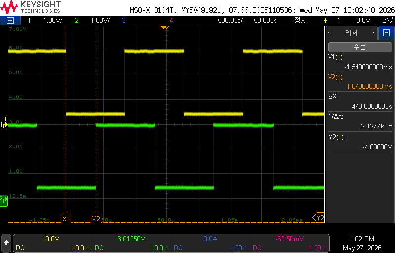
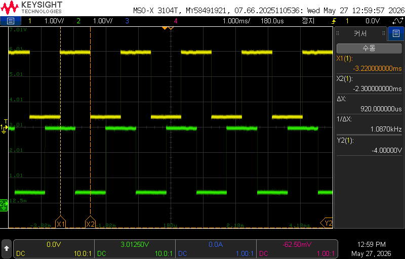
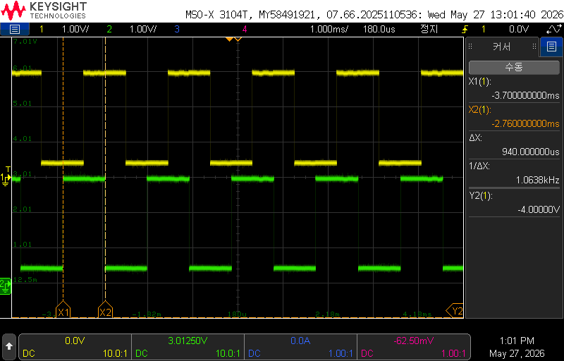

# ESB 타이밍 측정값

[[tx_ble_module]](PTX) ↔ [[rx_ble_module]](PRX) 간 실측 타이밍. 오실로스코프 GPIO 프로브 기반 측정 결과.

## 측정 환경

| 항목 | 내용 |
|---|---|
| 측정 장비 | Keysight MSO-X 3104T 오실로스코프 |
| 측정 일자 | 2026-05-27 |
| 프로브 핀 | P0.17 (TX 시작), P0.18 (ACK 수신) — 검증용 GPIO 토글 |
| 대상 코드 | esb 브랜치 `03_TX_esb` |

P0.17/P0.18 GPIO 토글은 측정 전용 코드 — 검증 완료 후 제거 여부 결정 필요 ([[tx_ble_module]] 참조).

## 측정 1 — TX→ACK 왕복 지연 (latency)

TX 패킷 전송 완료 시점 ~ ACK 수신 시점까지의 왕복 지연.

**측정값: 약 470 us**

## 측정 2 — TX 전송 주기

PTX가 ESB 패킷을 송신하는 반복 주기.

**측정값: 약 920 us**

PRD 기준 목표 주기는 10 ms — 현재 측정값(920 us)은 SDK 기본 동작 주기로 추정. 10 ms 주기 설정과의 관계 확인 필요.

## 측정 3 — ACK 수신 주기

PTX 기준 ACK 수신 반복 주기 (= PRX 응답 주기).

**측정값: 약 940 us**

TX 전송 주기(920 us)와 근사. ACK with payload 동작상 정상 범위.

## 출처

- GPIO 토글 커밋: `200c817` (feat(tx): P0.17/P0.18 GPIO 토글 추가 — ESB TX 주기 오실로스코프 검증용)
- ESB 링크 파라미터: [[esb_link_layer]]
