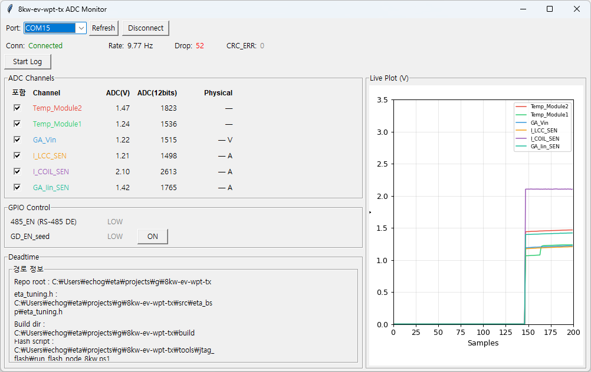

# g팀 8kW EV WPT TX 주간 업무 보고

**기간**: 2026-06-09 ~ 2026-06-16  
**보드**: 8kW EV 무선전력전송(WPT) 송신 보드 Ver1.0E00  
**MCU**: TI AM263P (LP-AM263P LaunchPad)

---

## 요약

이번 주는 두 개의 큰 작업을 완료했다.

1. **PWM 전력제어 브링업**: 풀브리지 인버터 4채널 파형을 85 kHz로 구동하고, dead-time을 컴파일타임 knob 한 줄로 제어하는 구조를 완성했다. 레그1·레그2 동형 파형을 실측으로 증빙하고, flash → 전원사이클 → silicon 핀 단대단 검증까지 완료했다. Production 기본값은 **150 ns** 확정.

2. **PC ↔ MCU UART 통신 + GPIO 양방향 제어**: ADC 6채널 텔레메트리를 10 Hz 바이너리 패킷으로 PC에 송출하고, PC GUI에서 실시간 모니터링·CSV 로깅·GPIO 제어를 할 수 있는 환경을 구축했다. GUI에서 GD_EN ON 버튼을 누르면 TYPE=0x10 커맨드가 MCU에 전달되어 GPIO93이 HIGH로 전환되는 왕복 검증까지 완료했다.

---

## 1. PWM 전력제어 브링업

### 1.1 하드웨어 구성

풀브리지 인버터 2레그 4채널. 핀맵은 아래와 같다.

| 레그 | 신호 | 커넥터 핀 | EPWM 모듈 | 역할 |
|------|------|-----------|-----------|------|
| 레그1 | HS1 | J4.39 | EPWM2_A | 상단 스위치 |
| 레그1 | LS1 | J4.40 | EPWM2_B | 하단 스위치 |
| 레그2 | HS2 | J6.52 | EPWM4_A | 상단 스위치 |
| 레그2 | LS2 | J6.51 | EPWM7_B | 하단 스위치 |

**타이머 파라미터**: TBCLK 200 MHz (1 count = 5 ns), TBPRD = 1176, 스위칭 주파수 85 kHz (실측 85.032 kHz)

---

### 1.2 레그2 dead-time 오차 발생 원인

레그1과 레그2는 dead-time 제어 방식이 구조적으로 다르다.

**레그1 (EPWM2 단일 모듈)**  
HS1과 LS1이 같은 EPWM2 모듈 안에 있어 모듈 내 하드웨어 dead-band 서브모듈(RED/FED)이 두 채널을 한 클럭 도메인에서 직접 제어한다.  
→ 오차 ~±0.6 ns (단일 모듈 내 하드웨어 비대칭 수준)

**레그2 (EPWM4 + EPWM7 두 모듈)**  
HS2(EPWM4_A)와 LS2(EPWM7_B)가 서로 다른 모듈에 분산되어 있어 dead-band 블록을 공유할 수 없다. 두 모듈이 별도의 카운터를 돌리므로, 동기화 후에도 모듈 간 잔류 스큐가 남는다.  
→ 오차 ~±3 ns (모듈 간 잔류 스큐)

> **근본 원인**: 회로도에서 레그2의 두 게이트 신호가 서로 다른 EPWM 인스턴스에 배선된 설계. 향후 PCB 개정 시 단일 모듈로 묶으면 구조적으로 해결 가능.

---

### 1.3 오차 개선 과정 — EPWM0 fan-out 도입

**1단계 (초기 구현)**  
EPWM4→EPWM7 1-hop SYNC + CMPB 오프셋으로 레그2 상보를 구현했으나, 직렬 SYNC 구조에서 모듈 간 위상 스큐 **~11~22 ns** 잔존.

**2단계 — EPWM0 더미 마스터 fan-out 도입 (commit `4014901`)**  
output이 없는 더미 EPWM0를 마스터로 두고, EPWM2/4/7 전부를 1-hop 등가 슬레이브로 연결하는 fan-out 토폴로지로 전환했다.

```
EPWM0 (더미 마스터 — output 없음, SYNCOUT_ON_CNTR_ZERO)
  ├── EPWM2  (레그1: HS1/LS1)
  ├── EPWM4  (레그2: HS2)
  └── EPWM7  (레그2: LS2)
```

- 기존 직렬 구조의 누적 스큐를 구조적으로 제거
- 레그1 ↔ 레그2 위상차 0, PHASE_TRIM 불필요
- 결과: **모듈 간 스큐 ~22 ns → ±2 ns 이내**

**레그2 2-compare isoform 설계** (레그1 dead-band와 동형 파형 합성):

| 신호 | AQ 이벤트 | CMPX 값 |
|------|-----------|---------|
| HS2 (EPWM4_A) | UP_CMPA=HIGH / DOWN_CMPB=LOW | CMPA = TBPRD/2 + DT_COUNTS |
| LS2 (EPWM7_B) | ZERO=HIGH / UP_CMPB=LOW / DOWN_CMPA=HIGH | CMPA = TBPRD/2 − DT_COUNTS |

`ETA_DEADTIME_NS`(eta_tuning.h) 한 줄이 `DT_COUNTS`로 변환되어 위 모든 CMPX 값을 자동 추종한다.

---

### 1.4 Dead-time 테스트 결과

#### 검증 1: RAM-load 4ch 동시 실측 — isoform 설계 검증 (2026-06-11)

**측정 조건**: Saleae Logic2, 500 MS/s (2 ns 격자), 4채널 동시 캡처  
**원본 데이터**: `raw/pwm_leg2_isoform/verify_dt{100,150,250,400}/digital.csv` (CH0=HS1, CH1=LS1, CH2=HS2, CH3=LS2)

<!-- 
[이미지 요청 — 스킬이 생성]
데이터: raw/pwm_leg2_isoform/verify_dt100/digital.csv, verify_dt150/digital.csv, verify_dt250/digital.csv, verify_dt400/digital.csv
분석 스크립트: raw/pwm_leg2_isoform/verify_dt100/analyze.py
차트 종류: 4개 DT 설정값별 레그1·레그2 4에지 시차 bar chart
  - x축: DT 설정값 (100/150/250/400 ns)
  - y축: 에지 시차 (ns), 범위 -4 ~ +4 ns
  - 계열: HS2.r-HS1.r / HS2.f-HS1.f / LS2.r-LS1.r / LS2.f-LS1.f
  - 레퍼런스 라인: y=0 (완전 동형 기준)
  - 제목: "레그1 · 레그2 4에지 시차 (동형 증빙)"
-->

**표 1 — 레그2 dead-time 정확도** (단위: ns, median [min/max])

| 설정값 | HS2→LS2 갭 | LS2→HS2 갭 | 양방향 합 | 방향 차 | Shoot-through |
|--------|-----------|-----------|---------|--------|---------------|
| 100 ns | 102 [100/104] | 100 [98/100] | 202 | 2 ns | **0** |
| 150 ns | 152 [150/154] | 148 [148/150] | 300 | 4 ns | **0** |
| 250 ns | 252 [250/254] | 248 [248/250] | 500 | 4 ns | **0** |
| 400 ns | 402 [400/404] | 398 [398/400] | 800 | 4 ns | **0** |

양방향 합 = 2×설정값 정확 보존. 방향 비대칭 ≤4 ns는 5 ns 양자화(±1 count) + 모듈 간 잔류 스큐에 기인.

**표 2 — 레그1·레그2 동형 4에지 시차** (단위: ns, median [min/max])

| 설정값 | HS2.r − HS1.r | HS2.f − HS1.f | LS2.r − LS1.r | LS2.f − LS1.f | high-time 4ch |
|--------|--------------|--------------|--------------|--------------|---------------|
| 100 ns | 0 [−2/0] | 0 [−2/0] | 0 [0/+2] | 0 [0/+2] | 5780 ns (공통) |
| 150 ns | 0 [−2/0] | 0 [−2/0] | 0 [0/+2] | 0 [0/+2] | 5730 ns (공통) |
| 250 ns | 0 [−2/0] | 0 [−2/0] | 0 [0/+2] | 0 [0/+2] | 5630 ns (공통) |
| 400 ns | 0 [−2/0] | 0 [−2/0] | 0 [0/+2] | 0 [0/+2] | 5480 ns (공통) |

4에지 시차 median **0 ns**, 최대 **±2 ns** — 4채널이 시간축에서 포개짐. 레그1 회귀 없음 확인.

---

#### 검증 2: flash → 전원사이클 → silicon 핀 실측 (2026-06-12)

컴파일타임 knob → 플래시 굽기 → VCC 전원사이클 → 실핀 측정의 단대단 경로 검증.

**원본 데이터**: `raw/pwm_deadtime_knob_verify/dt{100,150,250,400}/leg{1,2}/digital.csv` (총 8개)  
분석 스크립트: `raw/pwm_deadtime_knob_verify/measure.py`

<!-- 
[이미지 요청 — 스킬이 생성]
데이터: raw/pwm_deadtime_knob_verify/dt100/leg1/digital.csv, dt100/leg2/digital.csv, dt150/leg1/digital.csv, dt150/leg2/digital.csv, dt250/leg1/digital.csv, dt250/leg2/digital.csv, dt400/leg1/digital.csv, dt400/leg2/digital.csv
분석 스크립트: raw/pwm_deadtime_knob_verify/measure.py
차트 종류: dead-time 설정값 추종 line chart
  - x축: 설정값 (100/150/250/400 ns)
  - y축: 실측 mean (ns)
  - 계열 4개: 레그1 HS↓→LS↑ / 레그1 LS↓→HS↑ / 레그2 HS↓→LS↑ / 레그2 LS↓→HS↑
  - 레퍼런스 라인: y=x (이상적 추종 기준)
  - 에러바: ±σ
  - 제목: "ETA_DEADTIME_NS knob — flash+boot silicon 실측 (레그1 vs 레그2)"
  - leg1 CH0=HS1(J4.39/EPWM2_A), CH1=LS1(J4.40/EPWM2_B)
  - leg2 CH0=HS2(J6.52/EPWM4_A), CH1=LS2(J6.51/EPWM7_B)
-->

**표 3 — flash+boot silicon 측정 결과** (단위: ns, mean ± σ)

| 설정 | 레그1 HS↓→LS↑ | 레그1 LS↓→HS↑ | 레그2 HS↓→LS↑ | 레그2 LS↓→HS↑ | 판정 |
|------|--------------|--------------|--------------|--------------|------|
| 100 ns | 100.75 ±0.97 | 100.14 ±0.51 | 101.98 ±0.27 | 99.01 ±1.00 | PASS |
| 150 ns | 150.70 ±0.95 | 150.10 ±0.44 | 151.94 ±0.36 | 148.99 ±1.00 | PASS |
| 250 ns | 250.71 ±0.96 | 250.11 ±0.47 | 251.84 ±0.54 | 249.12 ±0.99 | PASS |
| 400 ns | 400.70 ±0.96 | 400.10 ±0.44 | 401.95 ±0.38 | 398.99 ±1.00 | PASS |

> Shoot-through: 양 레그, 전 설정, 전 주기 **0 ns**  
> **16/16 PASS**, 최대 절대 오차 1.98 ns  
> 표본 수: 레그1 7,989~10,272 주기 / 레그2 10,271~15,978 주기

**구조적 방향 비대칭** (설정값 무관, 일정값):

| 레그 | 비대칭 (HS↓→LS↑ − LS↓→HS↑) | 원인 |
|------|--------------------------|------|
| 레그1 | ~+0.6 ns | 단일 모듈 RED/FED 하드웨어 비대칭 |
| 레그2 | ~+3 ns | 모듈 간 잔류 스큐 (PHASE_TRIM=0) |

두 레그 간 절대 차이는 동일 설정에서 레그2가 레그1보다 +1.2~1.3 ns 크며, 설정값에 무관한 구조적 일정값이다.

---

### 1.5 최종 세팅 및 현재 상태

| 항목 | 값 | 비고 |
|------|-----|------|
| 스위칭 주파수 | **85 kHz 고정** | 실측 85.032 kHz (+0.002%) |
| TBCLK | 200 MHz | 1 count = 5 ns, TBPRD = 1176 |
| Dead-time 기본값 | **150 ns** | `ETA_DEADTIME_NS = 150U` (eta_tuning.h) |
| 조정 가능 범위 | 100~400 ns | 범위 벗어나면 `#error`로 빌드 차단 |
| EPWM SYNC 구조 | EPWM0 fan-out | EPWM2/4/7 1-hop 등가 슬레이브 |
| 잔류 오차 | 레그1 ~±0.6 ns / 레그2 ~±3 ns | Shoot-through 0, 안전 기준 내 |
| Standalone 부팅 | 정상 | SW1=`0,0,1,1` (xSPI 8D SFDP) |

전력단 브링업 시 실부하 조건에서 150 ns를 기준으로 재조정 가능.  
다음 단계: **PWM P3 보호 (trip-zone)**.

---

## 2. PC ↔ MCU UART 통신 + GPIO 양방향 제어

### 2.1 개요 및 물리 경로

LP-AM263P UART5를 통해 PC와 MCU가 바이너리 패킷으로 통신하는 구조를 구축했다.  
ADC 6채널 텔레메트리 → PC GUI 모니터링을 기본으로, PC에서 GPIO를 제어하는 양방향 커맨드까지 확장했다.

**물리 경로**:

```
MCU UART5 TXD/RXD
  → J1.4 (EPWM15_A alt-function 패드)
    → THVD1400 U13 (RS-485 드라이버)
      → J24
        → CP210x USB-UART 어댑터
          → PC COM15
```

**통신 설정**: 115200 / 8N1

---

### 2.2 공통 프레임 구조

모든 패킷은 아래 공통 구조를 따른다 (big-endian).

```
[SOF=0xA5][LEN][TYPE][SEQ][... payload (LEN bytes) ...][CRC-H][CRC-L]
```

| 필드 | 크기 | 설명 |
|------|------|------|
| SOF | 1B | 고정값 `0xA5` — 프레임 시작 마커 |
| LEN | 1B | payload 바이트 수 |
| TYPE | 1B | 패킷 종류 식별자 |
| SEQ | 1B | 0~255 rolling — 수신측 드롭 감지 |
| payload | LEN bytes | 타입별 데이터 |
| CRC | 2B | CRC-16/CCITT-FALSE |

**CRC-16/CCITT-FALSE**: poly `0x1021`, init `0xFFFF`, reflect 없음.  
계산 범위: byte[1] (LEN) ~ payload 끝. SOF와 CRC 자신은 제외.

---

### 2.3 패킷 타입 상세

#### TYPE=0x01 — ADC 텔레메트리 (MCU→PC, 18B 고정, 10 Hz)

| 바이트 | 필드 | 값 |
|--------|------|----|
| [0] | SOF | `0xA5` |
| [1] | LEN | `12` |
| [2] | TYPE | `0x01` |
| [3] | SEQ | rolling |
| [4~5] | ch0 raw | Temp_Module2 — u16 big-endian |
| [6~7] | ch1 raw | Temp_Module1 — u16 big-endian |
| [8~9] | ch2 raw | GA_Vin — u16 big-endian |
| [10~11] | ch3 raw | I_LCC_SEN — u16 big-endian |
| [12~13] | ch4 raw | I_COIL_SEN — u16 big-endian |
| [14~15] | ch5 raw | GA_Iin_SEN — u16 big-endian |
| [16~17] | CRC | CRC-16/CCITT-FALSE |

ADC raw count(0~4095)만 wire에 실리고, mV 변환(`raw × 3300 / 4095`)은 PC GUI가 담당한다 (**thin device / smart host** 패턴).  
채널 순서는 펌웨어 `ETA_ADC_CH` enum이 단일 소스 — 채널 추가 시 직렬화·LEN이 자동 추종.

#### TYPE=0x02 — GPIO 상태 (MCU→PC, 7B, 이벤트 기반)

| 바이트 | 필드 | 값 |
|--------|------|----|
| [0] | SOF | `0xA5` |
| [1] | LEN | `1` |
| [2] | TYPE | `0x02` |
| [3] | SEQ | rolling |
| [4] | GPIO_STATUS | bit0=485_EN / bit1=GD_EN_seed |
| [5~6] | CRC | CRC-16/CCITT-FALSE |

`eta_gpio_init()` 직후 및 GD_EN 상태 변경 시 자동 송신.

#### TYPE=0x10 — GPIO 커맨드 (PC→MCU, 8B, fire-and-forget)

| 바이트 | 필드 | 값 |
|--------|------|----|
| [0] | SOF | `0xA5` |
| [1] | LEN | `2` |
| [2] | TYPE | `0x10` |
| [3] | SEQ | rolling |
| [4] | CMD_ID | `0x01` = GD_EN_seed |
| [5] | VALUE | `0`=LOW / `1`=HIGH |
| [6~7] | CRC | CRC-16/CCITT-FALSE |

MCU 수신 → GPIO 즉시 실행 → TYPE=0x02 상태 패킷 응답 반송.

---

### 2.4 수신측 재동기 설계

스트림 노이즈·1바이트 손상에 대비한 슬라이딩 파서:

```
① SOF(0xA5) 탐색
② LEN / TYPE 게이트 일치 확인
③ CRC-16 검증
④ 불일치 → 1바이트 슬라이드 후 ①로
```

ASCII 잡음이나 가짜 SOF는 게이트/CRC에서 자연 폐기 — 별도 필터 불필요.

---

### 2.5 RS-485 방향 제어 (485_EN 자동 토글)

THVD1400 U13의 DE 핀을 GPIO91(`485_EN`, J5.48)로 제어.  
`UART_write` 직전 HIGH → 완료 후 LOW로 자동 토글 — 호출부에서 별도 처리 불필요.

---

### 2.6 SDK RX 버그 수정

SDK `UART_read()` POLLED+NO_WAIT+FULL 모드에서 `rx.count`가 앱 transaction에 반영되지 않는 문제 발견.  
8바이트 요청 시 stale `0x00` 버퍼가 주입되어 SOF 탐색 불가.  
→ **`count=1`, 반환값 `==SystemP_SUCCESS`로 판정하는 1바이트씩 읽기**로 수정.

---

### 2.7 PC GUI

`tools/gui/gui.py` (Python + pyserial + Tkinter + matplotlib)



*스크린샷: COM15 연결, Rate 9.77 Hz, ADC 6채널 실측값 표시 (Temp_Module2 1.47V, I_COIL_SEN 2.10V 등), GPIO Control 섹션에서 GD_EN_seed [ON] 버튼, Live Plot에서 I_COIL_SEN 전압 급상승 이벤트 포착.*

| 기능 | 내용 |
|------|------|
| ADC 실시간 표시 | ADC(V) / 12-bit raw / Physical 4컬럼 표 |
| 라이브 플롯 | 채널별 체크박스 토글, 200샘플 슬라이딩 윈도우 |
| 패킷 헬스 | 수신 레이트(Hz) / SEQ 드롭 / CRC 에러 카운트 |
| CSV 로깅 | raw 값 기준, Start 시점 채널 고정 |
| GPIO 제어 | GD_EN ON/OFF 버튼 + 485_EN·GD_EN 상태 라벨 |
| Dead-time 컨트롤 | Spinbox 입력 → eta_tuning.h 치환 → 빌드 → 플래시 원클릭 |
| 헤드리스 CLI | `python gui.py --deadtime 150 --write --build --flash` |

단일 exe 배포 가능 (PyInstaller, ~39 MB).

---

### 2.8 실보드 검증 결과

| 검증 항목 | 조건 | 결과 |
|-----------|------|------|
| ADC 텔레메트리 | COM13, 29.8 s 관찰 | 10.067 Hz, 301프레임, SEQ드롭 0, CRC에러 0 |
| 프레이밍 강건성 | 1바이트 손상 / ASCII 잡음 / 가짜 SOF | 재동기·폐기 후 복구 PASS |
| GPIO 왕복 제어 | GUI GD_EN ON → TYPE=0x10 송신 | GPIO93 HIGH — Logic2 실측 확인 |
| Standalone 재확인 | 플래시 굽기 → 전원사이클 후 | GPIO 동작 유지 확인 |

---

## 잔여 항목

| 항목 | 상태 | 비고 |
|------|------|------|
| PWM P3 보호 (trip-zone) | 다음 착수 | trip-zone 입력 핀·보호 신호 스펙 확보 필요 |
| ADC 센서 스케일링 (A3) | 블로커 | 센서 스펙 미입수 (°C/V/A 변환 계수) |
| UART5 RS-485 차동 검증 | 구현 완료·미검증 | 8kW 보드 결합 시 THVD1400 차동 라인 실측 |
| UART5 송신 논블로킹화 | 잔여 | 제어루프 병행 시 DMA/콜백 전환 필요 |
| GUI Physical 단위 표시 | 블로커 | 센서 계수 입수 후 `PHYSICAL_COEFF[]` 한 곳만 수정 |
