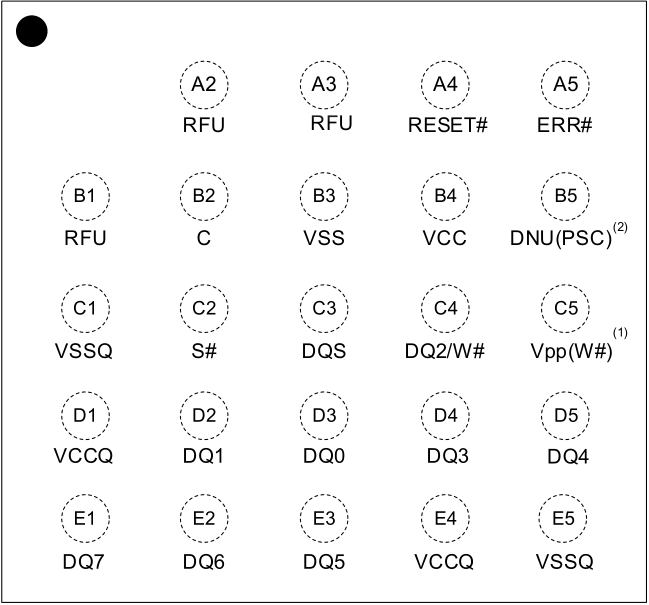

**…………………………………………………… ……….IS25LX256/128** 

**IS25WX256/128** 

## **1. PIN CONFIGURATION** 

**24-ball BGA (5x5 Array)** 

Top View, Balls Facing Down 

**----- Start of picture text -----** 
A2 A3 A4 A5 RFU RFU RESET# ERR# B1 B2 B3 B4 B5 (2) RFU C VSS VCC DNU(PSC) C1 C2 C3 C4 C5 (1) VSSQ S# DQS DQ2/W# Vpp(W#) D1 D2 D3 D4 D5 VCCQ DQ1 DQ0 DQ3 DQ4 E1 E2 E3 E4 E5 DQ7 DQ6 DQ5 VCCQ VSSQ **----- End of picture text -----** 

## **Notes:** 

**1. Dedicated W# instead of Vpp is supported as an optional device only. See the ordering information for detail. 2. Dedicated PSC (Phase Shifted Clock) is supported as an optional device only. See the ordering information for detail.** 

6 

_**Integrated Silicon Solution, Inc.- www.issi.com**_ **Rev. A14** 

05/12/2026 

