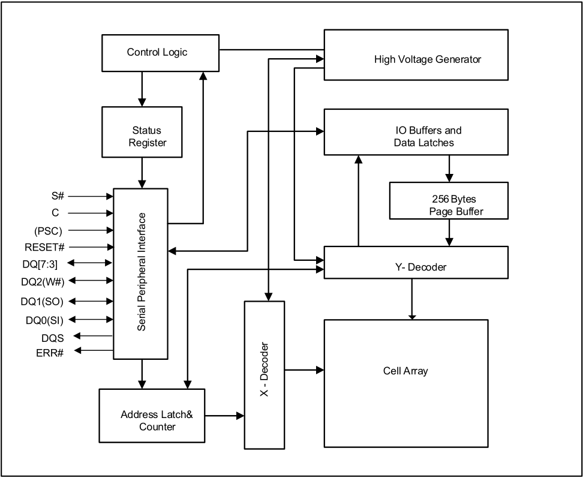

**…………………………………………………… ……….IS25LX256/128 IS25WX256/128** 

## **3. BLOCK DIAGRAM** 

**----- Start of picture text -----** 
Control Logic High Voltage Generator Status IO Buffers and Register Data Latches S# 256 Bytes C Page Buffer (PSC) RESET# DQ[7:3] Y- Decoder DQ2(W#) DQ1(SO) DQ0(SI) DQS ERR# Cell Array Address Latch& Counter Serial Peripheral Interface  X - Decoder **----- End of picture text -----** 

8 

_**Integrated Silicon Solution, Inc.- www.issi.com**_ **Rev. A14** 05/12/2026 

