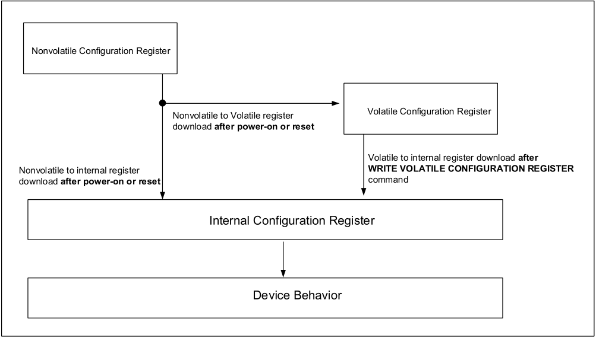
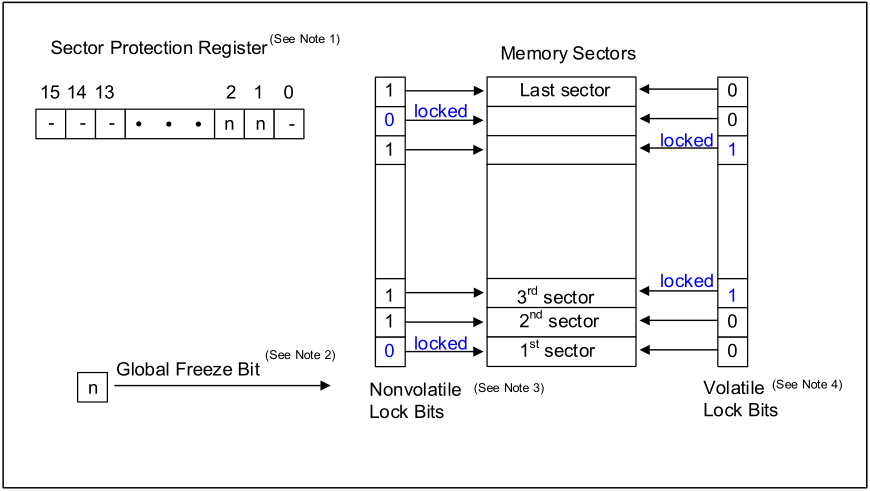

**…………………………………………………… ……….IS25LX256/128 IS25WX256/128** 

## **6. REGISTERS** 

## **6.1 STATUS REGISTER** 

Status register bits can be read from or written to using READ STATUS REGISTER or WRITE STATUS REGISTER commands, respectively. When the status register enable /disable bit (bit 7) is set to 1 and W# is driven LOW, the status register nonvolatile bits become read only and the WRITE STATUS REGISTER operation will not execute. The only way to exit this hardware-protected mode is to driven W# HIGH. 

**Table 6.1 Status Register Bit Definition** 

|**Bit**|**Name**|**Settings**|**Definition **|**Notes**|
|---|---|---|---|---|
|7|SRWD|0 = Enabled (default) 1 = Disabled|**Nonvolatile control bit:**Used with W# to enable or disable writing to the status register:|-|
|5|TB|0 = Top (default) 1 = Bottom|**Nonvolatile control bit**: Determines whether the protected memory area defined by the block protect bits starts from the top or bottom of the memory array.|-|
|6, 4:2|BP[3:0]|See Protected Area tables|**Nonvolatile control bit**: Defines memory to be software protected against PROGRAM or ERASE operations. When one or more block protect bits is set to 1, a designated memory area is protected from PROGRAM and ERASE operations.|1|
|1|WEL|0 = Clear (default) 1 = Set|**Volatile control bit**: The device always powers up with this bit cleared to prevent inadvertent WRITE, PROGRAM, or ERASE operations. To enable these operations, the WRITE ENABLE operation must be executed first to see this bit.|-|
|0|WIP|0 = Ready(default) 1 = Busy|**Volatile status bit**: Indicates if one of the following command cycles in in progress: WRITE STATUS REGISTER WRITE NONVOLATILE CONFIGURATION REGISTER PROGRAM ERASE|2|

Notes: 

1. The CHIP ERASE command is executed only if all bits = 0. 

2. Status register bit 0 is the inverse of flag status register bit 7. 

15 

_**Integrated Silicon Solution, Inc.- www.issi.com**_ **Rev. A14** 05/12/2026 

**…………………………………………………… ……….IS25LX256/128** 

**IS25WX256/128** 

**Table 6.2 Block assignment by Block Protect (BP) Bits** 

|**Status Register Bits**|**Status Register Bits**|**Status Register Bits**|**Status Register Bits**|**Byte** **Protected**|**Protected Memory Area for 256Mb (Block Size = 128KB)**|**Protected Memory Area for 256Mb (Block Size = 128KB)**|
|---|---|---|---|---|---|---|
|**BP3**|**BP2**|**BP1**|**BP0**||**TBS = 0, Top area**|**TBS = 1, Bottom area**|
|0|0|0|0|0KB|0 ( None)|0 ( None)|
|0|0|0|1|128KB|1 (1 block : 255th)|1 (1 block : 0th)|
|0|0|1|0|256KB|2 (2 blocks : 254thand 255th)|2 (2 blocks : 0thand 1st)|
|0|0|1|1|512KB|3 (4 blocks : 252ndto 255th)|3 (4 blocks : 0thto 3rd)|
|0|1|0|0|1MB|4 (8 blocks : 248thto 255th)|4 (8 blocks : 0thto 7th)|
|0|1|0|1|2MB|5 (16 blocks : 240thto 255th)|5 (16 blocks : 0thto 15th)|
|0|1|1|0|4MB|6 (32 blocks : 224thto 255th)|6 (32 blocks : 0thto 31st)|
|0|1|1|1|8MB|7 (64 blocks : 192ndto 255th)|7 (64 blocks : 0thto 63rd)|
|1|0|0|0|16MB|8 (128 blocks : 128thto 255th)|8 (128 blocks : 0thto 127th)|
|1|0|0|1|32MB (All)|9 (256 blocks : 0thto 255th)|9 (256 blocks : 0thto 255th)|
|1|0|1|0|32MB (All)|10 (256 blocks : 0thto 255th)|10 (256 blocks : 0thto 255th)|
|1|0|1|1|32MB (All)|11 (256 blocks : 0thto 255th)|11 (256 blocks : 0thto 255th)|
|1|1|0|0|32MB (All)|12 (256 blocks : 0thto 255th)|12 (256 blocks : 0thto 255th)|
|1|1|0|1|32MB (All)|13 (256 blocks : 0thto 255th)|13 (256 blocks : 0thto 255th)|
|1|1|1|0|32MB (All)|14 (256 blocks : 0thto 255th)|14 (256 blocks : 0thto 255th)|
|1|1|1|1|32MB (All)|15 (256 blocks : 0thto 255th)|15 (256 blocks : 0thto 255th)|

|**Status Register Bits**|**Status Register Bits**|**Status Register Bits**|**Status Register Bits**|**Byte** **Protected**|**Protected Memory Area for 128Mb (Block Size = 128KB)**|**Protected Memory Area for 128Mb (Block Size = 128KB)**|
|---|---|---|---|---|---|---|
|**BP3**|**BP2**|**BP1**|**BP0**||**TBS = 0, Top area**|**TBS = 1, Bottom area**|
|0|0|0|0|0KB|0 ( None)|0 ( None)|
|0|0|0|1|128KB|1 (1 block : 127th)|1 (1 block : 0th)|
|0|0|1|0|256KB|2 (2 blocks : 126thand 127th)|2 (2 blocks : 0thand 1st)|
|0|0|1|1|512KB|3 (4 blocks : 124thto 127th)|3 (4 blocks : 0thto 3rd)|
|0|1|0|0|1MB|4 (8 blocks : 120thto 127th)|4 (8 blocks : 0thto 7th)|
|0|1|0|1|2MB|5 (16 blocks : 112ndto 127th)|5 (16 blocks : 0thto 15th)|
|0|1|1|0|4MB|6 (32 blocks : 96thto 127th)|6 (32 blocks : 0thto 31st)|
|0|1|1|1|8MB|7 (64 blocks : 64thto 127th)|7 (64 blocks : 0thto 63rd)|
|1|0|0|0|16MB (All)|8 (128 blocks : 0thto 127th)|8 (128 blocks : 0thto 127th)|
|1|0|0|1|16MB (All)|9 (128 blocks : 0thto 127th)|9 (128 blocks : 0thto 127th)|
|1|0|1|0|16MB (All)|10 (128 blocks : 0thto 127th)|10 (128 blocks : 0thto 127th)|
|1|0|1|1|16MB (All)|11 (128 blocks : 0thto 127th)|11 (128 blocks : 0thto 127th)|
|1|1|0|0|16MB (All)|12 (128 blocks : 0thto 127th)|12(128 blocks : 0thto 127th)|
|1|1|0|1|16MB (All)|13 (128 blocks : 0thto 127th)|13 (128 blocks : 0thto 127th)|
|1|1|1|0|16MB (All)|14 (128 blocks : 0thto 127th)|14 (128 blocks : 0thto 127th)|
|1|1|1|1|16MB (All)|15 (128 blocks : 0thto 127th)|15 (128 blocks : 0thto 127th)|

16 

_**Integrated Silicon Solution, Inc.- www.issi.com**_ **Rev. A14** 

05/12/2026 

**…………………………………………………… ……….IS25LX256/128** 

**IS25WX256/128** 

**Table 6.3 Block assignment by Block Protect (BP) Bits for Optional 64KB Sector Size** 

|**Status Register Bits**|**Status Register Bits**|**Status Register Bits**|**Status Register Bits**|**Byte** **Protected**|**Block Size =64KB Protected Memory Area (256Mb, 512Blocks)**|**Block Size =64KB Protected Memory Area (256Mb, 512Blocks)**|
|---|---|---|---|---|---|---|
|**BP3**|**BP2**|**BP1**|**BP** **0**||**TBS = 0, Top area**|**TBS = 1, Bottom area**|
|0|0|0|0|0KB|0 ( None)|0 ( None)|
|0|0|0|1|64KB|1 (1 block: 511st)|1 (1 block: 0th)|
|0|0|1|0|128KB|2 (2 blocks: 510thand 511st)|2 (2 blocks: 0thand 1st)|
|0|0|1|1|256KB|3 (4 blocks: 508thto 511st)|3 (4 blocks: 0thto 3rd)|
|0|1|0|0|512KB|4 (8 blocks: 504thto 511st)|4 (8 blocks: 0thto 7th)|
|0|1|0|1|1MB|5 (16 blocks: 496thto 511st)|5 (16 blocks: 0thto 15th)|
|0|1|1|0|2MB|6 (32 blocks: 480thto 511st)|6 (32 blocks: 0thto 31st)|
|0|1|1|1|4MB|7 (64 blocks: 448thto 511st)|7 (64 blocks: 0thto 63rd)|
|1|0|0|0|8MB|8 (128 blocks: 384thto 511st)|8 (128 blocks: 0thto 127th)|
|1|0|0|1|16MB|9 (256 blocks: 256thto 511st)|9 (256 blocks: 0thto 255th)|
|1|0|1|0|24MB|10 (384 blocks : 128thto 511st)|10 (384 blocks : 0thto 383rd)|
|1|0|1|1|28MB|11 (448 blocks : 64thto 511st)|11 (448 blocks : 0thto 447th)|
|1|1|0|0|30MB|112 (480 blocks : 32ndto 511st)|12 (480 blocks : 0thto 479th)|
|1|1|0|1|31MB|13 (496 blocks : 16thto 511st)|13 (496 blocks : 0thto 495th)|
|1|1|1|0|32256KB|14 (504 blocks : 8thto 511st)|14 (504 blocks : 0thto 503rd)|
|1|1|1|1|32MB (All)|15 (512 blocks : 0thto 511st)|15 (512 blocks : 0thto 511st)|

|**Status Register Bits**|**Status Register Bits**|**Status Register Bits**|**Status Register Bits**|**Byte** **Protected**|**Block Size =64KB Protected Memory Area (128Mb, 256Blocks)**|**Block Size =64KB Protected Memory Area (128Mb, 256Blocks)**|
|---|---|---|---|---|---|---|
|**BP3**|**BP2**|**BP1**|**BP0**||**TBS = 0, Top area**|**TBS = 1, Bottom area**|
|0|0|0|0|0KB|0 ( None)|0 ( None)|
|0|0|0|1|64KB|1 (1 block : 255th)|1 (1 block : 0th)|
|0|0|1|0|128KB|2 (2 blocks : 254thand 255th)|2 (2 blocks : 0thand 1st)|
|0|0|1|1|256KB|3 (4 blocks : 252ndto 255th)|3 (4 blocks : 0thto 3rd)|
|0|1|0|0|512KB|4 (8 blocks : 248thto 255th)|4 (8 blocks : 0thto 7th)|
|0|1|0|1|1MB|5 (16 blocks : 240thto 255th)|5 (16 blocks : 0thto 15th)|
|0|1|1|0|2MB|6 (32 blocks : 224thto 255th)|6 (32 blocks : 0thto 31st)|
|0|1|1|1|4MB|7 (64 blocks : 192ndto 255th)|7 (64 blocks : 0thto 63rd)|
|1|0|0|0|8MB|8 (128 blocks : 128thto 255th)|8 (128 blocks : 0thto 127th)|
|1|0|0|1|12MB|9 (192 blocks : 64thto 255th)|9 (192 blocks : 0thto 191st)|
|1|0|1|0|14MB|10 (224 blocks : 32ndto 255th)|10 (224 blocks : 0thto 223rd)|
|1|0|1|1|15MB|11 (240 blocks : 16thto 255th)|11 (240 blocks : 0thto 239th)|
|1|1|0|0|15872KB|12 (248 blocks : 8thto 255th)|12 (248 blocks : 0thto 247th)|
|1|1|0|1|16128KB|13 (252 blocks : 4thto 255th)|13 (252 blocks : 0thto 251st)|
|1|1|1|0|16256KB|14 (254 blocks : 2ndto 255th)|14 (254 blocks : 0thto 253rd)|
|1|1|1|1|16MB (All)|15 (256 blocks : 0thto 255th)|15 (256 blocks : 0thto 255th)|

17 

_**Integrated Silicon Solution, Inc.- www.issi.com**_ **Rev. A14** 

05/12/2026 

**…………………………………………………… ……….IS25LX256/128 IS25WX256/128** 

## **6.2 FLAG STATUS REGISTER** 

Flag status register bits are read by using READ FLAG STATUS REGISTER command. All bits are volatile and are reset to zero on power up. 

Status bits are set and reset automatically by the internal controller. Error bits must be cleared through the CLEAR STATUS REGISTER command. 

**Table 6.4 Flag Status Register** 

|**Bit**|**Name**|**Settings**|**Definition**|
|---|---|---|---|
|7|Program or erase controller|0 = Busy 1 = Ready|**Status bit:**Indicates whether one of the following operation is in progress: WRITE STATUS REGISTER, WRITE NONVOLATILE CONFIGURATION REGISTER, PROGRAM, or ERASE|
|6|Erase suspend|0 = Clear 1 = Suspend|**Status bit:**Indicates whether an ERASE operation has been or is going to be suspended.|
|5|Erase|0 = Clear 1 = Failure or protection error|**Error bit**: Indicates whether an ERASE operation has succeeded or failed.|
|4|Program|0 = Clear 1 = Failure orprotection error|**Error bit**: Indicates whether a PROGRAM operation has succeeded or failed.|
|3|Reserved|0|Reserved|
|2|Program suspend|0 = Clear 1 = Suspend|**Status bit:**Indicates whether a PROGRAM operation has been or is going to be suspended.|
|1|Protection|0 = Clear 1 = Failure or protection error|**Error bit**: Indicates whether an ERASE or PROGRAM operation has attempted to modify the protected array sector, or whether a PROGRAM operation has attempted to access the locked OTP space.|
|0|Addressing|0 = 3-byte addressing 1 = 4-byte addressing|**Status bit**: Indicates whether 3-byte or 4-byte address mode is enabled.|

18 

_**Integrated Silicon Solution, Inc.- www.issi.com**_ **Rev. A14** 05/12/2026 

**…………………………………………………… ……….IS25LX256/128 IS25WX256/128** 

## **6.3 INTERNAL CONFIGURATION REGISTER** 

The memory configuration is set by an internal configuration register that is not directly accessible to users. 

The user can change the default configuration at power up by using the WRITE NONVOLATILE CONFIGURATION REGISTER. Information from the nonvolatile configuration register overwrites the internal configuration register during power on or after a reset. 

The user can change the configuration during device operation using the WRITE VOLATILE CONFIGURATION REGISTER command. Information from the volatile configuration register overwrites the internal configuration register immediately after the WRITE command completes. 

## **Figure 6.1 Internal Configuration Register** 

**----- Start of picture text -----** 
Nonvolatile Configuration Register Volatile Configuration Register Nonvolatile to Volatile register download  after power-on or reset Volatile to internal register download  after Nonvolatile to internal register  WRITE VOLATILE CONFIGURATION REGISTER download  after power-on or reset command Internal Configuration Register Device Behavior **----- End of picture text -----** 

19 

_**Integrated Silicon Solution, Inc.- www.issi.com**_ **Rev. A14** 05/12/2026 

**…………………………………………………… ……….IS25LX256/128 IS25WX256/128** 

## **6.4 NONVOLATILE CONFIGURATION REGISTER** 

Nonvolatile configuration register bits set the device configuration after power-up or reset. All bits are erased (FFh) unless stated otherwise. This is read from and written to using the READ NONVOLATILE CONFIGURATION REGISTER and WRITE NONVOLATILE CONFIGURATION REGISTER command, respectively. The commands use the main array address scheme, but only the LSB is used to access different register settings, thereby providing up to 256 bytes of registers. A READ command from reserved address returns FFh. A WRITE command to a reserved setting is ignored, flag status register bit 1 is set, and the write enable latch bit is cleared. 

**Table 6.5 Nonvolatile Configuration Register** 

|**LSB** **Address**|**Bit**|**Name**|**Settings**|**Description**|**Note** **s**|
|---|---|---|---|---|---|
|FFh:0Ch||Reserved|Reserved|Reserved||
||[7]|Reserved|Reserved|Reserved||
|0Bh|[6]|SSOENB|1 = All 8 DQs are same (Default) 0 = DQ3 is inverted, and remaining IOs are same.|SSO pattern of DLP Enabled or Disabled.||
|||||SSO pattern means IO3 is inverted and other||
|||||7 IOs are the same.||
||[5:4]|CRCSIZE|11 = 16-byte (Default) 10 = 32-byte 01 = 64-byte 00 = 128-byte|Selects chunk size for Program CRC operation.||
||[3]|CRCENB|1 = CRC Disabled (Default) 0 = CRC Enabled|Address Parity and Array Data Parity Enabled or Disabled in Octal DDR mode.||
||[2]|ERRBECC|1 = ERR# indicates 2–bit detection.(Default) 0 = ERR# LOW indicates 1-bt correction.|ERR# LOW behavior for 1-bit correction or 2- bit detection out of ECC event. Also it will determine ECC error type for ECCFCA bits. Only valid when ECCENB bit is 0.||
||[1]|ERRBENB|1 = ERR# OFF (Default) 0 = ERR# ON|Enable or disable ERR# signal, which indicates ERR error.||
||[0]|ECCENB|1 = ECC OFF (Default) 0 = ECC ON|Enables or Disables ECC||
|0Ah|[7:0]|DLP Pattern|55h = 01010101 (Default) Bit 7 is an MSB|Data Learning Pattern for training.||
|09h:08h||Reserved|Reserved|Reserved||

20 

_**Integrated Silicon Solution, Inc.- www.issi.com**_ **Rev. A14** 05/12/2026 

**…………………………………………………… ……….IS25LX256/128** 

**IS25WX256/128** 

## **Nonvolatile Configuration Register (Continued)** 

|**LSB** **Address**|**Bit**|**Name**|**Settings**|**Description**|**Note** **s**|
|---|---|---|---|---|---|
|07h|[7:0]|Wrap configuration|FFh = Continuous (Default) FEh = 64-byte wrap FDh = 32-byte wrap FCh = 16-byte wrap Others = Reserved|Enables the device to read from memory sequentially or to wrap within 16-, 32-, or 64- byte boundaries||
|06h|[7:0]|XIP Configuration|FFh = XIP disabled (Default) FEh = 8IOFR XIP FDh = 8OFR XIP F8h = FAST READ XIP Others = Reserved|||
|05h|[7:0]|Beyond 128Mb address configuration|FFh = 3-byte address (Default) FEh = 4-byte address Others = Reserved|Defines the number of address bytes for a command.||
|04h|[7:0]|Reserved|Reserved|Reserved||
|03h|[7:0]|Programmab le output drive strength|FFh = 50 ohm (Default) FEh = 35 ohm FDh = 25 ohm FCh = 18 ohm Others = Reserved|Optimizes the impedance at VCC/2 output voltage.||
|02h|[7:0]|Reserved|Reserved|Reserved||
|01h|[7:0]|Dummy cycle configuration|00h = Identical to 1Fh 01h = 1 dummy cycle 02h = 2 dummy cycle 03h to 1Dh = 3 to 29 dummy cycles 1Eh = 30 dummy cycles 1Fh = Default Others = Reserved|Sets the number of dummy cycles subsequent to all FAST READ, OTP READ (4Bh), and DLP READ (CDh) commands (See the Command Set Table for default setting values).|1|
|00h|[7:0]|I/O mode|FFh = Extended SPI (Default) DFh = Extended SPI without DQS E7h = Octal DDR C7h = Octal DDR without DQS Others = Reserved|Sets the device to work in different I/O modes such as DDR mode or DQS mode (Strobe enabled)|2|

## Notes: 

1. The number of cycles must be set to accord with the clock frequency, which varies by the type of FAST READ, OTP READ, and DLP Read command (See Supported Clock Frequency Table). Insufficient dummy clock cycles for the operating frequency causes the memory to read incorrect data. Dummy cycle for DLP READ = Dummy cycle setting of OCTAL DDR mode + 2 clock cycles. 18 clock cycle is a default setting. 2.For parts configured with pin configuration option “ **Boot in DDR x8” the default value of this byte is FFh. On those parts it’s not possible to configure the parts to work in extended SPI using NVCR. Only Octal DDR with DQS mode is supported.** 

21 

_**Integrated Silicon Solution, Inc.- www.issi.com**_ **Rev. A14** 05/12/2026 

**…………………………………………………… ……….IS25LX256/128 IS25WX256/128** 

## **6.5 VOLATILE CONFIGURATION REGISTER** 

Volatile configuration register bits temporarily set the device configuration after power-up or reset. All bits are erased (FFh) unless stated otherwise. This register is read from and written to using the READ VOLATILE CONFIGURATION REGISTER and WRITE VOLATILE CONFIGURATION REGISTER commands, respectively. The commands use the main array address scheme, but only the LSB is used to access different register settings, thereby providing up to 256 bytes of registers. A READ command from reserved address returns FFh. A WRITE command to a reserved setting is ignored, flag status register bit 1 is set, and the write enable latch bit is cleared. 

**Table 6.6 Volatile Configuration Register** 

|**LSB** **Address**|**Bit**|**Name**|**Settings**|**Description**|**Notes**|
|---|---|---|---|---|---|
|FFh:12h||Reserved|Reserved|Reserved||
|11h|[7:3]|Reserved|Reserved|Reserved||
||[2:0]|BANKSTAT(4)|000 = No Active program/erase operation 100 = program/erase operation in bank 0 101 = program/erase operation in bank 1 110 = program/erase operation in bank 2 111 = program/erase operation in bank 3|Indicates Active program/erase operation at specific bank. Useful for read while program/erase operation.||
|10h|[7:0]|ECCFCA|Chunk address, [AA31:A24]|1stECC Event occurred chunk address ; 1-bit correction event or 2-bit detection event will be depends on setting of ERRBECC bit (bit 2 of address 0Bh)||
|0Fh|[7:0]|ECCFCA|Chunk address, [A23:A16]|||
|0Eh|[7:0]|ECCFCA|Chunk address, [A15:A8]|||
|0Dh|[7:4]|ECCFCA|Chunk address, [A7:A4]|||
||[3:0]|Reserved|Reserved (outputs 0000)|Reserved||
||||0 = NO double programming or partial |Indicates if there is an attempt for Incremental (Double) Programming within ECC boundary. Incremental programming is not allowed within ECC boundary when ECC is ON.||
|0Ch|[7]||programming attempt within ECC chunk |||
|||IPA_ECCB|without erase (default) 1 = Yes double programming or partial|||
||||programming attempt within ECC chunk without erase.|||
||[6:3]|ECCCOUNTER|0000 = NO ECC event (default) 0001 = 1 ECC event 1111 = 15 ECC events|Store cumulative ECC event occurrence. Max. 15 ECC event occurrence can be stored, and stays 15 after further occurrence.|2|
||[2]|ECCSTAT|0 = No error (default) 1 = 2-bit Error Detection|Indicates any 2-bit Error detection||
||[1]|PARSTAT|0 = No error (default) 1= Address Parity Error|Indicates any Address Parity Error detection||
||[0]|CRCSTAT|0 = No error (default) 1= Program Array Data CRC Error|Indicates any Program Array Data CRC Error detection||

22 

_**Integrated Silicon Solution, Inc.- www.issi.com**_ **Rev. A14** 05/12/2026 

**…………………………………………………… ……….IS25LX256/128** 

**IS25WX256/128** 

**Table 6.6 Volatile Configuration Register (Continued)** 

|**LSB** **Address**|**Bit**|**Name**|**Settings**|**Description**|**Notes**|
|---|---|---|---|---|---|
|0Bh|Reserved|Reserved|Reserved|Reserved||
||[6]|SSOENB|1 = All 8 DQs are same (Default) 0 = DQ3 is inverted, and remaining IOs are same.|SSO pattern of DLP Enabled or Disabled.||
|||||SSO pattern means IO3 is inverted and||
|||||other 7 IOs are the same.||
||[5:4]|CRCSIZE|11 = 16-byte (Default) 10 = 32-byte 01 = 64-byte 00 = 128-byte|Selects chunk size for Program CRC operation.||
||[3]|CRCENB|1 = CRC Disabled (Default) 0 = CRC Enabled|Address Parity and Array Data Parity Enabled or Disabled in Octal DDR mode.||
||[2]|ERRBECC|1 = ERR# indicates 2–bit detection. (Default) 0 = ERR# LOW indicates 1-bt correction.|ERR# LOW behavior for 1-bit correction or ||
|||||2-bit detection out of ECC event. Also it will determine ECC error type for ECCFCA bits.||
||||| Only valid when ECCENB bit is 0.||
||[1]|ERRBENB|1 = ERR# OFF (Default) 0 = ERR# ON|Enable or disable ERR# signal, which indicates ERR error||
||[0]|ECCENB|1 = ECC OFF (Default) 0 = ECC ON|Enables or Disables ECC||
|0Ah|[7:0]|DLP Pattern|55h = 01010101 (Default), Bit 7 is an MSB|Data Learning Pattern for training.||
|09h:08h||Reserved|Reserved|Reserved||

23 

_**Integrated Silicon Solution, Inc.- www.issi.com**_ **Rev. A14** 05/12/2026 

**…………………………………………………… ……….IS25LX256/128** 

**IS25WX256/128** 

**Table 6.6 Volatile Configuration Register (Continuted)** 

|**LSB** **Address**|**Bit**|**Name**|**Settings**|**Description**|**Notes**|
|---|---|---|---|---|---|
|07h|[7:0]|Wrap configuration|FFh = Continuous (Default) FEh = 64-byte wrap FDh = 32-byte wrap FCh = 16-byte wrap Others = Reserved|Enables the device to read from memory sequentially or to wrap within 16-, 32-, or 64- byte boundaries||
|06h|[7:0]|XIP Configuration|FFh = XIP disabled (Default) FEh = XIP enabled Others = Reserved|Enables the device to operate in the selected XIP mode. It is first required to enable XIP and then enter XIP mode using the XIP confirmation bit.||
|05h|[7:0]|Beyond 128Mb address configuration|FFh = 3-byte address (Default) FEh = 4-byte address Others = Reserved|Defines the number of address bytes for a command.||
|04h|[7:0]|Reserved|Reserved|Reserved||
|03h|[7:0]|Programmable output drive strength|FFh = 50 ohm (Default) FEh = 35 ohm FDh = 25 ohm FCh = 18 ohm Others = Reserved|Optimizes the impedance at VCC/2 output voltage.||
|02h|[7:0]|Reserved|Reserved|Reserved||
|01h|[7:0]|Dummy cycle configuration|00h = Identical to 1Fh 01h = 1 dummy cycle 02h = 2 dummy cycle 03h to 1Dh = 3 to 29 dummy cycles 1Eh = 30 dummy cycles 1Fh = Default Others = Reserved|Sets the number of dummy cycles subsequent to all FAST READ, OTP READ (4Bh), and DLP READ (CDh) commands (See the Command Set Table for default setting values).|1|
|00h|[7:0]|I/O mode|FFh = Extended SPI (Default) DFh = Extended SPI without DQS E7h = Octal DDR C7h = Octal DDR without DQS Others = Reserved|Sets the device to work in different I/O modes such as DDR mode or DQS mode (Strobe enabled)|3|

Note: 

1. The number of cycles must be set to accord with the clock frequency, which varies by the type of FAST READ, OTP READ, and DLP Read command (See Supported Clock Frequency Table). Insufficient dummy clock cycles for the operating frequency causes the memory to read incorrect data. Dummy cycle for DLP READ = Dummy cycle setting of OCTAL DDR mode + 2 clock cycles. 18 clock cycle is a default setting. 

2. ECC event counter (bit [6:3] of address 0Ch) stops counting once reach maximum value 15. 

3. For parts configured with pin configuration option “ **Boot in DDR x8” the default value of this byte is FFh. On those parts it’s not possible to configure the parts to work in extended SPI using VCR. Only Octal DDR with DQS mode is supported.** 

4. BANKSTAT bits are supported in an optional device only (option L). 

24 

_**Integrated Silicon Solution, Inc.- www.issi.com**_ **Rev. A14** 05/12/2026 

**…………………………………………………… ……….IS25LX256/128** 

**IS25WX256/128** 

## **Table 6.7 Maximum Clock Frequencies – SDR and DDR Read Starting at Any Byte Address** 

|**IS25WX (VCC= 1.7V to 1.95V, DDR=200MHz, ECC is OFF)**|**IS25WX (VCC= 1.7V to 1.95V, DDR=200MHz, ECC is OFF)**|**IS25WX (VCC= 1.7V to 1.95V, DDR=200MHz, ECC is OFF)**|**IS25WX (VCC= 1.7V to 1.95V, DDR=200MHz, ECC is OFF)**|**IS25WX (VCC= 1.7V to 1.95V, DDR=200MHz, ECC is OFF)**|**IS25WX (VCC= 1.7V to 1.95V, DDR=200MHz, ECC is OFF)**|**IS25WX (VCC= 1.7V to 1.95V, DDR=200MHz, ECC is OFF)**|
|---|---|---|---|---|---|---|
|**Number of Dummy Clock** **Cycles**|**Fast Read**|**Octal Output Fast Read**||**Octal I/O**|**Fast Read**|**Octal DDR** **(8D-8D-8D)**|
||SDR (1S-1S-1S)|SDR (1S-1S-8S)|DDR (1S-1D-8D)|SDR (1S-8S-8S)|DDR (1S-8D-8D)||
|1|70|16|NA|NA|NA|NA|
|2|88|33|16|NA|NA|NA|
|3|104|50|33|16|16|16|
|4|120|66|50|33|33|33|
|5|133|83|66|50|50|50|
|6|150|100|83|66|66|66|
|7||116|95|75|76|76|
|8||120|105|85|86|86|
|9||130|114|95|95|95|
|10||140|124|105|105|105|
|11||150|133|116|114|114|
|12|166|166|143|125|124|124|
|13|||152|133|133|133|
|14|||162|143|143|143|
|15|||171|152|152|152|
|16|||181|166|162|162|
|17|||191||171|171|
|18|||200||181|181|
|19|||||191|191|
|20 and above|||||200|200|

|**IS25WX (VCC= 1.7V to 1.95V, DDR=200MHz, ECC is OFF)**|**IS25WX (VCC= 1.7V to 1.95V, DDR=200MHz, ECC is OFF)**|**IS25WX (VCC= 1.7V to 1.95V, DDR=200MHz, ECC is OFF)**|**IS25WX (VCC= 1.7V to 1.95V, DDR=200MHz, ECC is OFF)**|**IS25WX (VCC= 1.7V to 1.95V, DDR=200MHz, ECC is OFF)**|**IS25WX (VCC= 1.7V to 1.95V, DDR=200MHz, ECC is OFF)**|**IS25WX (VCC= 1.7V to 1.95V, DDR=200MHz, ECC is OFF)**|
|---|---|---|---|---|---|---|
|**Number of Dummy Clock** **Cycles**|**Fast Read**|**Octal Output Fast Read**||**Octal I/O**|**Fast Read**|**Octal DDR** **(8D-8D-8D)**|
||SDR (1S-1S-1S)|SDR (1S-1S-8S)|DDR (1S-1D-8D)|SDR (1S-8S-8S)|DDR (1S-8D-8D)||
|1|70|16|NA|NA|NA|NA|
|2|88|33|16|NA|NA|NA|
|3|104|50|33|16|16|16|
|4|120|66|50|33|33|33|
|5|133|83|66|50|50|50|
|6|150|100|83|66|66|66|
|7||116|95|75|76|76|
|8||120|105|85|86|86|
|9||130|114|95|95|95|
|10||140|124|105|105|105|
|11||150|133|116|114|114|
|12|166|166|143|125|124|124|
|13|||152|133|133|133|
|14|||162|143|143|143|
|15|||171|152|152|152|
|16|||181|166|162|162|
|17|||191||171|171|
|18|||200||181|181|
|19|||||191|191|
|20 and above|||||200|200|

## **Note:** 

## **1. Values are guaranteed by characterization and not 100% tested in production** 

25 

_**Integrated Silicon Solution, Inc.- www.issi.com**_ **Rev. A14** 

05/12/2026 

**…………………………………………………… ……….IS25LX256/128** 

**IS25WX256/128** 

|**IS25WX (VCC= 1.7V to 1.95V, DDR=166MHz, ECC is ON)**|**IS25WX (VCC= 1.7V to 1.95V, DDR=166MHz, ECC is ON)**|**IS25WX (VCC= 1.7V to 1.95V, DDR=166MHz, ECC is ON)**|**IS25WX (VCC= 1.7V to 1.95V, DDR=166MHz, ECC is ON)**|**IS25WX (VCC= 1.7V to 1.95V, DDR=166MHz, ECC is ON)**|**IS25WX (VCC= 1.7V to 1.95V, DDR=166MHz, ECC is ON)**|**IS25WX (VCC= 1.7V to 1.95V, DDR=166MHz, ECC is ON)**|
|---|---|---|---|---|---|---|
|**Number of Dummy Clock** **Cycles**|**Fast Read**|**Octal Output Fast Read**||**Octal I/O**|**Fast Read**|**Octal DDR** **(8D-8D-8D)**|
||SDR (1S-1S-1S)|SDR (1S-1S-8S)|DDR (1S-1D-8D)|SDR (1S-8S-8S)|DDR (1S-8D-8D)||
|1|70|16|NA|NA|NA|NA|
|2|88|33|16|NA|NA|NA|
|3|104|50|33|16|16|16|
|4|120|66|50|33|33|33|
|5|133|83|66|50|40|40|
|6|150|100|83|66|50|50|
|7||116|95|75|66|66|
|8||120|105|85|83|83|
|9||130|114|95|95|95|
|10||140|124|105|105|105|
|11||150|133|116|114|114|
|12|166|166|143|125|124|124|
|13|||152|133|133|133|
|14|||166|143|143|143|
|15||||152|152|152|
|16||||166|162|162|
|17|||||166|166|
|18|||||||
|19|||||||
|20 and above|||||||

|**IS25WX (VCC= 1.7V to 1.95V, DDR=166MHz, ECC is ON)**|**IS25WX (VCC= 1.7V to 1.95V, DDR=166MHz, ECC is ON)**|**IS25WX (VCC= 1.7V to 1.95V, DDR=166MHz, ECC is ON)**|**IS25WX (VCC= 1.7V to 1.95V, DDR=166MHz, ECC is ON)**|**IS25WX (VCC= 1.7V to 1.95V, DDR=166MHz, ECC is ON)**|**IS25WX (VCC= 1.7V to 1.95V, DDR=166MHz, ECC is ON)**|**IS25WX (VCC= 1.7V to 1.95V, DDR=166MHz, ECC is ON)**|
|---|---|---|---|---|---|---|
|**Number of Dummy Clock** **Cycles**|**Fast Read**|**Octal Output Fast Read**||**Octal I/O**|**Fast Read**|**Octal DDR** **(8D-8D-8D)**|
||SDR (1S-1S-1S)|SDR (1S-1S-8S)|DDR (1S-1D-8D)|SDR (1S-8S-8S)|DDR (1S-8D-8D)||
|1|70|16|NA|NA|NA|NA|
|2|88|33|16|NA|NA|NA|
|3|104|50|33|16|16|16|
|4|120|66|50|33|33|33|
|5|133|83|66|50|40|40|
|6|150|100|83|66|50|50|
|7||116|95|75|66|66|
|8||120|105|85|83|83|
|9||130|114|95|95|95|
|10||140|124|105|105|105|
|11||150|133|116|114|114|
|12|166|166|143|125|124|124|
|13|||152|133|133|133|
|14|||166|143|143|143|
|15||||152|152|152|
|16||||166|162|162|
|17|||||166|166|
|18|||||||
|19|||||||
|20 and above|||||||

## **Note:** 

**1. Values are guaranteed by characterization and not 100% tested in production** 

26 

_**Integrated Silicon Solution, Inc.- www.issi.com**_ **Rev. A14** 05/12/2026 

**…………………………………………………… ……….IS25LX256/128** 

**IS25WX256/128** 

## **IS25LX (VCC = 2.7V to 3.6V, DDR=133MHz)** 

|**Number of Dummy Clock** **Cycles**|**Fast Read**|**Octal Output Fast Read**|**Octal Output Fast Read**|**Octal I/O**|**Fast Read**|**Octal DDR** **(8D-8D-8D)**|
|---|---|---|---|---|---|---|
||SDR (1S-1S-1S)|SDR (1S-1S-8S)|DDR (1S-1D-8D)|SDR (1S-8S-8S)|DDR (1S-8D-8D)||
|1|70|16|NA|NA|NA|NA|
|2|88|33|16|NA|NA|NA|
|3|104|50|33|16|16|16|
|4|120|66|50|33|33|33|
|5|133|83|66|50|40|40|
|6||100|83|66|50|50|
|7||116|95|76|66|66|
|8||133|105|86|83|83|
|9|||114|95|95|95|
|10|||124|105|105|105|
|11|||133|114|114|114|
|12||||124|124|124|
|13 and above||||133|133|133|

## **Note:** 

**1. Values are guaranteed by characterization and not 100% tested in production** 

27 

_**Integrated Silicon Solution, Inc.- www.issi.com**_ **Rev. A14** 

05/12/2026 

**…………………………………………………… ……….IS25LX256/128** 

**IS25WX256/128** 

## **Table 6.8 Sequence of Bytes During Wrap** 

|**Starting Address**|**16-Byte Wrap**|**32-Byte Wrap**|**64-Byte Wrap**|
|---|---|---|---|
|0|0-1-2- … - 15-0-1-..|0-1-2- … - 31-0-1-..|0-1-2- … - 63-0-1-..|
|1|1-2-3- … - 15-0-1-2-..|1-2-3- … - 31-0-1-2-..|1-2-3- … - 63-0-1-2-..|
|….|….|….|….|
|15|15-0-1- … - 15-0-1-2-..|15-0-1- … - 31-0-1-2-..|15-0-1- … - 63-0-1-2-..|
|….|….|….|….|
|31|-|31-0-1- … - 31-0-1-2-..|31-0-1- … - 63-0-1-2-..|
|….|….|….|….|
|63|-|-|63-0-1- … - 63-0-1-2-..|

**Table 6.9 SSO (Simultaneous Switching Ouput) Pattern Selection Bit Table** 

|SSOSEL (bit 6, 0Bh)|**IO Pattern**|**DQ0~DQ2, DQ4~DQ7**|**DQ3**|
|---|---|---|---|
|Bit 6 = 1 (default; SSO disabled)|All 8 DQs are same|0011 0101|0011 0101|
|Bit 6 = 0 (SSO enabled)|DQ3 is inverted (7 DQs are same)|0011 0101|1100 1010|

## **Note:** 

**1. Training pattern can be written to DLPPTN bits** (bit [7:0], address 0Ah). Bit 7 maps to 1[st] Training Data of MSB. The default pattern is “0101 0101” for all 8 DQs (no SSO pattern). 

28 

_**Integrated Silicon Solution, Inc.- www.issi.com**_ **Rev. A14** 05/12/2026 

**…………………………………………………… ……….IS25LX256/128 IS25WX256/128** 

## **6.6 SECURITY REGISTERS** 

Security Registers enable sector and password protection on multiple levels using non-volatile and volatile register and bit settings. 

## **Figure 6.2 Sector and Password Protection** 

**----- Start of picture text -----** 
(See Note 1) Sector Protection Register Memory Sectors 15 14 13 2 1 0 1 Last sector 0 locked - - - n n - 0 0 locked 1 1 locked 1 3rd sector 1 1 2nd sector 0 locked st (See Note 2) 0 1  sector 0 Global Freeze Bit n Nonvolatile (See Note 3) Volatile (See Note 4) Lock Bits Lock Bits **----- End of picture text -----** 

## **Notes:** 

**1. Sector protection register: This 16-bit nonvolatile register includes two active bits [2:1] to enable sector and password protection.** 

2. **Global freeze bit:** This volatile bit protects the settings in all nonvolatile lock bits. 

3. **Nonvolatile lock bits:** Each nonvolatile bit corresponds to and provides nonvolatile protection for an individual memory sector (128KB), which remains locked (protection enabled) until its corresponding bit is cleared to 1. 

4. **Volatile lock bits:** Each volatile bit corresponds to and provides volatile protection for an individual memory sector (128KB), which is locked temporarily(protection is cleared when the device is reset or powered down) 

**5. In an optional device of 64KB sector size, nonvolatile lock bits and volatile lock bits for ASP (Advanced Sector Protection) correspond to 128KB sector size instead of 64KB. But traditional BP protection correspond to 64KB sector size.** 

29 

_**Integrated Silicon Solution, Inc.- www.issi.com**_ **Rev. A14** 05/12/2026 

**…………………………………………………… ……….IS25LX256/128** 

**IS25WX256/128** 

## **Sector Protection Security Register** 

**Table 6.10 Sector Protection Security Register** 

|**Bits**|**Name**|**Settings**|**Description**|**Notes**|
|---|---|---|---|---|
|15:3|Reserved|1 = Default|-||
|2|Password protection lock|1 = Disabled (Default) 0 = Enabled|**OTP bit:**When set to 1, and password protection is disabled. When set to 0, password protection is enabled permanently; the 64-bit password cannot be retrieved or reset.|1, 2|
|1|Sector protection lock|1 = Enabled, with password protection (Default) 0 = Enabled, without password protection|**OTP bit:**When set to 1, nonvolatile lock bits can be set to lock/unlock their corresponding memory sectors; bit 2 can be set to 0, enabling password protection permanently. When set to 0, nonvolatile lock bits can be set to lock/unlock their corresponding memory sectors; bit 2 must remain set to 1, disabling password protectionpermanently.|1, 3, 4|
|0|Reserved|1 = Default|-||

## **Notes:** 

1. **Bit 2 and bit 1 are user-configurable, one-time-programmable, and mutually exclusive in that only one of them can be set to 0.** It is recommended that one of the bits be set to 0 when first programming device when using Advanced Sector Protection. 

2. The 64-bit password must be programmed and verified before this bit set to 0 because after it is set, password changes are not allowed, thus providing protection from malicious software. When this bit is set to 0, a 64-bit password is required to reset the global freeze bit from 0 to 1. In addition, if password is incorrect or lost, the global freeze bit can no longer be set and nonvolatile lock bits cannot be changed. 

3. Whether this bit is set to 1 or 0, it enables programming or erasing nonvolatile lock bits (which provide memory sector protection). The password protection bit must be set beforehand because setting this bit will either enable password protection permanently (bit 2 = 0) or disable password protection permanently (bit 1 = 0) 

4. **By default, all sectors are unlocked with device shipped from the factory** . Sectors are locked, unlocked, read, or lock down as explained in the Nonvolatile and Volatile Lock Bits table and the volatile Lock Bit Register Bit Definitions table. 

**Table 6.11 Global Freeze Bit** 

|**Bits**|**Name**|**Settings**|**Description**|
|---|---|---|---|
|7:1|Reserved|0|Bit values are 0|
|0|Global freeze bit|1 = Disabled (Default) 0 = Enabled|**Volatile bit:**When set to 1, all nonvolatile lock bits can be set to enable or disable locking their corresponding memory sectors. When set to 0, nonvolatile lock bits are protected from PROGRAM or ERASE commands. This bit should not be set to 0 until the nonvolatile lock bits are set.|

## **Note:** 

1. The READ GLOBAL FREEZE BIT command enables reading this bit. **When password protection is enabled, this bit is locked upon device power-up or reset.** It cannot be changed without the password. **After the password is entered, the UNLOCK PASSWORD command resets this bit to 1** , enabling programming or erasing the nonvolatile lock bits. After the bits are changed, the **WRITE GLOBAL FREEZE BIT command sets this bit to 0** , protecting the nonvolatile lock bits from PROGRAM or ERASE operations. 

30 

_**Integrated Silicon Solution, Inc.- www.issi.com**_ **Rev. A14** 

05/12/2026 

**…………………………………………………… ……….IS25LX256/128** 

**IS25WX256/128** 

## **6.7 NONVOLATILE LOCK BIT AND VOLATILE LOCK BIT SECURITY REGISTERS** 

**Table 6.12 Nonvolatile and volatile lock bits** 

|**Bit Details**|**Nonvolatile Lock Bit**|**Volatile Lock Bit**|
|---|---|---|
|Description|Each sector of memory has one corresponding nonvolatile lock bit|Each sector of memory has one corresponding nonvolatile lock bit; this bit is the sector write lock bit described in the Volatile Lock Bit Register table.|
|Function|When set to 0, locks and protects its corresponding memory sector from PROGRAM or ERASE operations. Because this bit is nonvolatile, the sector remains locked, protection enabled, until the bit is cleared to 1.|When set to 1, locks and protects its corresponding memory sector from PROGRAM or ERASE operations. Because this bit is volatile, protection is temporary. The sector is unlocked, protection disabled, upon device reset orpower-down.|
|Settings|1 = Lock disabled 0 = Lock enabled|0 = Lock disabled 1 = Lock enabled|
|Enabling protection|The bit is set to 0 by the WRITE NONVOLATILE LOCK BITS command, enabling protection for designated locked sectors. Programming a sector lock bit requires the typical byte program time.|When set to 1, locks and protects its corresponding memory sector from PROGRAM or ERASE operations. Because this bit is volatile, protection is temporary. The sector is unlocked, protection disabled, upon device reset orpower-down.|
|Disabling protection|All bits are cleared to 1 by ERASE NONVOLATILE LOCK BITS command, unlocking and disabling protection, unlocking and disabling protection for all sectors simultaneously. Erasing all sector lock bits requires typical sector erase time.|All bits are cleared to 0 upon reset or power-down, unlocking and disabling protection for all sectors.|
|Reading the bit|Bits are read by the READ NONVOLATILE LOCK BITS command.|Bits are read by the READ VOLATILE LOCK BITS command.|

31 

_**Integrated Silicon Solution, Inc.- www.issi.com**_ **Rev. A14** 05/12/2026 

**…………………………………………………… ……….IS25LX256/128 IS25WX256/128** 

## **NONVOLATILE LOCK BIT SECURITY REGISTER** 

For nonvolatile sector locking, the nonvolatile lock bits are stored in the flash cells within an erasable sector lockbit array, hence, making this a nonvolatile locking scheme. An erased flash cell corresponds to an unlocked sector and programmed flash cell corresponds to a locked sector. 

One of nonvolatile lock bit is related to each sector, **the nonvolatile lock bits are programmed individually but must be erased as a group** . 

Programming nonvolatile lock bits requires the typical byte programming time. Erasing all the nonvolatile lock bits requires typical sector erase time. 

**Table 6.13 Nonvolatile Lock Bit Register** 

|**Nonvolatile Lock Bit Register**|**Protection Status**|
|---|---|
|00h|Sectorprotected from modifyoperations|
|FFh|Sector unprotected from modifyoperations(default)|

32 

_**Integrated Silicon Solution, Inc.- www.issi.com**_ **Rev. A14** 05/12/2026 

**…………………………………………………… ……….IS25LX256/128 IS25WX256/128** 

## **VOLATILE LOCK BIT SECURITY REGISTER** 

One volatile lock bit register is associated with each sector of memory. It enables the sector to be locked, unlocked, or locked-down with the WRITE VOLATILE LOCK BITS command, which executes only when sector lock down (bit 1) is set to 0. Each register can be read with the READ VOLATILE LOCK BITS command. 

## **Table 6.14 Volatile lock bit register** 

|**Bits**|**Name**|**Settings**|**Description**|
|---|---|---|---|
|7:2|Reserved|0|Bit values are 0-|
|1|Sector lock down|0 = lock-down disabled (Default) 1 = lock-down enabled|**Volatile bit:**Device always powers up with this bit set to 0 so that sector lock down and sector write protect bits can be set to 1. When this bit is set to 1, neither of the two volatile bits can be written to until the next power cycle, hardware, or software reset.|
|0|Sector write protect|0 = Write protect disabled (Default) 1 = Write protect enabled|**Volatile bit:**Device always powers up with this bit set to 0 so that PROGRAM or ERASE operations in this sector can be executed and sector content modified. When this bit is set to 1, PROGRAM and ERASE operations in this sector are not executed.|

33 

_**Integrated Silicon Solution, Inc.- www.issi.com**_ **Rev. A14** 05/12/2026 

**…………………………………………………… ……….IS25LX256/128 IS25WX256/128** 

## **6.8 PROTECTION MANAGEMENT REGISTER** 

The device offers enhanced security features that can be enabled by properly setting the protection management register (PMR). 

The PMR bits can be read from or written to using the READ PROTECTION MANAGEMENT REGISTER and WRITE PROTECTION MANAGEMENT REGISTER commands. 

When the PMR lockdown bit (bit 2) is set to 0, the device will no longer respond to WRITE PROTECTION MANAGEMENT REGISTER commands. If this command is issued, the register will remain unchanged and the device will set an error code in flag status register bits 1 and 4. 

Note: If the enhanced security features (activated through the PMR) are not going to be used, **programming bit 2 of the PMR to 0 is strongly recommended** . This prevents any future unintentional operation on this register that could result in permanent and irreversible locking of the memory sectors. 

**Table 6.15 Protection Management Register** 

|**Bit**|**Name**|**Settings**|**Description**|**Notes**|
|---|---|---|---|---|
|7|Reserved|Reserved|Reserved||
|6|Reserved|Reserved|Reserved||
|5|Reserved|Reserved|Reserved|1|
|4|Status Register Lock|0 = Lock 1 = Unlock (Default)|**OTP control bit:**Permanently locks the status register, further writes to SR not allowed regardless of the state of W#pin and write enable/disable bit of the status register.||
|3|Reserved|Reserved|Reserved||
|**2**|**PMR Lockdown**|**0 = Lock** **1 = Unlock(Default)**|**OTP control bit:**Permanently locks the protection management register.||
|1|Nonvolatile sector lock bit register lockdown|0 = Lock 1 = Unlock (Default)|**OTP control bit:**Permanently locks the contents of the nonvolatile sector lock bit register.|1|
|0|Nonvolatile sector lock bit erase lock|0 = Lock 1 = Unlock (Default)|**OTP control bit:**When this bit is set to 1, the nonvolatile sector lock bit register array is erasable; otherwise, it is unerasable.||

## **Note:** 

**1. When this bit is set to 0, the nonvolatile lock bits are locked from PROGRAM and ERASE operations permanently.** 

34 

_**Integrated Silicon Solution, Inc.- www.issi.com**_ **Rev. A14** 05/12/2026 

**…………………………………………………… ……….IS25LX256/128 IS25WX256/128** 

## **PROTECTION MANAGEMENT REGISTER Operations** 

Protection management register bits can be read with the READ PROTECTION MANAGEMENT REGISTER (2Bh) command. They can be programmed independently or collectively with the WRITE PROTECTION MANAGEMENT REGISTER command (68h). 

## **The bits are one-time programmable and cannot be erased.** 

To initiate a READ PROTECTION MANAGEMENT command, S# is driven LOW. For extended SPI protocol, input is on DQ0, output on DQ1. For Octal DDR Protocol, input/output is on DQ [7:0]. The operation is terminated by driving S# HIGH at any time during data output. 

Before a WRITE PROTECTION MANAGEMENT REGISTER command is initiated, the WRITE ENABLE command must be executed to set the write enable latch bit to 1. To initiate a command, S# is driven LOW and held LOW until the eighth bit of the last data byte has been latched in, after which it must be driven HIGH. For the extended SPI and Octal DDR protocols, input is on DQ0, and DQ [7:0], respectively, followed by the data bytes. If S# is not driven HIGH, the command is not executed, error bits are not set, and the write enable latch remains set to 1. The operation is self-timed and its duration is tPPMR. 

**Table 6.16 Protection Management Register Operations** 

|**Operation Name**|**Description**|
|---|---|
|READ PROTECTION MANAGEMENT REGISTER (2Bh)|The command does not require dummy cycles in extended SPI protocol, while 8 dummy cycles are necessary in Octal DDR protocol. When the register is read continuously, the same byte is output repeatedly.|
|WRITE PROTECTION MANAGEMENT REGISTER (68h)|When an operation is in progress, the write in progress bit is set to 1. The write enable latch bit is cleared to 0, whether the operation is successful or not. The status register and flag status register can be polled for the operation status. When the operation completes, the write in progress bit is cleared to 0, whether the operation is successful or not. For stacked devices, it is possible to obtain the operation status by reading the flag status register a number of times corresponding to the die stacked, with S# toggled in between the READ FLAG STATUS REGISTER commands. When the operation completes, the program or erase controller bit of the flag status register is cleared to 1. The end of operation can be detected when the program or erase controller bit of the flag status register outputs 1 for all the die of the stack. When a 0 is written to any reserved field, the operation is initiated; however, uCode aborts the operation without programming any bits. Then the write enable latch bit is cleared, and the programming error bit and protection error bits are set to 1. When protection management bit 2 is set to 0 (locked), the command is not executed, the write enable latch remains set to 1, and flag status register and protection error bits are set to 1.|

35 

_**Integrated Silicon Solution, Inc.- www.issi.com**_ **Rev. A14** 05/12/2026 

