**…………………………………………………… ……….IS25LX256/128 IS25WX256/128** 

## **8. DEVICE OPERATION** 

## **8.1 BASIC DEVICE OPERATION** 

- Before a command is issued, status register should be checked to ensure device is ready for proper operation. 

- When incorrect command is inserted, the device becomes standby mode and keeps the standby mode until next S# falling edge. 

- When correct command is inserted, the device becomes active mode, and keeps active mode until next S# rising edge. 

- While a Status Register Write operation or any Nonvolatile Register Write operation, access to any memory array is not allowed 

- In an optional device (option L), while Program or Erase of memory array is in progress in one bank, Fast Read Array data Command can be issued on any of the three non-busy banks (Read while Program/Erase Operation). 

37 

_**Integrated Silicon Solution, Inc.- www.issi.com**_ **Rev. A14** 05/12/2026 

**…………………………………………………… ……….IS25LX256/128 IS25WX256/128** 

## **8.2 COMMAND SET SUMMARY** 

## **Table 8.1 Commend Set** 

|**able 8.1 Commend Set**||||||||
|---|---|---|---|---|---|---|---|
|**Command**|**Code**|**Extended SPI**||**Octal DDR**||**Address** **Bytes**|**Data** **Bytes**|
|||**Command-** **Address-Data**|**Dummy** **Clock** **Cycles**|**Command-** **Address-Data**|**Dummy** **Clock** **Cycles**|||
|**Software RESET Operations**||||||||
|RESET ENABLE|66h|1-0-0|0|8-0-0|0|0|0|
|RESET MEMORY|99h|1-0-0|0|8-0-0|0|0|0|
|**READ ID Operations**||||||||
|READ ID|9E/9Fh|1-0-1|0|8-0-8|8|0|1 to 20|
|READ SFDP|5Ah|1-1-1|8|8-8-8|8|3(1)|1 ~|
|**READ MEMORY Operations**||||||||
|READ|03h|1-1-1|0|-|-|3/4(2)|1 ~|
|FAST READ|0Bh|1-1-1|8|8-8-8|16|3/4(2)|1 ~|
|OCTAL OUTPUT FAST READ|8Bh|1-1-8|8|8-8-8|16|3/4(2)|1 ~|
|OCTAL I/O FAST READ|CBh|1-8-8|16|8-8-8|16|3/4(2)|1 ~|
|DDR OCTAL OUTPUT FAST READ|9Dh|1-1-8|8|8-8-8|16|3/4(2)|1 ~|
|DDR OCTAL I/O FAST READ|FDh|1-8-8|16|8-8-8|16|4|1 ~|
|**READ MEMORY Operations with 4-Byte Address**||||||||
|4-BYTE READ|13h|1-1-1|0|-|-|4|1 ~|
|4-BYTE FAST READ|0Ch|1-1-1|8|8-8-8|16|4|1 ~|
|4-BYTE OCTAL OUTPUT FAST READ|7Ch|1-1-8|8|8-8-8|16|4|1 ~|
|4-BYTE OCTAL I/O FAST READ|CCh|1-8-8|16|8-8-8|16|4|1 ~|
|**WRITE Operations**||||||||
|WRITE ENABLE|06h|1-0-0|0|8-0-0|0|0|0|
|WRITE DISABLE|04h|1-0-0|0|8-0-0|0|0|0|
|**READ REGISTER Operations**||||||||
|READ STATUS REGISTER|05h|1-0-1|0|8-0-8|8|0|1 ~|
|READ FLAG STATUS REGISTER|70h|1-0-1|0|8-0-8|8|0|1 ~|
|READ NONVOLATILE CONFIGURATION REGISTER|B5h|1-1-1|8|8-8-8|8|3/4(2)|1 ~|
|READ VOLATILE CONFIGURATION REGISTER|85h|1-1-1|8|8-8-8|8|3/4(2)|1 ~|
|READ PROTECTION MANAGEMENT REGISTER|2Bh|1-0-1|0|8-0-8|8|0|1 ~|

38 

_**Integrated Silicon Solution, Inc.- www.issi.com**_ **Rev. A14** 05/12/2026 

**…………………………………………………… ……….IS25LX256/128** 

**IS25WX256/128** 

## **Command Set (Continued)** 

|**Command Set(Continued)**||||||||
|---|---|---|---|---|---|---|---|
|**Command**|**Code**|**Extended SPI**||**Octal DDR**||**Address** **Bytes**|**Data** **Bytes**|
|||**Command-** **Address-Data**|**Dummy** **Clock** **Cycles**|**Command-** **Address-Data**|**Dummy** **Clock** **Cycles**|||
|**WRITE REGISTER Operations**||||||||
|WRITE STATUS REGISTER|01h|1-0-1|0|8-0-8|0|0|1|
|WRITE NONVOLATILE CONFIGURATION REGISTER|B1h|1-1-1|0|8-8-8|0|3/4(2)|1|
|WRITE VOLATILE CONFIGURATION REGISTER|81h|1-1-1|0|8-8-8|0|3/4(2)|1|
|WRITE PROTECTION MANAGEMENT REGISTER|68h|1-0-1|8|8-0-8|0|0|1|
|**CLEAR Operations**||||||||
|CLEAR FLAG STATUS REGISTER|50h|1-0-0|0|8-0-0|0|0|0|
|CLEAR ERRB|B6h|1-0-0|0|8-0-0|0|0|0|
|**PROGRAM Operations**||||||||
|PAGE PROGRAM|02h|1-1-1|0|8-8-8|0|3/4(2)|1 to 256|
|OCTAL INPUT FAST PROGRAM|82h|1-1-8|0|8-8-8|0|3/4(2)|1 to 256|
|EXTENDED OCTAL INPUT FAST PROGRAM|C2h|1-8-8|0|8-8-8|0|3/4(2)|1 to 256|
|**PROGRAM Operations with 4-BYTE Address**||||||||
|4-BYTE PAGE PROGRAM|12h|1-1-1|0|8-8-8|0|4|1 to 256|
|4-BYTE OCTAL INPUT FAST PROGRAM|84h|1-1-8|0|8-8-8|0|4|1 to 256|
|4-BYTE EXTENDED OCTAL INPUT FAST PROGRAM|8Eh|1-8-8|0|8-8-8|0|4|1 to 256|
|**ERASE Operations**||||||||
|32KB SUBSECTOR ERASE|52h|1-1-0|0|8-8-0|0|3/4(2)|0|
|4KB SUBSECTOR ERASE|20h|1-1-0|0|8-8-0|0|3/4(2)|0|
|128KB SECTOR ERASE|D8h|1-1-0|0|8-8-0|0|3/4(2)|0|
|CHIP ERASE|C7h/60h|1-0-0|0|8-0-0|0|0|0|
|**ERASE Operations with 4-BYTE Address**||||||||
|4-BYTE 32KB SUBSECTOR ERASE|5Ch|1-1-0|0|8-8-0|0|4|0|
|4-BYTE 4KB SUBSECTOR ERASE|21h|1-1-0|0|8-8-0|0|4|0|
|4-BYTE 128KB SECTOR ERASE|DCh|1-1-0|0|8-8-0|0|4|0|
|**SUSPEND/RESUME Operations**||||||||
|PROGRAM/ERASE SUSPEND|75h|1-0-0|0|8-0-0|0|0|0|
|PROGRAM/ERASE RESUME|7Ah|1-0-0|0|8-0-0|0|0|0|
|**ONE-TIME PROGRAMMABLE (OTP) Operations**||||||||
|READ OTP ARRAY|4Bh|1-1-1|8|8-8-8|16|3/4(2)|1 to 65|
|PROGRAM OTP ARRAY|42h|1-1-1|0|8-8-8|0|3/4(2)|1 to 65|

39 

_**Integrated Silicon Solution, Inc.- www.issi.com**_ **Rev. A14** 

05/12/2026 

**…………………………………………………… ……….IS25LX256/128** 

**IS25WX256/128** 

## **Commend Set (Continued)** 

|**Commend Set(Continued)**||||||||
|---|---|---|---|---|---|---|---|
|**Command**|**Code**|**Extended SPI**||**Octal DDR**||**Address** **Bytes**|**Data** **Bytes**|
|||**Command-** **Address-Data**|**Dummy** **Clock** **Cycles**|**Command-** **Address-Data**|**Dummy** **Clock** **Cycles**|||
|**4-BYTE ADDRESS MODE Operations**||||||||
|ENTER 4-BYTE ADDRESS MODE|B7h|1-0-0|0|-(5)|-5)|0|1|
|EXIT 4-BYTE ADDRESS MODE|E9h|1-0-0|0|-(5)|-(5)|0|1|
|**DEEP POWER-DOWN Operations**||||||||
|ENTER DEEP POWER-DOWN|B9h|1-0-0|0|8-0-0|0|0|0|
|RELEASE FROM DEEP POWER- DOWN|ABh|1-0-0|0|8-0-0|0|0|0|
|**ADVANCED SECTOR PROTECTION Operations**||||||||
|READ SECTOR PROTECTION|2Dh|1-0-1|0|8-0-8|8|0|1 ~|
|PROGRAM SECTOR PROTECTION|2Ch|1-0-1|0|8-0-8|0|0|2|
|READ VOLATILE LOCK BITS|E8h|1-1-1|0|8-8-8|8|3/4(2)|1 ~|
|WRITE VOLATILE LOCK BITS|E5h|1-1-1|0|8-8-8|0|3/4(2)|1|
|READ NONVOLATILE LOCK BITS|E2h|1-1-1|0|8-8-8|8|4|1 ~|
|WRITE NONVOLATILE LOCK BITS|E3h|1-1-0|0|8-8-0|0|4|0|
|ERASE NONVOLATILE LOCK BITS|E4h|1-0-0|0|8-0-0|0|0|0|
|READ GLOBAL FREEZE BIT|A7h|1-0-1|0|8-0-8|8|0|1 ~|
|WRITE GLOBAL FREEZE BIT|A6h|1-0-0|0|8-0-0|0|0|0|
|READ PASSWORD|27h**(3)**|1-0-1|0|8-0-8|8|0|1 ~|
|WRITE PASSWORD|28h|1-0-1|0|8-0-8|0|0|8|
|UNLOCK PASSWORD|29h|1-0-1|0|8-0-8|0|0|8|
|**ADVANCED SECTOR PROTECTION Operations with 4-BYTE**||||**Address**||||
|4-BYTE READ VOLATILE LOCK BITS|E0h|1-1-1|0|8-8-8|8|4|1 ~|
|4-BYTE WRITE VOLATILE LOCK BITS|E1h|1-1-1|0|8-8-8|0|4|1|
|**DATA LEARNING PATTERN**|**Operations**|||||||
|DATA LEARNING PATTERN READ|CDh|1-0-8|18(4)|8-0-8|18(4)|0|1~|

## **Notes:** 

**1. Read SFDP instruction accepts only 3-byte address even if the device is configured to 4-byte address mode. In Octal DDR mode, it will be fixed 4-byte address cycle.** 

**2. Requires 4-byte of address if the device is configured to 4-byte address mode or Octal DDR protocol.** 

**3. After the 8-bit instruction shifted in, the 64-bit data are shifted out, the last significant byte first, most significant bit of each byte first. The READ PASSWORD instruction is terminated by driving chip select (S#) HIGH at any time during data output. When read continuously, the device outputs 64-bit data repeatedly.** 

**4. Dummy cycle for DLP Read operation is set by 01h of configuration register setting.** 

   - **Dummy cycle for DLPRD = Dummy cycle setting of OCTAL DDR mode + 2 clock cycles. 18 clock cycle is a default setting.** 

**5. If the device is configured to Octal DDR mode, it will be fixed 4-byte address mode regardless of B7h, E9h command.** 

40 

_**Integrated Silicon Solution, Inc.- www.issi.com**_ **Rev. A14** 

05/12/2026 

**…………………………………………………… ……….IS25LX256/128 IS25WX256/128** 

## **8.3 SOFTWARE RESET OPERATIONS** 

## **RESET ENABLE and RESET MEMORY Commands** 

To initiate these commands, S# is driven LOW and the command code is input on DQ0. A minimum de-selection time of tSHSL2 must come between RESET ENABLE and RESET MEMORY or reset is not guaranteed. Then, S# must be driven HIGH for the device to enter power-on reset. 

## **Table 8.2 RESET ENABLE and RESET MEMORY Commands** 

|**Operation Name**|**Description/Conditions**|
|---|---|
|RESET ENABLE (66h)|To reset the device, the RESET ENABLE command must be followed by the RESET MEMORY command. When the two commands are executed, the device enters a power-on reset condition. All volatile lock bits and volatile configuration register are reset to the power-on reset default condition according to nonvolatile configuration register settings. If a reset is initiated while a WRITE, PROGRAM, or ERASE operation is in progress or suspended, the operation is aborted and data may be corrupted.**Reset is effective after** **the flag status register bit 7 outputs 1 with at least one byte output**.|
|RESET MEMORY (99h)||

## **Figure 8.1 RESET ENABLE and RESET MEMORY – 66h and 99h** 

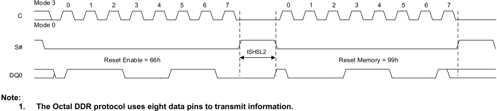

**----- Start of picture text -----** 
Mode 3 0 1 2 3 4 5 6 7 0 1 2 3 4 5 6 7 C Mode 0 S# tSHSL2 Reset Enable = 66h Reset Memory = 99h DQ0 Note: 1.  The Octal DDR protocol uses eight data pins to transmit information. **----- End of picture text -----** 

41 

_**Integrated Silicon Solution, Inc.- www.issi.com**_ **Rev. A14** 

05/12/2026 

**…………………………………………………… ……….IS25LX256/128 IS25WX256/128** 

## **8.4 READ ID OPERATION** 

To initiate this command, S# is driven LOW and the command code is input on DQn. When S# is driven HIGH, the device goes to standby. The operation is terminated by driving S# HIGH at any time during data output. 

**Table 8.3 READ ID Operation** 

|**Operation Name**|**Description/Conditions**|
|---|---|
|READ ID (9Eh/9Fh)|Outputs information shown in the Device ID Data tables. If an ERASE or PROGRAM cycle is in progress when the command is initiated, the command is not decoded and the command cycle in progress is not affected.|

**Figure 8.2 READ ID Command** 

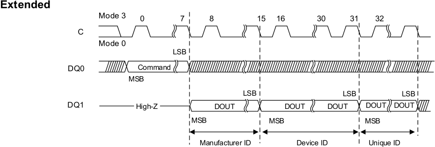

**----- Start of picture text -----** 
Extended Mode 3 0 7 8 15 16 30 31 32 C Mode 0 LSB DQ0 Command MSB LSB LSB LSB DQ1 High-Z DOUT DOUT DOUT DOUT DOUT MSB MSB MSB Manufacturer ID Device ID Unique ID **----- End of picture text -----** 

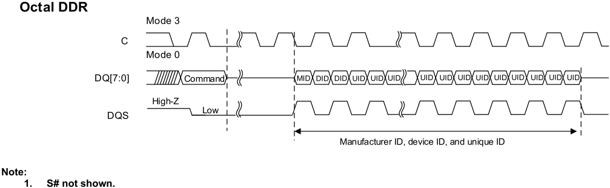

**----- Start of picture text -----** 
Octal DDR Mode 3 C Mode 0 DQ[7:0] Command MID DID DID UID UID UID UID UID UID UID UID UID UID UID UID High-Z Low DQS Manufacturer ID, device ID, and unique ID Note: 1.  S# not shown. **----- End of picture text -----** 

42 

_**Integrated Silicon Solution, Inc.- www.issi.com**_ **Rev. A14** 05/12/2026 

**…………………………………………………… ……….IS25LX256/128 IS25WX256/128** 

## **8.5 READ SFDP OPERATION** 

## **Read SFDP (Serial Flash Discovery Parameter) Command** 

To execute READ SFDP command, S# is driven LOW. The command code is input on DQ0, followed by three address bytes and eight dummy clock cycles. The device outputs the information starting from the specified address. When 256-byte boundary reached, the data output wraps to address 0 of SFDP table. The operation is terminated by driving S# HIGH at any time during data output. 

Note: The operation always executes in continuous mode so the read burst wrap setting in the volatile configuration register does not apply. 

## **Figure 8.3 READ SFDP Command – 5Ah** 

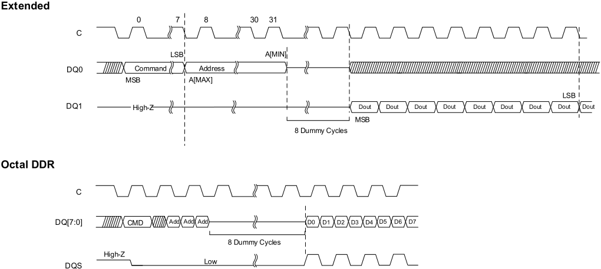

**----- Start of picture text -----** 
Extended 0 7 8 30 31 C LSB A[MIN] DQ0 Command Address MSB A[MAX] LSB DQ1 High- Z Dout Dout Dout Dout Dout Dout Dout Dout Dout MSB 8 Dummy Cycles Octal DDR C DQ[7:0] CMD Add Add Add D0 D1 D2 D3 D4 D5 D6 D7 8 Dummy Cycles High-Z Low DQS **----- End of picture text -----** 

**Note: 1. S# not shown.** 

43 

_**Integrated Silicon Solution, Inc.- www.issi.com**_ **Rev. A14** 

05/12/2026 

**…………………………………………………… ……….IS25LX256/128 IS25WX256/128** 

## **8.6 READ MEMORY OPERATION** 

To initiate a command, S# is driven LOW and the command code is input on DQn, followed by input of the address bytes on DQn. The operation is terminated by driving S# HIGH at any time during data output. 

**Table 8.4 READ MEMORY Operation** 

|**Operation Name**|**Operation Name**||**Description/Conditions**|
|---|---|---|---|
|READ (03h)||1S-1S-1S|The device supports 3-byte addressing (default), with A [23:0] input during address cycle. After any READ command is executed, the device will output data from the selected address. After the boundary is reached, the device will start reading again from the beginning. Each address bit is latched in during the rising edge of the clock. The addressed byte can be at any location, and the address automatically increments to the next address after each byte of data is shifted out; therefore, a die can be read with a single command. FAST READ can operate at higher frequency (fC). DDR commands function in DDR protocol regardless of settings in the nonvolatile configuration register; Other commands function in DDR protocol only after DDR protocol is enabled by the register settings.**Due to the nature of DDR protocol,** **an even number of bytes is always transferred**.**The LSB of the byte** **address shall always be zero when using DDR protocol**. If LSB of the address is set to one when using DDR protocol, the results are indeterminate.|
|FAST READ (0Bh)||1S-1S-1S||
|OCTAL OUTPUT FAST READ (8Bh)||1S-1S-8S||
|OCTAL I/O FAST READ (CBh)||1S-8S-8S||
|DDR OCTAL OUTPUT FAST READ(9Dh)||1S-1D-8D||
|**4-BYTE READ MEMORY Operations** **Table 8.5 4-BYTE READ MEMORY Operation**||||
|**Operation Name**|||**Description/Conditions**|
|4-BYTE READ (13h)|1S-1S-1S||READ MEMORY operations can be extended to a 4-byte address range, with A [31:0] input during address cycle. Selection of 3-byte or 4- byte address can be enabled in two ways: through nonvolatile configuration register or through the ENABLE 4-BYTE ADDRESS MODE/EXIT 4-BYTE ADDRESS MODE commands. Each address bit is latched in during the rising edge of the clock. The addressed byte can be at any location, and the address automatically increments to the next address after each byte of the data is shifted out; therefore, a die can be read with a single command. FAST READ can operate at higher frequency (fC)|
|4-BYTE FAST READ (0Ch)|1S-1S-1S|||
|4-BYTE OCTAL OUTPUT FAST READ (7Ch)|1S-1S-8S|||
|4-BYTE OCTAL I/O FAST READ (CCh)|1S-8S-8S|||
|DDR OCTAL I/O FAST READ (1)(FDh)|1S-8D-8D|||

44 

_**Integrated Silicon Solution, Inc.- www.issi.com**_ **Rev. A14** 05/12/2026 

**…………………………………………………… ……….IS25LX256/128** 

**IS25WX256/128** 

## **READ MEMORY Operations Timings** 

## **Figure 8.4 SDR READ (1S-1S-1S) – 03h/13h[(2)]** 

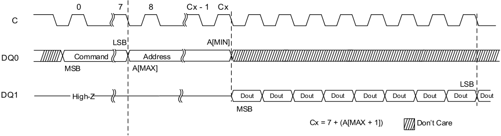

**----- Start of picture text -----** 
0 7 8 Cx - 1 Cx C LSB A[MIN] DQ0 Command Address MSB A[MAX] LSB DQ1 High- Z Dout Dout Dout Dout Dout Dout Dout Dout Dout MSB Cx = 7 + (A[MAX + 1]) Don’t Care **----- End of picture text -----** 

## **Notes:** 

**1. S# not shown.** 

**2. READ and 4-BYTE READ COMMANDS** 

## **Figure 8.5 FAST READ – 0Bh/0Ch[(3)]** 

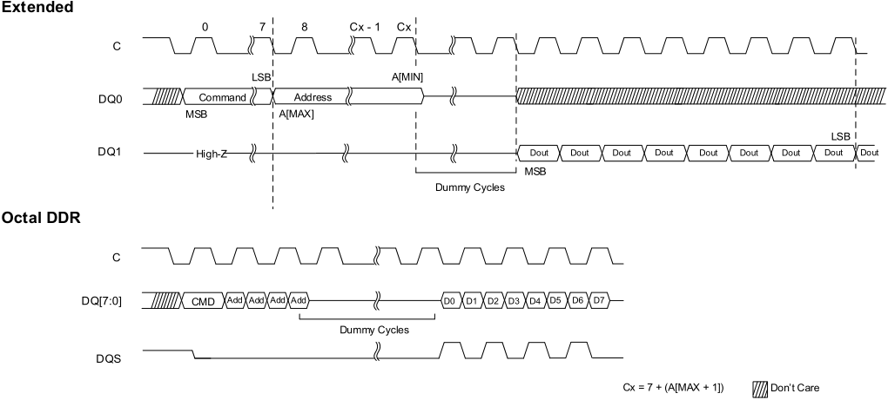

**----- Start of picture text -----** 
Extended 0 7 8 Cx - 1 Cx C LSB A[MIN] DQ0 Command Address MSB A[MAX] LSB DQ1 High- Z Dout Dout Dout Dout Dout Dout Dout Dout Dout MSB Dummy Cycles Octal DDR C DQ[7:0] CMD Add Add Add Add D0 D1 D2 D3 D4 D5 D6 D7  Dummy Cycles DQS Cx = 7 + (A[MAX + 1]) Don’t Care **----- End of picture text -----** 

## **Notes:** 

**1. Timing shows command code 0Bh but this timing also applies to the following DDR protocol command codes, for which device behavior is identical: 8Bh, CBh, 9Dh, FDh, 7Ch, and CCh.** 

**2. S# not shown** 

**3. FAST READ and 4-BYTE FAST READ COMMANDS** 

45 

_**Integrated Silicon Solution, Inc.- www.issi.com**_ **Rev. A14** 

05/12/2026 

**…………………………………………………… ……….IS25LX256/128** 

**IS25WX256/128** 

**Figure 8.6 OCTAL OUTPUT FAST READ (1S-1S-8S) – 8Bh/7Ch[(3)]** 

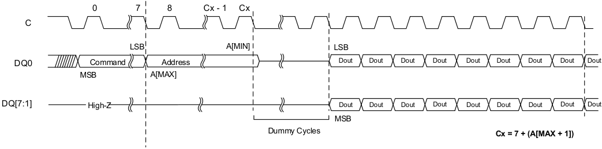

**----- Start of picture text -----** 
0 7 8 Cx - 1 Cx C LSB A[MIN] LSB DQ0 Command Address Dout Dout Dout Dout Dout Dout Dout Dout Dout MSB A[MAX] DQ[7:1] High- Z Dout Dout Dout Dout Dout Dout Dout Dout Dout MSB Dummy Cycles Cx = 7 + (A[MAX + 1]) **----- End of picture text -----** 

## **Notes:** 

**1. Requires 32-bit address in 4-byte address configuration. In octal DDR protocol, the command, address, and data-out bits are transmitted on all eight data pins in DDR mode. The address is fixed with 4-byte.** 

**2. S# not shown** 

**3. OCTAL OUTPUT FAST READ and 4-BYTE OCTAL OUTPUT FAST READ COMMANDS** 

**Figure 8.7 OCTAL I/O FAST READ (1S-8S-8S) – CBh/CCh[(3)]** 

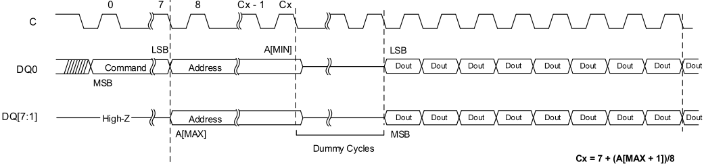

**----- Start of picture text -----** 
0 7 8 Cx - 1 Cx C LSB A[MIN] LSB DQ0 Command Address Dout Dout Dout Dout Dout Dout Dout Dout Dout MSB DQ[7:1] High-Z Address Dout Dout Dout Dout Dout Dout Dout Dout Dout A[MAX] MSB Dummy Cycles Cx = 7 + (A[MAX + 1])/8 **----- End of picture text -----** 

## **Notes:** 

**1. Requires 32-bit address in 4-byte address configuration. In octal DDR protocol, the command, address, and data-out bits are transmitted on all eight data pins in DDR mode. The address is fixed with 4-byte.** 

**2. S# not shown** 

**3. OCTAL I/O FAST READ and 4-BYTE OCTAL I/O FAST READ COMMANDS** 

46 

_**Integrated Silicon Solution, Inc.- www.issi.com**_ **Rev. A14** 05/12/2026 

**…………………………………………………… ……….IS25LX256/128** 

**IS25WX256/128** 

**Figure 8.8 DDR OCTAL OUTPUT FAST READ with DDR ADDRESS and DATA (1S-1D-8D)– 9Dh[(3)]** 

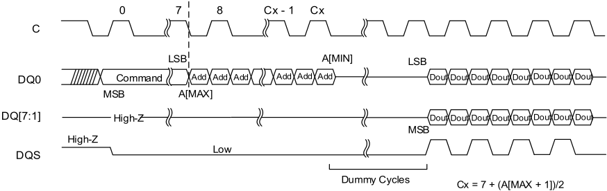

**----- Start of picture text -----** 
0 7 8 Cx - 1 Cx C LSB A[MIN] LSB DQ0 Command Add Add Add Add Add Add Dout Dout Dout Dout Dout Dout Dout Dou t MSB A[MAX] DQ[7:1] High- Z Dout Dout Dout Dout Dout Dout Dout Dou t MSB High-Z Low DQS Dummy Cycles Cx = 7 + (A[MAX + 1])/2 **----- End of picture text -----** 

## **Notes:** 

**1. Requires 32-bit address in 4-byte address configuration. In octal DDR protocol, the command, address, and data-out bits are transmitted on all eight data pins in DDR mode. The address is fixed with 4-byte.** 

**2. S# not shown** 

**3. DDR OCTAL OUTPUT FAST READ COMMAND. No 4-BYTE DDR OCTAL I/O FAST READ COMMAND.** 

**Figure 8.9 4-BYTE DDR OCTAL I/O FAST READ with DDR ADDRESS and DATA (1S-8D-8D) – FDh[(1)]** 

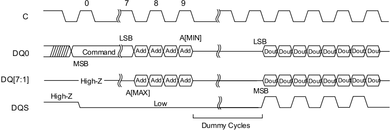

**----- Start of picture text -----** 
0 7 8 9 C LSB A[MIN] LSB DQ0 Command Add Add Add Add Dout Dout Dout Dout Dout Dout Dout Dou t MSB DQ[7:1] High-Z Add Add Add Add Dout Dout Dout Dout Dout Dout Dout Dou t A[MAX] MSB High-Z Low DQS Dummy Cycles **----- End of picture text -----** 

## **Notes:** 

**1. FDh (DDR OCTAL I/O FAST READ COMMAND) is 4-Byte Address command. Always requires 32-bit address. In octal DDR protocol, the command, address, and data-out bits are transmitted on all eight data pins in DDR mode.** 

**2. S# not shown** 

47 

_**Integrated Silicon Solution, Inc.- www.issi.com**_ **Rev. A14** 05/12/2026 

**…………………………………………………… ……….IS25LX256/128 IS25WX256/128** 

## **8.7 WRITE ENABLE/DISABLE OPERATION** 

To initiate a command, S# is driven LOW and held LOW until the eight bit of the command code has been latched in, after which it must be driven HIGH. For extended and Octal SPI protocols respectively, the command code is input on DQ0 and DQ [7:0]. If S# is not driven HIGH after the command code has been latched in, the command is not executed, flag status register error bits are not set, and the write enable latch remains cleared to its default setting of 0, providing protection against errant data modification. 

## **Table 8.6 WRITE ENABLE/DISABLE Operation** 

|**Operation Name**|**Description/Conditions**|
|---|---|
|WRITE ENABLE|Sets the write enable latch bit before each PROGRAM, ERASE, and WRITE command|
|WRITE DISABLE|Clears the write enable latch bit. In case of a protection error, WRITE DISABLE will not clear the bit. Instead, a CLEAR FLAG STATUS REGISTER command must be issued to clear both flags.|

## **Figure 8.10 WRITE ENABLE and WRITE DISABLE Timing** 

## **Extended** 

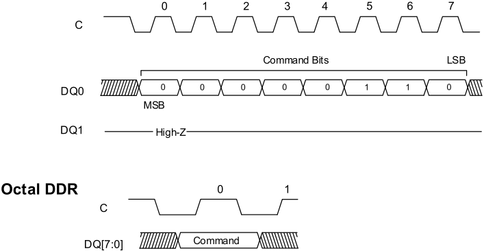

**----- Start of picture text -----** 
0 1 2 3 4 5 6 7 C Command Bits LSB DQ0 0 0 0 0 0 1 1 0 MSB DQ1 High-Z Octal DDR 0 1 C DQ[7:0] Command **----- End of picture text -----** 

## **Notes:** 

**1. WRITE ENABLE command sequence and code, shown here, is 06h (0000 0110 binary). WRITE DISABLE timing is identical, but its command code is 04h (0000 0100 binary).** 

48 

_**Integrated Silicon Solution, Inc.- www.issi.com**_ **Rev. A14** 05/12/2026 

**…………………………………………………… ……….IS25LX256/128 IS25WX256/128** 

## **8.8 READ REGISTER OPERATION** 

To initiate a command, S# is driven LOW. For extended SPI protocol, input is on DQ0, output on DQ1. For octal SPI protocol, I/O is on DQ [7:0]. The operation is terminated by driving S# HIGH at any time during data output. 

**Table 8.7 READ REGISTER Operations** 

|**Operation Name**|**Description/Conditions**|
|---|---|
|READ STATUS REGISTER (05h)|Can be read continuously and at any time, including during a PROGRAM, ERASE, or WRITE OPERATION. If one of these operations is in progress, checking the write in progress bit or P/E controller bit is recommended before executingthe command.|
|READ FLAG STATUS REGISTER (70h)||
|READ NONVOLATILE CONFIGURATION REGISTER (B5h)|When continuously read, the device outputs the same byte repeatedly. All reserved fields output a value of 1.|
|READ VOLATILE CONFIGURATION REGISTER (85h)|When continuously read, the device outputs the same byte repeatedly. All reserved fields output a value of 1.|

## **Figure 8.11 READ STATUS REGISTER – 05h** 

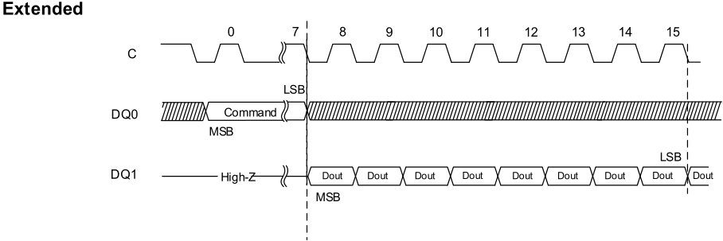

**----- Start of picture text -----** 
Extended 0 7 8 9 10 11 12 13 14 15 C LSB DQ0 Command MSB LSB DQ1 High- Z Dout Dout Dout Dout Dout Dout Dout Dout Dout MSB **----- End of picture text -----** 

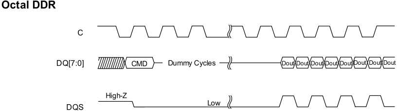

**----- Start of picture text -----** 
Octal DDR C DQ[7:0] CMD Dummy Cycles Dout Dout Dout Dout Dout Dout Dout Dout High-Z Low DQS **----- End of picture text -----** 

49 

_**Integrated Silicon Solution, Inc.- www.issi.com**_ **Rev. A14** 

05/12/2026 

**…………………………………………………… ……….IS25LX256/128** 

**IS25WX256/128** 

## **Figure 8.12 READ CONFIGURATION REGISTER – B5h/85h** 

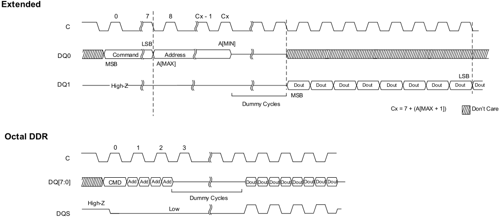

**----- Start of picture text -----** 
Extended 0 7 8 Cx - 1 Cx C LSB A[MIN] DQ0 Command Address MSB A[MAX] LSB DQ1 High- Z Dout Dout Dout Dout Dout Dout Dout Dout Dout MSB Dummy Cycles Cx = 7 + (A[MAX + 1]) Don’t Care Octal DDR 0 1 2 3 C DQ[7:0] CMD Add Add Add Add Dout Dout Dout Dout Dout Dout Dout Dout  Dummy Cycles High-Z Low DQS **----- End of picture text -----** 

## **Notes:** 

**1. S# not shown.** 

**2. Requires 4-bytes of address if device is configured to 4-byte address mode.** 

50 

_**Integrated Silicon Solution, Inc.- www.issi.com**_ **Rev. A14** 05/12/2026 

**…………………………………………………… ……….IS25LX256/128 IS25WX256/128** 

## **8.9 WRITE REGISTER OPERATION** 

Before a WRITE REGISTER command is initiated, the WRITE ENABLE command must be executed to set the write enable latch bit to 1. To initiate a command, S# is driven LOW and held LOW until the eighth bit of the last data byte has been latched in, after which it must be driven HIGH; for the WRITE NONVOLATILE CONFIGURATION REGISTER command. For the extended and octal SPI protocols respectively, input is on DQ0 and DQ [7:0], followed by the data bytes. If S# is not driven HIGH, the command is not executed, flag status register bits are not set, and the write enable latch remains set to 1. The operation is self-timed and its duration is tW for WRITE STATUS REGISTER and tNVCR for WRITE NONVOLATILE CONFIGURATION REGISTER. 

## **Table 8.8 WRITE REGISTER Operations** 

|**Operation Name**|**Description/Conditions**|
|---|---|
|WRITE STATUS REGISTER (01h)|The WRITE STATUS REGISTER command writes new values to status register bits 7:2, enabling software data protection. The status register can also be combined with the W# signal to provide hardware data protection. This command has no effect on status register bits 1:0. For the WRITE STATUS REGISTER and WRITE NONVOLATILE CONFIGURATION REGISTER commands, when the operation is in progress, the write in progress bit is set to 1. The write enable latch bit is cleared to 0, whether the operation is successful or not. The status register and flag staus register can be polled for the operation status. When the operation completes, the write in progress bit is cleared to 0, whether the operation is successful or not.|
|WRITE NONVOLATILE CONFIGURATION REGISTER (B1h)||
|WRITE VOLATILE CONFIGURATION REGISTER (81h)|Because register bits are volatile, change to this bit is immediate. Reserved bits are not affected by this command.|

## **Figure 8.13 WRITE STATUS REGISTER – 01h** 

## **Extended** 

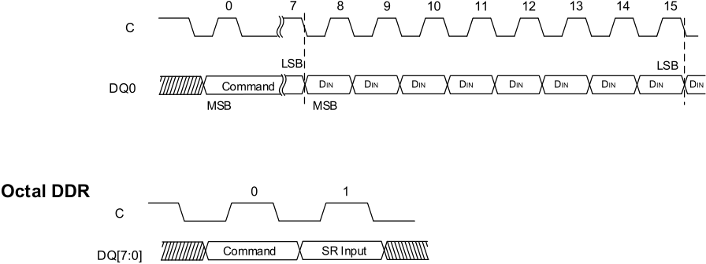

**----- Start of picture text -----** 
0 7 8 9 10 11 12 13 14 15 C LSB LSB DQ0 Command DIN DIN DIN DIN DIN DIN DIN DIN DIN MSB MSB Octal DDR 0 1 C DQ[7:0] Command SR Input **----- End of picture text -----** 

**Note:** 

**1. S# not shown.** 

51 

_**Integrated Silicon Solution, Inc.- www.issi.com**_ **Rev. A14** 

05/12/2026 

**…………………………………………………… ……….IS25LX256/128 IS25WX256/128** 

## **Figure 8.14 WRITE CONFIGURATION REGISTER – B1h/81h** 

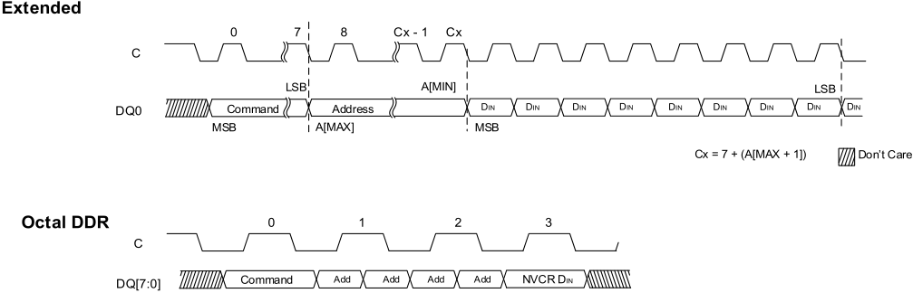

**----- Start of picture text -----** 
Extended 0 7 8 Cx - 1 Cx C LSB A[MIN] LSB DQ0 Command Address DIN DIN DIN DIN DIN DIN DIN DIN DIN MSB A[MAX] MSB Cx = 7 + (A[MAX + 1]) Don’t Care Octal DDR 0 1 2 3 C DQ[7:0] Command Add Add Add Add NVCR DIN **----- End of picture text -----** 

## **Notes:** 

**1. S# not shown.** 

**2. Requires 4-bytes of address if device is configured to 4-byte address mode.** 

52 

_**Integrated Silicon Solution, Inc.- www.issi.com**_ **Rev. A14** 05/12/2026 

**…………………………………………………… ……….IS25LX256/128 IS25WX256/128** 

## **8.10 CLEAR FLAG STATUS REGISTER OPERATION** 

To initiate a command, S# is driven LOW. For extended SPI protocol, input is on DQ0, output on DQ1. For octal SPI protocol, I/O is on DQ [7:0]. The operation is terminated by driving S# HIGH at any time. 

## **Table 8.9 WRITE REGISTER Operations** 

|**Operation Name**|**Description/Conditions**|
|---|---|
|CLEAR FLAG STATUS REGISTER (50h)|Resets the error bits (erase, program, and protection)|

## **Figure 8.15 CLEAR FLAG STATUS REGISTER Timing – 50h** 

## **Extended** 

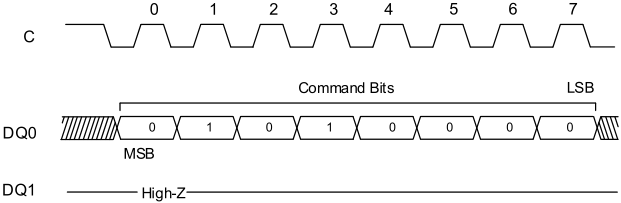

**----- Start of picture text -----** 
0 1 2 3 4 5 6 7 C Command Bits LSB DQ0 0 1 0 1 0 0 0 0 MSB DQ1 High-Z **----- End of picture text -----** 

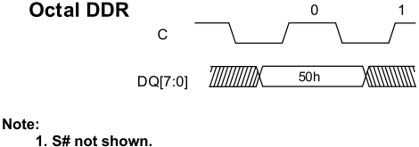

**----- Start of picture text -----** 
Octal DDR 0 1 C DQ[7:0] 50h Note: 1. S# not shown. **----- End of picture text -----** 

53 

_**Integrated Silicon Solution, Inc.- www.issi.com**_ **Rev. A14** 05/12/2026 

**…………………………………………………… ……….IS25LX256/128 IS25WX256/128** 

## **8.11 PROGRAM OPERATION** 

Before a PROGRAM command is initiated, the WRITE ENABLE command must be executed to set the write enable latch bit to 1. To initiate a command, S# is driven LOW and held LOW until the eighth bit of the last data byte has been latched in, after which it must be driven HIGH. If S# is not driven HIGH, the command is not executed, flag status register error bits are not set, and the write enable latch remains set to 1. Each address bit is latched in during the rising edge of the clock. 

When a command is applied to a BP protected sector, the command is not executed, the write enable latch bit **remains set to 1** , and flag status register bits **1 and 4 are set** . 

When a command is applied to an ASP protected sector, the command is not executed, the write enable latch bit **clears to 0** , and flag status register bits **1 and 4 are set** . 

If the operation times out, the write enable latch bit is reset and the program fail bit is set to 1. 

Note: The manner of latching data shown and explained in the timing diagrams ensures that the number of clock pulses is a multiple of one byte before command execution, helping reduce the effects of noisy or undesirable signals and enhancing device data protection. 

## **Table 8.10 PROGRAM Operations** 

|**Operation Name**|**Description/Conditions**|
|---|---|
|PAGE PROGRAM (02h)|A PROGRAM operation changes a bit from 1 to 0. When the operation is in progress, the write in progress bit is set to 1. The write enable latch bit is cleared to 0, whether the operation is successful or not. The status register and flag status register can be polled for the operation status. When the operation completes, the write in progress bit is cleared to 0. An operation can be paused or resumed by the PROGRAM/ERASE SUSPEND or PROGRAM/ERASE RESUME command, respectively. If the bits of the least significant address, which is the starting address, are not all zero, all data transmitted beyond the end of the current page is programmed from the starting address of the same page. If the number of bytes sent to the device exceed the maximum page size, previously latched data is discarded and only the last maximum page- size number of data bytes are guaranteed to be programmed correctly within the same page. If the number of bytes sent to the device is less than the maximum page size, they are correctly programmed at the specified address without any effect on the other bytes of the same page. Due to its nature, Octal DDR operation requires bus transition in **even number**, therefore for program operation, the following restriction apply: - If there is a need to program from odd starting address, keep the even input address and the input data shall start with “FFh”. - - If there is a need to program with odd ending address, simply provide an extra data with “FFh” in the last fallingedge of clock.|
|OCTAL INPUT FAST PROGRAM (82h)||
|EXTENDED OCTAL INPUT FAST PROGRAM (C2h)||

54 

_**Integrated Silicon Solution, Inc.- www.issi.com**_ **Rev. A14** 05/12/2026 

**…………………………………………………… ……….IS25LX256/128** 

**IS25WX256/128** 

## **4-BYTE PROGRAM Operations** 

## **Table 8.11 4-BYTE PROGRAM Operations** 

|**Operation Name**|**Description/Conditions**|
|---|---|
|4-BYTE PAGE PROGRAM (12h)|PROGRAM operations can be extended to a 4-bytes address range, with [A31:0] input during address cycle. Selecton of the 3-byte or 4-byte address range can be enabled in two ways: - through the nonvolatile configuration register. - through the ENABLE 4-BYTE ADDRESS MODE/EXIT 4-BYTE ADDRESS MODE commands.|
|4-BYTE OCTAL INPUT FAST PROGRAM (84h)||
|4-BYTE EXTENDED OCTAL INPUT FAST PROGRAM (8Eh)||

## **Figure 8.16 PAGE PROGRAM – 02h/12h** 

## **Extended** 

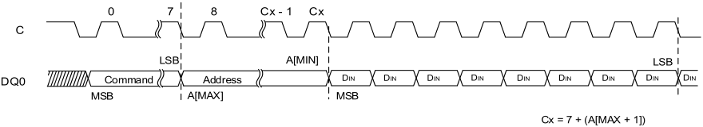

**----- Start of picture text -----** 
0 7 8 Cx - 1 Cx C LSB A[MIN] LSB DQ0 Command Address DIN DIN DIN DIN DIN DIN DIN DIN DIN MSB A[MAX] MSB Cx = 7 + (A[MAX + 1]) **----- End of picture text -----** 

## **Notes:** 

**1. Request 4-bytes of address if device is configured to 4-byte address mode.** 

**2. In Octal DDR protocol, command, address, and data-input bits are transmitted on all eight DQ pins in DDR mode, and address is fixed with 4-byte mode.** 

**3. S# is not shown. The operation is self-timed, and its duration is tPP.** 

## **Figure 8.17 OCTAL INPUT FAST PROGRAM – 82h/84h** 

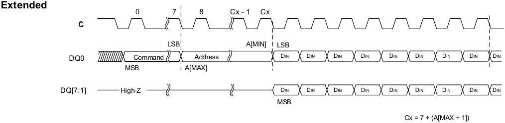

**----- Start of picture text -----** 
Extended 0 7 8 Cx - 1 Cx C LSB A[MIN] LSB DQ0 Command Address DIN DIN DIN DIN DIN DIN DIN DIN DIN MSB A[MAX] DQ[7:1] High-Z DIN DIN DIN DIN DIN DIN DIN DIN DIN MSB Cx = 7 + (A[MAX + 1]) **----- End of picture text -----** 

## **Notes:** 

**1. Requires 4-bytes of address if device is configured to 4-byte address mode.** 

**2. In Octal DDR protocol, command, address, and data-input bits are transmitted on all eight DQ pins in DDR mode, and address is fixed with 4-byte mode.** 

**3. S# is not shown. The operation is self-timed, and its duration is tPP.** 

55 

_**Integrated Silicon Solution, Inc.- www.issi.com**_ **Rev. A14** 05/12/2026 

**…………………………………………………… ……….IS25LX256/128** 

**IS25WX256/128** 

## **Figure 8.18 EXTENDED OCTAL INPUT FAST PROGRAM – C2h/8Eh** 

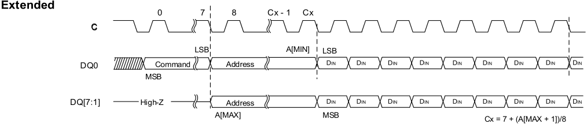

**----- Start of picture text -----** 
Extended 0 7 8 Cx - 1 Cx C LSB A[MIN] LSB DQ0 Command Address DIN DIN DIN DIN DIN DIN DIN DIN DIN MSB DQ[7:1] High-Z Address DIN DIN DIN DIN DIN DIN DIN DIN DIN A[MAX] MSB Cx = 7 + (A[MAX + 1])/8 **----- End of picture text -----** 

**Notes:** 

**1. Requires 4-bytes of address if device is configured to 4-byte address mode.** 

**2. In Octal DDR protocol, command, address, and data-input bits are transmitted on all eight DQ pins in DDR mode, and address is fixed with 4-byte mode.** 

**3. S# is not shown. The operation is self-timed, and its duration is tPP.** 

56 

_**Integrated Silicon Solution, Inc.- www.issi.com**_ **Rev. A14** 05/12/2026 

**…………………………………………………… ……….IS25LX256/128 IS25WX256/128** 

## **8.12 ERASE OPERATION** 

An ERASE operation changes a bit from 0 to 1. Before any ERASE command is initiated, the WRITE ENABLE command must be executed to set the write enable latch bit to 1; if not, the device ignores the command and no error bits are set to indicate operation failure. S# is driven LOW and held LOW until eighth bit of the last data byte has been latched in, after which it must be driven HIGH. The operations are self-timed, and duration is tSSE, tSE, or tBE according to command. 

If S# is not driven HIGH, the command is not executed, flag status register error bits are not set, and the write enable latch remains set to 1. 

When the operation is in progress, the program or erase controller bit of the flag status register is set to 0. In addition, the write in progress bit is set to 1. When the operation completes, the write in progress bit is cleared to 0. The write enable latch bit is cleared to 0, whether the operation is successful or not. If the operation times out, the write enable latch bit is reset and the erase error bit is set to 1. 

The status register and flag status register can be polled for the operation status. When the operation completes, these register bits are cleared to 1. 

Note: For all ERASE operations, noisy or undesirable signal effects can be reduced and device data protection enhanced by holding S# LOW until the eighth bit of the last data byte has been latched in; this ensures that the number of clock pulses is a multiple of one byte before command execution 

## **Table 8.12 ERASE Operations** 

|**Operation Name**|**Description/Conditions**|
|---|---|
|SUBSECTOR ERASE (52h/20h)|Sets the selected subsector or sector bits to FFh. Any address within the subsector is valid for entry. Each address bit is latched in during the rising edge of the clock. The operation can be suspended and resumed by the PROGRAM/ERASE SUSPEND and PROGRAM/ERASE RESUME commands, respectively. The command is not executed if target sector is BP protected. The write enable latch bit**remains set to 1**, and flag status register bits**1 and 5** **are set to 1**. If target sector is ASP protected, the command will not be executed too. But the write enable latch bit**clears to 0**, and flag status register bits**1** **and 5 are set to 1**.|
|SUBSECTOR ERASE (D8h)||
|CHIP ERASE (C7h/60h)|Sets the device bits to FFh. The command is not executed if any sector is BP protected. The write enable latch bit**remains set to 1**, and flag status register bits**1 and 5 are set to 1**. If any sector is ASP protected, the command will be executed on unprotected block. The protected block will be skipped. The write enable latch bit**clears to 0**, and flag status register bits**1 and 5 remain to 0**.|

57 

_**Integrated Silicon Solution, Inc.- www.issi.com**_ **Rev. A14** 05/12/2026 

**…………………………………………………… ……….IS25LX256/128** 

**IS25WX256/128** 

## **Figure 8.19 SUBSECTOR and SECTOR ERASE Timing** 

## **Extended** 

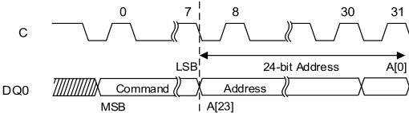

**----- Start of picture text -----** 
0 7 8 30 31 C LSB 24-bit Address A[0] DQ0 Command Address MSB A[23] **----- End of picture text -----** 

**Notes:** 

**1. Requires 4-bytes of address if device is configured to 4-byte address mode.** 

**2. In Octal DDR protocol, command, address, and data-input bits are transmitted on all eight DQ pins in DDR mode, and address is fixed with 4-byte mode.** 

**3. S# is not shown. The operation is self-timed, and its duration is tSSE/tSE.** 

## **Figure 8.20 CHIP ERASE Timing** 

## **Extended** 

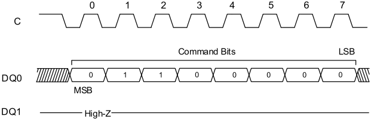

**----- Start of picture text -----** 
0 1 2 3 4 5 6 7 C Command Bits LSB DQ0 0 1 1 0 0 0 0 0 MSB DQ1 High-Z **----- End of picture text -----** 

**Notes:** 

**1. In Octal DDR protocol, command, address, and data-input bits are transmitted on all eight DQ pins in DDR mode. 2. S# is not shown. The operation is self-timed, and its duration is tBE.** 

58 

_**Integrated Silicon Solution, Inc.- www.issi.com**_ **Rev. A14** 05/12/2026 

**…………………………………………………… ……….IS25LX256/128 IS25WX256/128** 

## **8.13 SUSPEND/RESUME OPERATIONS** 

## **PROGRAM/ERASE SUSPEND Operations** 

A PROGRAM/ERASE SUSPEND command enables the memory controller to interrupt and suspend an array PROGRAM or ERASE operation within the program/erase latency. 

To initiate the command, S# is driven LOW, and the command code is input on DQn. The operation is terminated by the PROGRAM/ERASE RESUME command. 

For a PROGRAM SUSPEND, the flag status register bit 2 is set to 1. For an ERASE SUSPEND, the flag status register bit 6 is set to 1. 

After an erase/program latency time, the flag status register bit 7 is also set to 1, but the device is considered in suspended state once bit 7 of the flag status register outputs 1 with at least one byte output. In the suspended state, the device is waiting for any operation. 

If the time remaining to complete the operation is less than the suspend latency, the device completes the operation and clears the flag status register bits 2 or 6, as applicable. Because the suspend state is volatile, if there is a power cycle, the suspend state information is lost and the flag status register powers up as 80h. 

It is possible to nest a PROGRAM/ERASE SUSPEND operation inside a PROGRAM/ERASE SUSPEND operation just once. Issue an ERASE command and suspend it. Then issue a PROGRAM command and suspend it also. With the two operations suspended, the next PROGRAM/ERASE RESUME command resumes the latter operation, and a second PROGRAM/ERASE RESUME command resumes the former (or first) operation. 

## **Table 8.13 SUSPEND Operations** 

|**Operation Name**|**Description/Conditions**|
|---|---|
|PROGRAM SUSPEND (75h)|A READ operation is possible in any page except the one in a suspended state. Reading from a sector that is in a suspended state will output indeterminate data.|
|ERASE SUSPEND (75h)|A PROGRAM or READ operation is possible in any page except the one in a suspended state. Reading from a sector that is in a suspended state will output indeterminate data. During a SUSPEND SUBSECTOR ERASE operation, reading an address in the sector that contains the suspended subsector could output indeterminate data. The device ignores a PROGRAM command to a sector that is in an erase suspend state; it also sets the flag status register bit 4 to 1 (program failure/protection error) and leaves the write enable latch bit unchanged. When the ERASE resumes, it does not check the new lock status of the WRITE VOLATILE LOCK BITS command.|

59 

_**Integrated Silicon Solution, Inc.- www.issi.com**_ **Rev. A14** 05/12/2026 

**…………………………………………………… ……….IS25LX256/128 IS25WX256/128** 

## **PROGRAM/ERASE RESUME Operations** 

To initiate the command, S# is driven LOW, and the command code is input on DQn. The operation is terminated by driving S# HIGH. 

## **Table 8.14 RESUME Operations** 

|**Operation Name**|**Description/Conditions**|
|---|---|
|PROGRAM RESUME (7Ah)|The status register write in progress bit is set to 1 and the flag status register program erase controller bit is set to 0. The command is ignored if the device is not in a suspended state. When the operation is in progress, the program or erase controller bit of the flag status register is set to 0. The flag status register can be polled for the operation status. When the operation completes, that bit is cleared to 1.|
|ERASE RESUME (7Ah)||

## **Note:** 

**3. See the Operations Allowed/Disallowed During Device States table.** 

## **Figure 8.21 PROGRAM/ERASE SUSPEND or RESUME Timing** 

## **Extended** 

**----- Start of picture text -----** 
0 1 2 3 4 5 6 7 C Command Bits LSB DQ0 MSB DQ1 High-Z **----- End of picture text -----** 

**Notes:** 

**1. In Octal DDR protocol, command is transmitted on all eight DQ pins. 2. S# is not shown.** 

60 

_**Integrated Silicon Solution, Inc.- www.issi.com**_ **Rev. A14** 

05/12/2026 

**…………………………………………………… ……….IS25LX256/128 IS25WX256/128** 

## **8.14 ONE-TIME PROGRAMMABLE OPERATION** 

## **READ OTP ARRAY COMMAND** 

To initiate READ OTP ARRAY command, S# is driven LOW. The command code is input on DQ0, followed by address bytes and dummy clock cycles. Each address bit is latched in during the rising edge of C. Data is shifted out on DQ1, beginning from the specified address and at a maximum frequency of fC (MAX) on the falling edge of the clock. The address increments automatically to the next address after each byte of data is shifted out. There is no rollover mechanism; therefore, if read continuously, after location 0x40, the device will output invalid data. The operation is terminated by driving S# HIGH at any time during data output. 

## **Figure 8.22 READ OTP Command** 

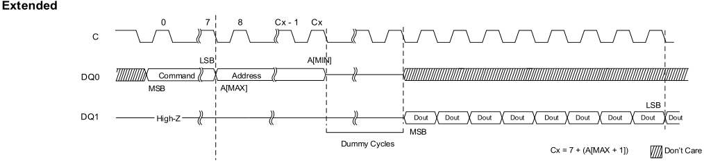

**----- Start of picture text -----** 
Extended 0 7 8 Cx - 1 Cx C LSB A[MIN] DQ0 Command Address MSB A[MAX] LSB DQ1 High-Z Dout Dout Dout Dout Dout Dout Dout Dout Dout MSB Dummy Cycles Cx = 7 + (A[MAX + 1]) Don’t Care **----- End of picture text -----** 

## **Notes:** 

**1. Requires 4-bytes of address if device is configured to 4-byte address mode.** 

**2. In Octal DDR protocol, command, address, and data-input bits are transmitted on all eight DQ pins in DDR mode, and address is fixed with 4-byte mode.** 

**3. S# is not shown.** 

## **PROGRAM OTP ARRAY COMMAND** 

To initiate PROGRAM OTP ARRAY command, the WRITE ENABLE command must be issued to set the write enable bit to 1; otherwise, the PROGRAM OTP ARRAY command is ignored and flag status register bits are not set. S# is driven LOW and held LOW until the eighth bit of the last data byte has been latched in, after which it must be driven HIGH. The command code is input on DQ0, followed by address bytes and at least one data byte. Each address bit is latched. The command code is input on DQ0, followed by address bytes and at least one data byte. Each address bit is latched in during the rising edge of the clock. When S# is driven HIGH, the operation, which is self-timed, is initiated; its duration is tPOTP. There is no rollover mechanism; therefore, after a maximum of 65 bytes are latched in the subsequent bytes are discarded. 

PROGRAM OTP ARRAY programs, at most, 64 bytes to the OTP memory area and one OTP control byte. When the operation is in progress, the write in progress bit is set to 1. The write enable latch bit is cleared to 0, whether the operation is successful or not, and the status register and flag status register can be polled for the operation status. When the operation completes, the write in progress bit is cleared to 0. 

If the operation times out, the write enable latch bit is reset and program fail bit is set to 1. If S# is not driven HIGH, the command is not executed, flag status register error bits are not set, and the write enable latch remains set to 1. The operation is considered complete once bit 7 of the flag status register outputs 1 with at least one byte output. 

The OTP control byte (byte 64) is used to permanently lock the OTP memory array. 

61 

_**Integrated Silicon Solution, Inc.- www.issi.com**_ **Rev. A14** 05/12/2026 

**…………………………………………………… ……….IS25LX256/128** 

**IS25WX256/128** 

## **8.15 ONE-TIME PROGRAMMABLE OPERATION** 

**Table 8.15 OTP Control Byte (Byte 64)** 

|**Bit**|**Name**|**Settings**|**Description**|
|---|---|---|---|
|0|OTP control byte|0 = Locked 1 = Unlocked (Default)|Used to permanently lock the 64-byte OTP array. When bit 0 = 1, the 64-byte OTP array can be programmed. When bit 0 = 0, the 64-byte OTP array is read only. Once bit 0 has been programmed to 0, it can no longer be changed to 1. Program OTP array is ignored, the write enable latch bit remains set, and flagstatus register bit 1 and 4 are set.|

## **Figure 8.23 PROGRAM OTP Command** 

## **Extended** 

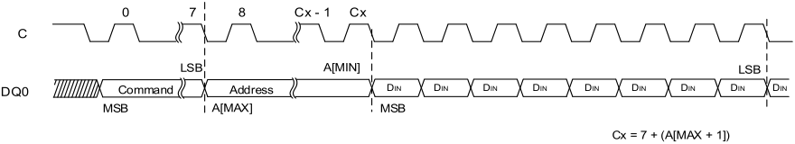

**----- Start of picture text -----** 
0 7 8 Cx - 1 Cx C LSB A[MIN] LSB DQ0 Command Address DIN DIN DIN DIN DIN DIN DIN DIN DIN MSB A[MAX] MSB Cx = 7 + (A[MAX + 1]) **----- End of picture text -----** 

## **Notes:** 

**1. Requires 4-bytes of address if device is configured to 4-byte address mode.** 

**2. In Octal DDR protocol, command, address, and data-input bits are transmitted on all eight DQ pins in DDR mode, and address is fixed with 4-byte mode.** 

**3. S# is not shown.** 

62 

_**Integrated Silicon Solution, Inc.- www.issi.com**_ **Rev. A14** 05/12/2026 

**…………………………………………………… ……….IS25LX256/128 IS25WX256/128** 

## **8.16 ADDRESS MODE OPERATION** 

To initiate these commands, S# is driven LOW, and the command is input on DQn. 

## **Table 8.16 ENTER or EXIT 4-BYTE ADDRESS MODE Operations** 

|**Operation Name**|**Description/Conditions**|
|---|---|
|ENTER 4-BYTE ADDRESS MODE (B7h)|The effect of the command is immediate. The default address mode is three bytes, and the device returns to default upon exiting the 4-byte address mode.|
|EXIT 4-BYTE ADDRESS MODE (E9h)||

## **Note:** 

**1. 3-byte address mode (Default) or 4-byte address mode in Extended protocol. In Octal DDR protocol, always fixed 4-byte address mode is supported.** 

63 

_**Integrated Silicon Solution, Inc.- www.issi.com**_ **Rev. A14** 05/12/2026 

**…………………………………………………… ……….IS25LX256/128** 

**IS25WX256/128** 

## **8.17 STATE TABLE** 

The device can be only one state at a time except for optional read while write operation.  Depending on the state of the device, some operations shown in the table below are allowed (Yes) and others are not (No). For example, when the device is in standby state, all operations except SUSPEND are allowed in any sector. In the erase suspend state, a PROGRAM operation is allowed in any sector except the one in which an ERASE operation has been suspended. 

## **Table 8.17 Operations Allowed/Disallowed During Device States** 

|**Operation**|**Standby State**|**Program or** **Erase State**|**Subsector Erase Suspend or** **Program Suspend State**|**Erase Suspend** **State**|**Notes**|
|---|---|---|---|---|---|
|READ Flash Array|Yes|**Yes(8)/No**|Yes|Yes|1|
|READ (status/flag status/volatile configurationregisters)|Yes|Yes|Yes|Yes|6|
|PROGRAM|Yes|No|No|Yes/No|2|
|ERASE (sector/subsector)|Yes|No|No|No|3|
|WRITE|Yes|No|No|No|4|
|WRITE|Yes|No|Yes|Yes|5|
|SUSPEND|No|Yes|No|No|7|

## **Notes:** 

**1. When issued to a sector or subsector that is simultaneously in an erase suspend state, the READ operation is accepted, but the data output is not guaranteed until erase has completed.** 

**2. All PROGRAM operations except PROGRAM OTP Array (42h). In the erase suspend state, a PROGRAM operation is allowed in any sector (Yes) except the sector (No) in which ERASE operation has been suspended.** 

**3. Applies to the SECTOR ERASE or SUBSECTOR ERASE operation.** 

**4. Applies to the following operations: WRITE STATUS REGISTER, WRITE NONVOLATILE CONFIGURATION REGISTER, PROGRAM OTP Array, WRITE PROTECTION MANAGEMENT REGISTER, WRITE PASSWORD, PROGRAM SECTOR PPROTECTION and CHIP ERASE.** 

**5. Applies to the following operations: WRITE VOLATILE CONFIGURATION REGISTER, WRITE ENABLE, WRITE DISABLE, CLEAR FLAG STATUS REGISTER operation.** 

**6. Applies to READ STATUS REGISTER, READ FLAG STATUS REGISTER or READ volatile configuration REGISTER operation.** 

**7. Applies to PROGRAM SUSPEND or ERASE SUSPEND operation.** 

**8. In an optional device (option L), READ Flash Array operation is allowed in any bank (Yes) except the bank (No) in which PROGRAM/ERASE operation has been in progress (Read While Write Operation).** 

64 

_**Integrated Silicon Solution, Inc.- www.issi.com**_ **Rev. A14** 05/12/2026 

**…………………………………………………… ……….IS25LX256/128 IS25WX256/128** 

## **8.18 XIP MODE** 

Execute-in-place (XIP) mode allows the memory to be read by sending an address to the device and then receiving the data on one or eight pins in parallel, depending on the customer requirements. XIP mode offers maximum flexibility to the application, saves instruction overhead, and reduces random access time. 

## **ACTIVATE or TERMINATE XIP Using Volatile Configuration Register** 

Applications that boot in SPI and must switch to XIP use volatile configuration register. XIP provides faster memory READ operations by requiring only an address to execute, rather than a command code and an address. 

To activate XIP requires two steps; 

- First, enable XIP by setting volatile configuration register (byte 6). 

- Next, drive the XIP confirmation bit to 0 during next FAST READ operation. XIP is then active. 

Once in XIP, any Fast Read Operation that occurs after S# is toggled requires only address bits to execute; a Fast Read command code is not necessary, and device operations use the SPI protocol. XIP is terminated by driving XIP confirmation bit to 1. Then the device automatically resets the XIP volatile configuration register to FFh. 

## **ACTIVATE or TERMINATE XIP Using Nonvolatile Configuration Register** 

Applications that must boot directly in XIP use nonvolatile configuration register. To enable a device to power-up in XIP using register, set nonvolatile configuration register (byte 6). Settings vary according to protocol, as explained in the Nonvolatile Configuration Register Section. Because the device boots directly in XIP, after the power cycle, no command code is necessary. XIP is terminated by driving XIP confirmation bit to 1. 

## **Figure 8.24 XIP Mode Entered at Power-On** 

## **Octal DDR** 

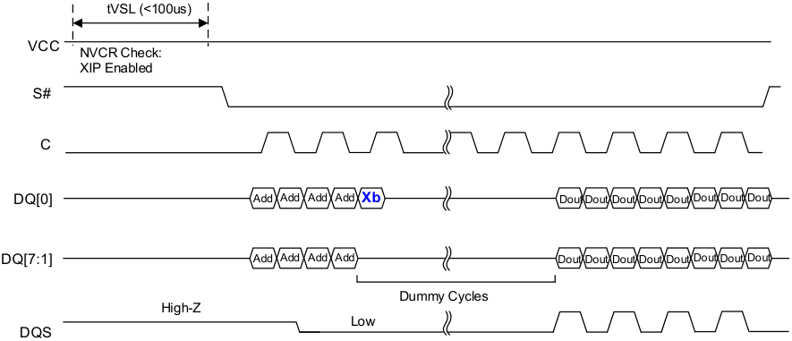

**----- Start of picture text -----** 
tVSL (<100us) VCC NVCR Check: XIP Enabled S# C DQ[0] Add Add Add Add Xb Dout Dout Dout Dout Dout Dout Dout Dout DQ[7:1] Add Add Add Add Dout Dout Dout Dout Dout Dout Dout Dout  Dummy Cycles High-Z Low DQS **----- End of picture text -----** 

## **Notes:** 

**1. Xb is the XIP confirmation bit and should be set as follows: 0 to keep XIP state; 1 to exit XIP mode and return to standard read mode.** 

**2. Example of NVCR. 06h = FEh (8IOFR XIP) in Octal DDR protocol** 

65 

_**Integrated Silicon Solution, Inc.- www.issi.com**_ **Rev. A14** 

05/12/2026 

**…………………………………………………… ……….IS25LX256/128 IS25WX256/128** 

## **Figure 8.25 XIP Mode Entry by Volatile Configuration Register** 

## **Extended** 

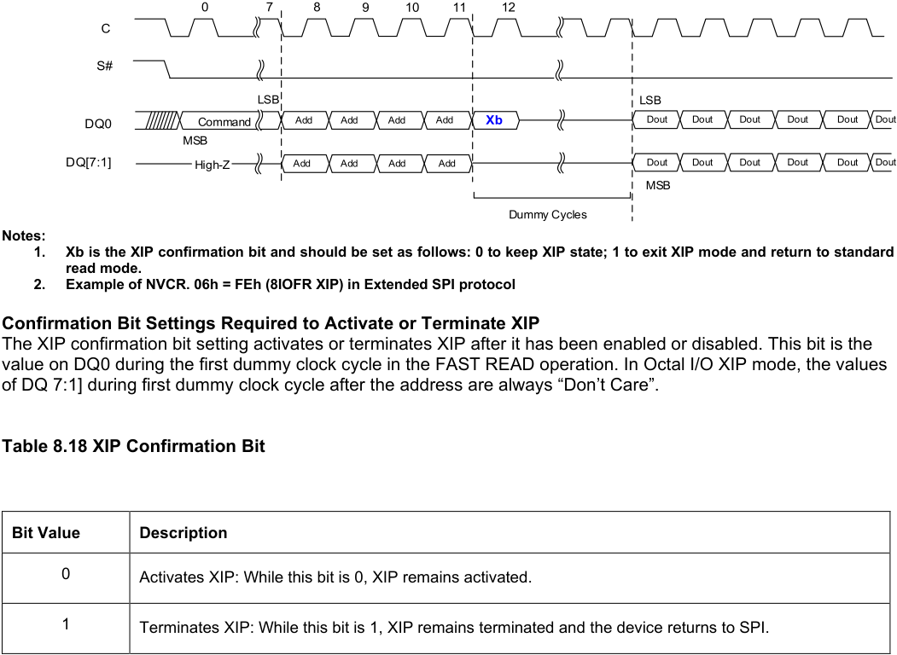

**----- Start of picture text -----** 
0 7 8 9 10 11 12 C S# LSB LSB DQ0 Command Add Add Add Add Xb Dout Dout Dout Dout Dout Dout MSB DQ[7:1] High-Z Add Add Add Add Dout Dout Dout Dout Dout Dout MSB Dummy Cycles Notes: 1.  Xb is the XIP confirmation bit and should be set as follows: 0 to keep XIP state; 1 to exit XIP mode and return to standard read mode. 2.  Example of NVCR. 06h = FEh (8IOFR XIP) in Extended SPI protocol Confirmation Bit Settings Required to Activate or Terminate XIP The XIP confirmation bit setting activates or terminates XIP after it has been enabled or disabled. This bit is the value on DQ0 during the first dummy clock cycle in the FAST READ operation. In Octal I/O XIP mode, the values of DQ 7:1] during first dummy clock cycle after the address are always “Don’t Care”. Table 8.18 XIP Confirmation Bit Bit Value  Description 0  Activates XIP: While this bit is 0, XIP remains activated. 1  Terminates XIP: While this bit is 1, XIP remains terminated and the device returns to SPI. **----- End of picture text -----** 

**1. Xb is the XIP confirmation bit and should be set as follows: 0 to keep XIP state; 1 to exit XIP mode and return to standard read mode.** 

## **Table 8.19 Effects of Running XIP in different Protocols** 

|**XIP Configuration (NVCR. 06h)**|**Description**|
|---|---|
|Fast Read (F8h), 8OFR (FDh) in Extended SPIprotocol|A LOW pulse on RESET# pin resets XIP and the device to the state it was in previous to the last power-up, as defined by the non-volatile configuration register.|
|8IOFR (FEh) inExtended SPIprotocol|Values of DQ [7:1] during first dummy clock cycles are “Don’t Care”.|
|Fast Read (F8h), 8OFR (FDh), 8IOFR (FEh) inOctal DDRprotocol||

66 

_**Integrated Silicon Solution, Inc.- www.issi.com**_ **Rev. A14** 

05/12/2026 

**…………………………………………………… ……….IS25LX256/128 IS25WX256/128** 

## **Terminating XIP after a Controller and Memory Reset** 

The system controller and the device can become out of synchronization if, during the life of the application, the system controller is reset without the device being reset. In such a case, the controller can reset the memory to power-on reset if the memory has reset functionality. 

The following sequence causes the controller to set the XIP configuration bit to 1, thereby terminating XIP. However, it does not reset the device or interrupt PROGRAM/ERASE operations that may be in progress. After terminating XIP, the controller must execute RESET ENABLE and RESET MEMORY to implement a software reset and reset the device. It’s required to have DQ0 equal to 1 for the situations listed here: 

- 3 clock cycles within S# LOW (S# becomes HIGH before 4[th] clock cycle) + 

- 4 clock cycles within S# LOW (S# becomes HIGH before 5[th] clock cycle) + 

- 5 clock cycles within S# LOW (S# becomes HIGH before 6[th] clock cycle) + 

- 25 clock cycles within S# LOW (S# becomes HIGH before 26[th] clock cycle) + 

- • 33 clock cycles within S# LOW (S# becomes HIGH before 34[th] clock cycle) + 

67 

_**Integrated Silicon Solution, Inc.- www.issi.com**_ **Rev. A14** 05/12/2026 

**…………………………………………………… ……….IS25LX256/128 IS25WX256/128** 

## **8.19 POWER-UP AND POWER-DOWN** 

## **Power-Up and Power-Down Requirements** 

At power-up and power-down, the device must not be selected; that is, S# must follow the voltage applied on Vcc reaches the correct values; VCC,min at power-up and VSS at power-down. 

To provide device protection and prevent data corruption and inadvertent WRITE operations during power-up, a power-on reset circuit is included. The logic inside the device is held to RESET while VCC is less than the poweron reset threshold voltage shown here; all operations are disabled, and the device does not respond to any instruction. During a standard power-up phase, the device ignores all commands except READ STATUS REGISTER and READ FLAG STATUS REGISTER. These operations can be used to check the memory internal state. After power-up, the device is in standby power mode; the write enable latch bit is reset; the write in progress bits is reset; and the dynamic protection register is configured as (write lock bit, lock down bit) = (0, 0). 

Normal precautions must be taken for supply line decoupling to stabilize the VCC supply. Each device in a system should have the VCC line decoupled by a suitful capacitor (typically 100nF) close to package pins. At power-down, when VCC drops from the operating voltage to below the power-on-reset threshold voltage shown here, all operations are disabled and the device does not respond to any command. 

When the operation is in progress, the program or erase controller bit of the status register is set to 0. To obtain the operation status, the flag status register must be polled. When the operation completes, the program or erase controller bit is cleared to 1. The cycle is complete after the flag status register outputs the program or erase controller bit to 1. 

## **Note: If power-down occurs while a WRITE, PROGRAM, or ERASE cycle is in progress, data corruption may occur.** 

VPPH must be applied only when VCC is stable and in the VCC,min to VCC, max voltage range. 

## **Figure 8.26 Power-Up Timing** 

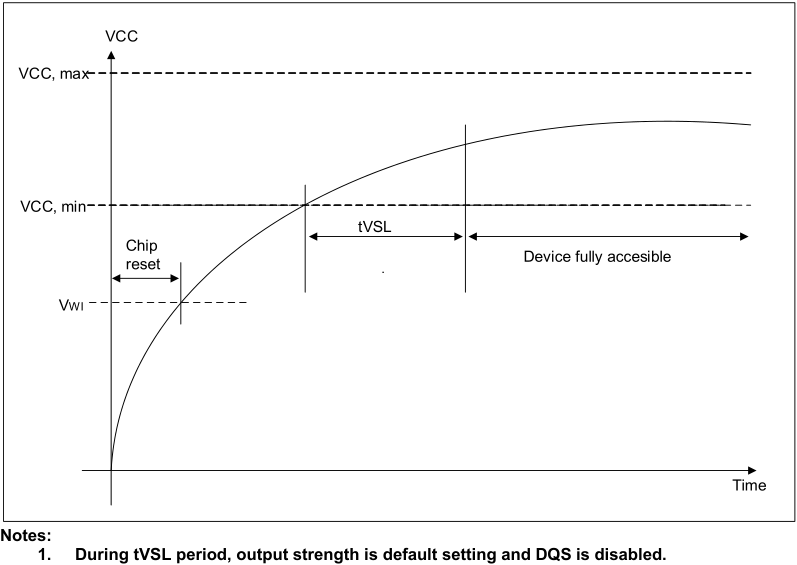

**----- Start of picture text -----** 
VCC VCC, max VCC, min tVSL Chip reset .  Device fully accesible VWI Time Notes: 1.  During tVSL period, output strength is default setting and DQS is disabled. **----- End of picture text -----** 

**----- Start of picture text -----** 
Notes: **----- End of picture text -----** 

68 

_**Integrated Silicon Solution, Inc.- www.issi.com**_ **Rev. A14** 

05/12/2026 

**…………………………………………………… ……….IS25LX256/128** 

**IS25WX256/128** 

**Table 8.20 Power-Up Timing and VWI Threshold** 

|**Symbol**|**Parameter**|**Parameter**|**Min**|**Max**|**Unit**|**Notes**|
|---|---|---|---|---|---|---|
|tVSL|VCC, min to device accessible||300|-|us|1, 2|
|VWI|Write Inhibit Voltage|IS25LX|-|2.5|V|1|
|||IS25WX|-|1.5|V|1|

## **Notes:** 

**1. Parameters listed are characterized only.** 

**2. On the first power-up after an event causing a sub-sector ERASE operation interrupt (for example, due to power-loss), the maximum time for tVSL will be up to 4.5ms in case of 4KB subsector erase interrupt and up to 36ms in case of 32KB subsector erase interrupt, this accounts for erase recovery embedded operation.** 

69 

_**Integrated Silicon Solution, Inc.- www.issi.com**_ **Rev. A14** 05/12/2026 

**…………………………………………………… ……….IS25LX256/128** 

**IS25WX256/128** 

## **8.20 DATA LEARNING PATTERN READ OPERATION FOR TRAINING (DLPRD)** 

The Data Learning Pattern is preamble bits, and it can help host controller to determine the phase shift from clock to data edges so that controller can capture data at the center of the data eye at high frequency operation. 

DLPRD function is supported in both Extended SPI mode and Octal DDR mode. 

- DLPRD (CDh) in Extended SPI mode: 1S-0-8D operation, 8-bit SDR command is transferred through DQ0 only, and DDR data is transferred through DQ0 to DQ7 

- DLPRD (CDh+CDh) in Octal DDR mode: 8D-0-8D, 16-bit DDR command and DDR data are transferred through DQ0 to DQ7. 

- **DQS must be always ON during DLPRD operation.** 

## **Note: To place DQS and DQ on the same position with DDR Octal I/O Read or Octal DDR read operation with 32-bit address, dummy cycle of DLPRD = Dummy cycle setting of each operation + 2 clock cycle (Default: 16 cycles + 2 cycles = 18 cycles).** 

The sequence of issuing DLPRD instruction is: CE# goes low → sending DLPRD instruction → dummy cycles → DLP data out repeatedly until CE# goes high. 

## **Note: DLP data is repeated after beat 7 if CE# remains LOW until CE# goes HIGH. Beat 7** → **beat 6** → **…beat 0** → **beat 7** → **beat 6** → **….** 

DLP pattern is an 8-bit data pattern in Configuration Register (bits [7:0], address; 0Ah), and default values are 01010101. 

## **Predefined pattern can be changed with Configuration Register Write Operation.** 

Also SSO pattern can be selected when SSOENB bit of Configuration Register (bit [6], address; 0Bh) sets to “1” like below. 

**Table 8.21 Data Learning Pattern** 

|SSOSEL (bit 6, 0Bh)|**IO Pattern**|**DQ0~DQ2, DQ4~DQ7**|**DQ3**|
|---|---|---|---|
|Bit 6 = 1 (default; SSO disabled)|All 8 DQs are same|0101 0101|0101 0101|
|Bit 6 = 0 (SSO enabled)|DQ3 is inverted (7 DQs are same)|0101 0101|1010 1010|

## **Figure 8.27 DLPRD Sequence in Extended SPI mode (NVCR. 00h = FFh)** 

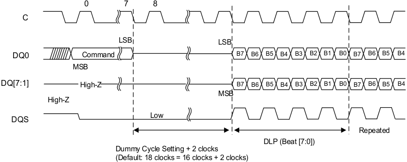

**----- Start of picture text -----** 
0 7 8 C LSB LSB DQ0 Command B7 B6 B5 B4 B3 B2 B1 B0 B7 B6 B5 B4 MSB DQ[7:1] High- Z B7 B6 B5 B4 B3 B2 B1 B0 B7 B6 B5 B4 MSB High-Z Low DQS Repeated DLP (Beat [7:0]) Dummy Cycle Setting + 2 clocks (Default: 18 clocks = 16 clocks + 2 clocks) **----- End of picture text -----** 

70 

_**Integrated Silicon Solution, Inc.- www.issi.com**_ **Rev. A14** 

05/12/2026 

**…………………………………………………… ……….IS25LX256/128 IS25WX256/128** 

## **Figure 8.28 DLP READ Sequence in Octal DDR mode.** 

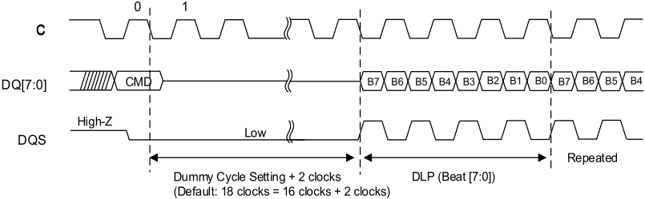

**----- Start of picture text -----** 
0 1 C DQ[7:0] CMD B7 B6 B5 B4 B3 B2 B1 B0 B7 B6 B5 B4 High-Z Low DQS Repeated Dummy Cycle Setting + 2 clocks DLP (Beat [7:0]) (Default: 18 clocks = 16 clocks + 2 clocks) **----- End of picture text -----** 

71 

_**Integrated Silicon Solution, Inc.- www.issi.com**_ **Rev. A14** 05/12/2026 

**…………………………………………………… ……….IS25LX256/128 IS25WX256/128** 

## **8.21 ECC OPERATION** 

ECC (Error Checking and Correcting) is to prevent stored data errors. 

The device implemented On-Chip ECC, which can correct 1-bit error and detect 2-bit error per 16-byte chunk. (SEC-DED: Single Error Correction and Double Error Detection) 

When ECC is ON, it is recommended that data be programmed in multiple of 16 bytes in predefined 16-byte chunk address using Page Program command instead of single byte or single word programming. 

However, partial programming of 16-byte chuck is allowed under the restriction that user cannot program or alter the content of partially programmed chunk without erasing a sector, which includes partially programmed chunk. 

Double programming (rewriting without erase), or rewrite partially programmed chunk (alternating of single bit, byte, or word without erasing within 16-byte ECC chunk) is an illegal operation, and automatically aborted. Also bit 7 of address 0Bh of volatile configuration register will be set to 1. 

ECC registers show detailed information for error correction activity on the device. The ECC status registers are placed on the Volatile Configuration Register, which include 3-bit ECC status ( bit [2:0] in address 0Ch) to identify the error type, 4-bit ECC counter ( bit [6:3]and first event chunk address ( address 14h~address 17h). First ECC event for chunk address will be selected by setting of EERRBECC bit of 0Bh. 

The Volatile ECC registers values can be reset through either of the following situations: 

- CLRERR command (B6h) 

- Issuing Software RESET command 

- Hardware RESET 

- JEDEC Standard In-Band RESET 

- Power-up cycle 

## **Table 8.22 16-byte ECC Chunks within a Page (256 byte)** 

|Chunk#|**0**|**1**|**2**|**3**|**4**|**5**|**6**|**7**|**8**|**9**|**10**|**11**|**12**|**13**|**14**|**15**|
|---|---|---|---|---|---|---|---|---|---|---|---|---|---|---|---|---|
|16 Bytes|**B0** **~** **B15**|**B16** **~** **B31**|**B32** **~** **B47**|**B48** **~** **B63**|**B64** **~** **B79**|**B80** **~** **B95**|**B96** **~** **B127**|**B128** **~** **B143**|**B144** **~** **B159**|**B160** **~** **B175**|**B144** **~** **B159**|**B176** **~** **B191**|**B192** **~** **B207**|**B208** **~** **B223**|**B224** **~** **B239**|**B240** **~** **B255**|

72 

_**Integrated Silicon Solution, Inc.- www.issi.com**_ **Rev. A14** 05/12/2026 

**…………………………………………………… ……….IS25LX256/128 IS25WX256/128** 

## **8.22 PROGRAM ADDRESS PARITY CHECK AND PROGRAM ARRAY DATA CRC CHECK OPERATION PROGRAM ADDRESS PARITY** 

The program address parity check function and program array data CRC check (1-bit CRC) function are supported at Octal DDR protocol only. 

The CRCENB bit (bit 3 in Configuration Register [address 0Bh]) can enable both program address parity check function and program data CRC check. Both are **EVEN** parity check. 

For a program address parity check operation, the host must input parity check bits (8-bits) on the rising edge of clock after the 4-byte address cycles in Octal DDR mode. 

**If Parity error is detected, the command will be aborted, PARSTAT bit (bit [1] of 0Ch in volatile configuration register) will be set to “1”.** 

CLRERR command (B6h) will clear PARSTAT bit to “0”. 

The program address parity bits are calculated by bitwise exclusive-OR of corresponding input pin. (bit 0 is calculated by addresses on the DQ0 pin; A0, A8, A16, and A24 out of 32 addresses) 

## **PROGRAM ARRAY DATA CRC** 

The program array data CRC check function is a data parity check function in a program operation. The program data size must be multiple of CRC chunk size, set by CRCSIZE bits (bits [5:4] of address 0Bh in configuration register), and 8-bit CRC code (data parity bits) should be following program data on the rising edge of clock. 

Also, starting address has to be at CRC chunk boundary. 

Otherwise, program array data CRC check might result in an error, and program operation would be aborted. The CRC chunk unit is default to set as 16 bytes. 

If CRC chunk size is set to 16-byte, and total program data size is 32-byte, then host will input 8-bit CRC code on the rising clock edge after 16-byte of programming data. Remaining 16-byte of program data will be input on the next rising edge of clock, and 8-bit CRC code will be followed after the end of program data. 

**If CRC error is detected, the program command will be aborted, CRCSTAT bit (bit [0] of 0Ch in volatile configuration register) will be set to “1”.** 

CLRERR command (B6h) will clear CRCSTAT bit to “0”. 

8-bit CRC code is also calculated by bitwise exclusive-OR of corresponding input pin in the CRC chunk. For example, CRC code bit 0 is calculated by all the bits of DQ0 pin in the CRC chunk. 

**Figure 8.29 PROGRAM Address Parity and Programming Array Data CRC Timing (S#, C, DQ [7:0])** 

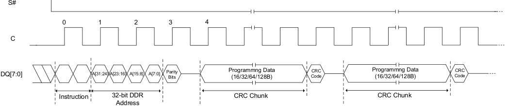

**----- Start of picture text -----** 
S# 0 1 2 3 4 C DQ[7:0] A[31:24] A[23:16] A[15:8] A[7:0] ParityBits Programmng Data (16/32/64/128B) CodeCRC  Programmng Data (16/32/64/128B) CodeCRC Instruction 32-bit DDR  CRC Chunk CRC Chunk Address **----- End of picture text -----** 

73 

_**Integrated Silicon Solution, Inc.- www.issi.com**_ **Rev. A14** 

05/12/2026 

**…………………………………………………… ……….IS25LX256/128** 

**IS25WX256/128** 

## **8.23 ERR# SIGNAL OPERATION** 

The ERR# pin is a real time indication signal for the ECC event. The ERR# pin is designed as an open drain structure. 

In normal situation, the ERR# is kept on Hi-Z state. Once ECC event occurs, the ERR# pin will pull LOW and stays LOW until RESET the device or until CLRERR command (B6h) is issued. 

When ERR# signal goes LOW after detecting ECC error, especially when 2-bit detection error occurred, ERR# signal must be LOW before the end of ECC chunk read data for host to block wrong read data from the device. 

So valid ERR# LOW signal must be within ECC chunk read data (tERR). tERR is from beginning of ECC chunk read data to ERR# LOW, and is maximum 2 clock cycles. 

|**Symbol**|**Parameter**|**Min**|**Typ**|**Max**|**Units**|
|---|---|---|---|---|---|
|tERR|ERR# Access time from beginning of ECC chunk|-||2|Clock|

The user can select ERR# corresponding ECC event type; 1-bit correction or 2-bit detection by setting ERRBECC bit (bit 2 of address 0Bh in configuration register). 

ERRBECC bit also selects ECC event type for storage of ECC occurred address location. 

If it is set to “1”, 

- ERR# signal reacts only to the 2-bit detection only. 

- The address for first 2-bit detection occurred location will be stored on the volatile configuration register (address 10h~0Dh). 

To confirm error type (2-bit detection) after ERR# signal goes LOW, host could check ECCSTAT bits (bit [2] of address 0Ch in configuration register). 

**The ERR# signal goes to high-z state by CLRERR command (B6h), which also clears all volatile register values related Parity error, CRC error and ECC error.** 

74 

_**Integrated Silicon Solution, Inc.- www.issi.com**_ **Rev. A14** 05/12/2026 

**…………………………………………………… ……….IS25LX256/128 IS25WX256/128** 

## **Figure 8.30 ERR# Signal Timing when detecting ECC error** 

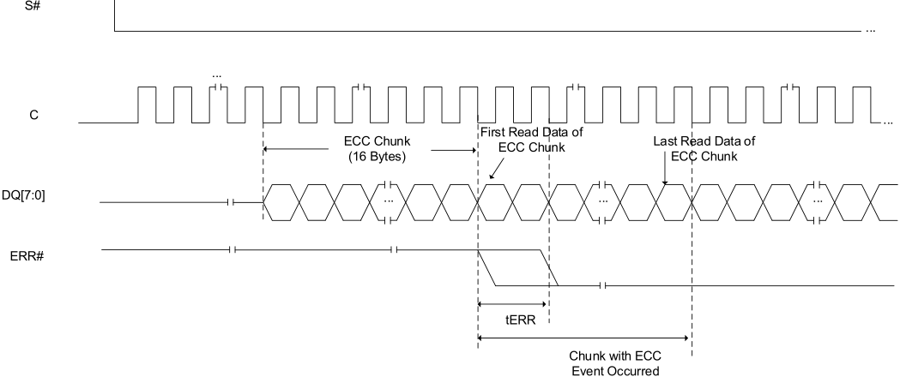

**----- Start of picture text -----** 
S# ... ... C First Read Data of  ... ECC Chunk  Last Read Data of ECC Chunk (16 Bytes) ECC Chunk DQ[7:0] ... ... ... ERR# tERR Chunk with ECC Event Occurred **----- End of picture text -----** 

## **8.24 CLEAR ERRB OPERATION** 

The CLERRB operation (B6h) disables ERR# signal, which has been LOW to indicate ECC error. 

Also it resets ECCSTAT bit, PARSTAT bit, CRCSTAT bit, ECCCOUNTER bits, IPA_ECCB bit, and ECCFCA bits to default state. 

Also power-on cycle or Hardware RESET/Software RESET operation will disables ERR# signal, and clears volatile register bits. 

75 

_**Integrated Silicon Solution, Inc.- www.issi.com**_ **Rev. A14** 05/12/2026 

**…………………………………………………… ……….IS25LX256/128** 

**IS25WX256/128** 

## **8.25 READ WHILE PROGRAM/ERASE OPERATION** 

The read while program/erase feature allows the host system to read data from any other 3 banks while program or erase operation is in progress at one bank of memory array. 

The read while program/erase feature can be used to perform the following: 

- Read another bank out of remaining 3 banks of memory array while Erase is in progress in one bank. 

- Read another bank out of remaining 3 banks of memory array while Program in progress in one bank. 

- At any time, only one bank is available for program/erase operation. 

To check which bank is in the middle of program/erase operation, host can check it by reading BANKSTAT bits [bit [2:0] of address 17h] 

The device can improve overall system performance by allowing a host system to program or erase in one bank, then immediately read array data from remaining bank, with zero latency. 

This releases the system from waiting for the completion of program or erase operations or suspend operation. 

## **NOTE: Read while Program/Erase function is supported by optional device (option L) only.** 

## **Figure 8.31 Block Diagram while Program/Erase Operation** 

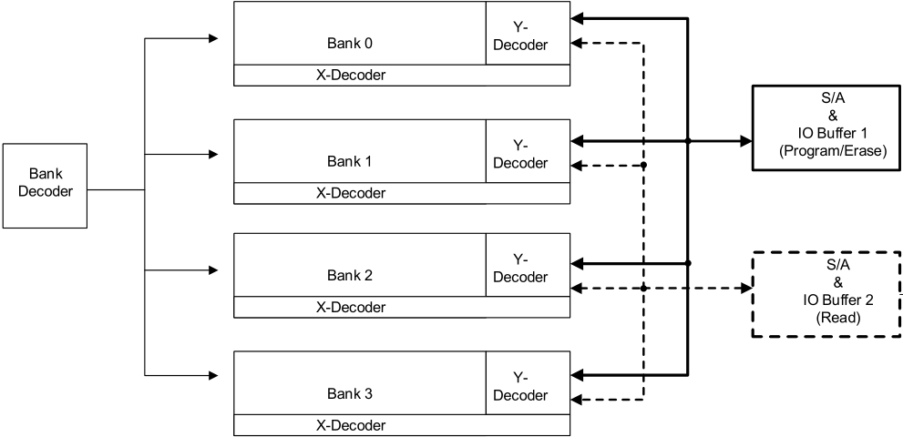

**----- Start of picture text -----** 
Y- Bank 0 Decoder X-Decoder S/A & IO Buffer 1 Y- (Program/Erase) Bank 1 Decoder Bank Decoder X-Decoder Y- S/A Bank 2 Decoder & IO Buffer 2 X-Decoder (Read) Y- Bank 3 Decoder X-Decoder **----- End of picture text -----** 

76 

_**Integrated Silicon Solution, Inc.- www.issi.com**_ **Rev. A14** 

05/12/2026 

**…………………………………………………… ……….IS25LX256/128 IS25WX256/128** 

## **8.26 PHASE SHIFTED CLOCK FOR CENTER ALIGNED DQS IN OCTAL DDR OPERATION** 

The device offers an optional feature of PCS (Phase Shifted Clock), which makes no timing relationship between data strobe (DQS) and read data. The feature is provided in certain devices, based on the Ordering Part Number. 

When PSC (Phase Shifted Clock) clock is provided, PSC clock will be used as a reference for DQS signal to put DQS signal on the center of read data valid window. 

- C is the reference for Read data Q 

- PSC is the reference for Data Strobe DQS. 

- PSC is supported only with BGA package. 

Normally PSC clock is a copy of C clock that is phase shifted 90 degrees. However, other degrees of phase shift between C and PSC may be used by host to optimize DQS position. 

PSC is not used for write operation. Also DQS must be enabled for PSC mode. 

Below parameters are defined only for PSC mode. 

## **Table 8.23 Timing Parameters in PSC MODE** 

|**Symbol**|**Parameter**||**Min**|**Typ**|**Max**|**Units**|
|---|---|---|---|---|---|---|
|FCT|Clock Frequency for Fast Read in Octal DDR mode|IS25LX (3.0V)|||133|MHz|
|||IS25WX (1.8V)|||166||
|tDQS|DQS Valid from PSC clock|@ CL = 10pF|||6|ns|
|||@ CL = 15pF|||6.5||
|||@ CL = 30pF|||7||
|tskew|Skew between tV and tDQSQ|133MHz (DDR)|-0.6||0.6|ns|
|||166MHz (DDR)|-0.5||0.5|ns|

## **Note:** 

## **1. Optional 128KB block instead of 64KB block is also supported with part number option.** 

77 

_**Integrated Silicon Solution, Inc.- www.issi.com**_ **Rev. A14** 05/12/2026 

**…………………………………………………… ……….IS25LX256/128** 

**IS25WX256/128** 

## **8.27 IN-BAND RESET** 

The device offers an additional feature of In-Band RESET function, which uses existing SPI signals to initiate a reset operation, which is different from existing software reset/hardware reset (dedicated RESET# pin); 

- Existing software reset commands often depend on the Flash being in a particular mode before they are effective. This makes software based reset sequences depend on slave device and mode. 

- - Dedicated RESET# pin requires additional pin over traditional 8-pins of SPI Flash device. Also it requires 1 more signal for reset operation. 

In Band-RESET operation requires 2-signal pins; S# and DQ0. 

- S# is driven active low to select the SPI slave. (note1) 

- Clock (C) remains stable in either a high or low state. (note 2) 

- SI (DQ0) is driven low by the bus master. (note 3) 

- S# is driven high while SI (DQ0) is still low. (note 4) 

- Repeat the above 4 steps, each time alternating the state of SI (DQ0). 

- After the fourth S# pulse, the slave triggers its internal reset. (note 5) 

Note 1    This powers up the SPI slave 

Note 2    This prevents any confusion with a command, as no command bits are transferred (clocked) 

- Note 3    No SPI bus slave drives SI (DQ0) during S# low before a transition of clock (C). Slave streaming output active is not allowed until after the first edge of clock (C). 

Note 4    The slave captures the state of SI on the rising edge of S# 

Note 5    SI (DQ0) is low on the first S#, high on the second, low on the third, 

- high on the fourth (This provides a 5h, unlike random noise) 

## **NOTE:** 

This reset sequence is not intended  to be used at normal power on, but to be used when the device is not responding to the system including Software Reset command. This reset sequence will be operational from any state that the device may be in. During the reset process, the device will ignore any chip select (command). Once the sequence is completed, the device will respond to normal operation. 

78 

_**Integrated Silicon Solution, Inc.- www.issi.com**_ **Rev. A14** 05/12/2026 

**…………………………………………………… ……….IS25LX256/128 IS25WX256/128** 

## **Figure 8.32  Timing for In-Band RESET Operation** 

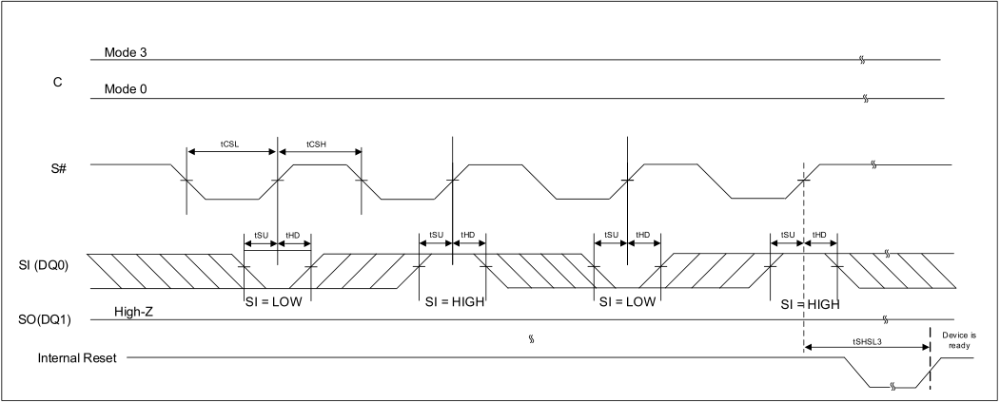

**----- Start of picture text -----** 
Mode 3 C Mode 0 tCSL tCSH S# tSU tHD tSU tHD tSU tHD tSU tHD SI (DQ0) SI = LOW SI = HIGH SI = LOW SI = HIGH SO(DQ1) High-Z Device is tSHSL3 ready Internal Reset **----- End of picture text -----** 

**Table 8.24 AC Timings for In Band RESET** 

|Parameter|Min|Max|Units|
|---|---|---|---|
|tCSL|500|-|ns|
|tCSH|500|-|ns|
|tSU (Setup Time)|5|-|ns|
|tHD (Hold Time)|5|-|ns|
|Reset Recovery Time|tSHSL3(1)|||

## **Notes:** 

1. tSHSL3 value is on the Table 9.5 

79 

_**Integrated Silicon Solution, Inc.- www.issi.com**_ **Rev. A14** 05/12/2026 

