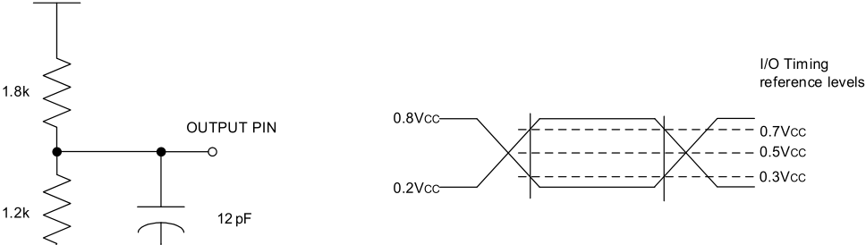
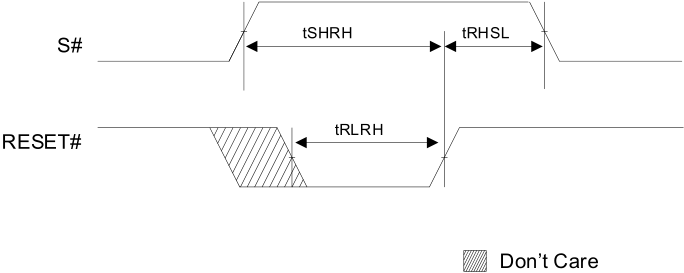
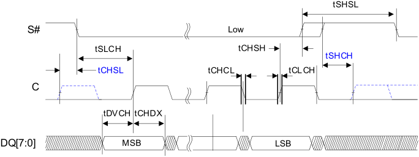
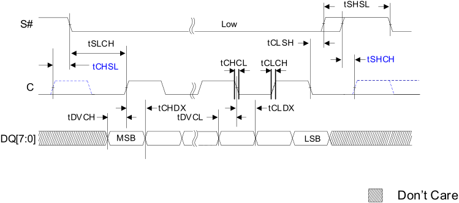
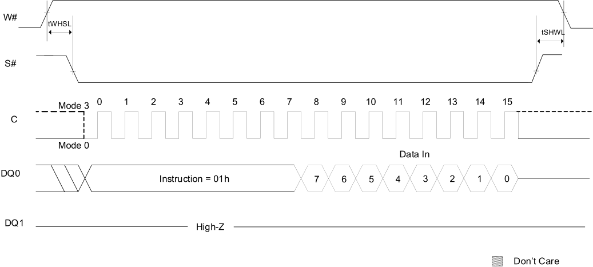
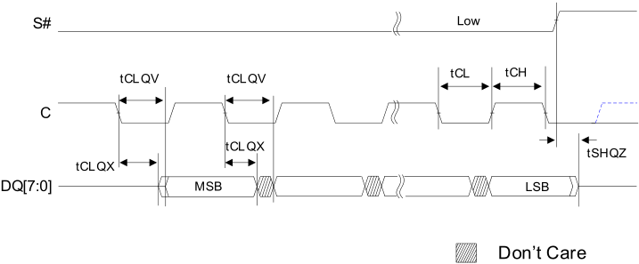
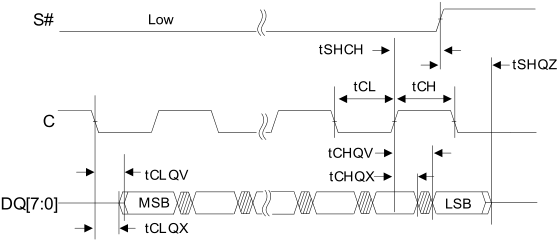
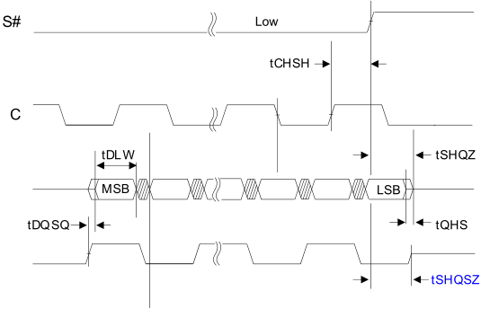
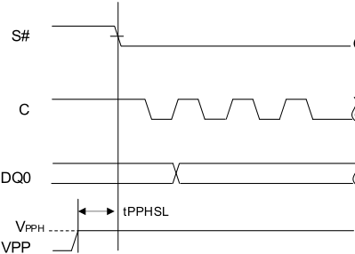

**…………………………………………………… ……….IS25LX256/128** 

**IS25WX256/128** 

## **9. ELECTRICAL CHARACTERISTICS** 

## **9.1 ABSOLUTE MAXIMUM RATINGS[(1)]** 

|**Symbol**|**Parameter**||**Min**|**Max**|**Units**|**Notes**|
|---|---|---|---|---|---|---|
|TSTG|Storage Temperature||-65|150|°C||
|VCC|Supply Voltage|IS25LX|-0.6|4|V|2|
|||IS25WX|-0.6|2.5|||
|VPP|Fast Program Voltage||-0.2|10|V||
|VIO|I/O voltage with respect to ground||-0.6|VCC+ 0.6|V|2|
|VESD|Electrostatic Discharge Voltage (humanbodymodel)||-2000|2000|V|2, 3|

## **Note:** 

**1. Applied conditions greater than those listed in “Absolute Maximum Ratings” may cause permanent damage to the device. This is a stress rating only and functional operation of the device at these or any other conditions above those indicated in the operational sections of this specification is not implied. Exposure to absolute maximum rating conditions for extended periods may affect reliability.** 

**2. All specified voltages are with respect to VSS. During infrequent, nonperiodic transitions, the voltage potential between VSS and VCC may undershoot to -2.0V for periods less than 20ns, or overshoot to VCC,max + 2.0V for periods less than 20ns.** 

**3. JEDEC Standard JESD22-A114A (C1 = 100pF, R1 = 1500 ohm, R2 = 500 ohm)** 

## **9.1 OPERATING CONDITIONS** 

|**Symbol**|**Parameter**|**Parameter**|**Min**|**Max**|**Units**|
|---|---|---|---|---|---|
|VCC|Supply Voltage|IS25LX|2.7|3.6|V|
|||IS25WX|1.7|2.0||
|VPPH|Supply Voltage on VPP||8.5|9.5|V|
|TA|Ambient Operating Temperature|Extended|-40|105|°C|
|||Automotive A3|-40|125|°C|

## **9.2 PIN CAPACITANCE[(1)]** 

(TA = 25°C, VBIAS=VCC/2, 54MHz) 

|**Symbol**|**Description**|**Min**|**Max**|**Units**|
|---|---|---|---|---|
|CIN/OUT|DQ [7:0], DQS, ERR#|-|5|pF|
|CIN|Other Input Pin Capacitance: C, W#, RESET#|-|6|pF|
|CIN/S#|Chip Select (S#)|-|5|pF|

Note: 1. These parameters are not 100% tested and not subject to a production test. They are verified by design and characterization. The capacitance is measured according to JEP147, “PROCEDURE FOR MEASURING INPUT CAPACITANCE USING A VECTOR NETWORK ANALYZER” with VCC and VSS applied and all other pins floating (except the pin under test). 

80 

_**Integrated Silicon Solution, Inc.- www.issi.com**_ **Rev. A14** 

05/12/2026 

**…………………………………………………… ……….IS25LX256/128** 

**IS25WX256/128** 

## **9.3 AC TIMING I/O CONDITIONS** 

|**Symbol**|**Parameter**||**Min**|**Max**|**Units**|
|---|---|---|---|---|---|
|CL(1)|Load Capacitance||-|12|pF|
|TR,TF|Input Rise and Fall Times|IS25LX||1.5|ns|
|||IS25WX||1.2||
|VT|Clock Reference Voltage||0.5VCC||V|
|VIN|Input Pulse Voltages||0.2VCCto 0.8VCC||V|
|VREFI|Input Timing Reference Voltages||0.3VCCto 0.7VCC||V|
|VREFO|Output Timing Reference Voltages||0.5VCC||V|

Note: 1. Output Buffers are configurable by user, and default value is 50ohm. 

## **Figure 9.1 Output test load & AC measurement I/O Waveform** 

**----- Start of picture text -----** 
I/O Timing reference levels 1.8k 0.8VC C OUTPUT PIN 0.7VCC 0.5VCC 0.3VCC 0.2VC C 1.2k 12 pF **----- End of picture text -----** 

81 

_**Integrated Silicon Solution, Inc.- www.issi.com**_ **Rev. A14** 

05/12/2026 

**…………………………………………………… ……….IS25LX256/128** 

**IS25WX256/128** 

## **9.4 DC CURRENT CHARACTERISTICS AND OPERATING CONDITIONS** 

**Table 9.1 DC Current Characteristics and Operating Conditions** 

|**Parameter**|**Symbol**|**Test Conditions**|**Test Conditions**||**Typ**|**Max**|**Units**|**Notes**|
|---|---|---|---|---|---|---|---|---|
|Input Leakage Current|ILI|VIN= 0V to VCC||||±2|µA||
|Output Leakage Current|ILO|VIN= 0V to VCC||||±2|µA||
|Standby Current|ICC1|S# =RESET# = VCC, VIN= VCCor VSS|IS25LX|105°C|10|130|µA|2|
|||||125°C||200|µA||
||||IS25WX|105°C|6|130|µA||
|||||125°C||200|µA||
|Deep power down current|ICC2|S# =RESET# = VCC, VIN= VPP=VCCor VSS|IS25LX|105°C|7.5|50|µA|3, 6|
|||||125°C||100|µA||
||||IS25WX|105°C|1|50|µA||
|||||125°C||100|µA||
|Operating Current (FAST READ EXTENDED I/O)|ICC3|C = 0.1VCC/0.9VCC at|54MHz, DQ1 = Open||12|20|mA|4|
|||C = 0.1VCC/0.9VCC at|133MHz, DQ1 = Open||16|28|mA||
|Operating Current (Octal SDR command)||C = 0.1VCC/0.9VCC at|166MHz, DQ = Open||24|42|mA||
|Operating Current (Octal DDR command)||C = 0.1VCC/0.9VCC at|166MHz, DQ = Open||30|46|mA||
|||C = 0.1VCC/0.9VCC at|200MHz, DQ = Open||34|48|mA||
|Operating Current (PROGRAM Operations)|ICC4|S# =|VCC||36|55|mA|5|
|Operating Current (WRITE Operations)|ICC5|S# =|VCC||16|55|mA||
|Operating Current (ERASE Operations)|ICC6|S# =|VCC||36|55|mA||

Notes: 

1. Current are RMS unless noted. Typical values are at VCC (1.8V); VI/O = 0V/VCC; TA=25°C 

2. Standby current is an average calculated 5 us after S# de-assertion and completion of any internal operation. 

3. Deep power-down current is an average calculated during a 5ms time interval 100us after completion of any internal operation. 

4. Read current is an average calculated during a 1KB continuous READ operation without load, in a checker-board pattern. 

5. Program current is an average measured over a 256-byte data PROGRAM operation. 

6. When VPP is floating, ICC2 (Max) =110 uA at 105 **°** C, 115uA at 125 **°** C for1.8V and 375 uA at 105 **°** C, 380uA at 125 **°** C for 3.0V. 

**Table 9.2 DC Current Characteristics and Operating Conditions** 

|**Parameter**|**Symbol**|**Conditions**|**Min**|**Max**|**Units**|
|---|---|---|---|---|---|
|Input Low voltage (DC)|VIL|-|-0.3|0.3VCC|V|
|Input Low voltage (AC)||-|-0.3|0.2VCC|V|
|Input High voltage (DC)|VIH|-|0.7VCC|VCC+ 0.3|V|
|Input High voltage (AC)||-|0.8VCC|VCC+ 0.3|V|
|Output Low voltage|VOL|IOL  =1.6mA|-|0.15 x VCC|V|
|Output High voltage|VOH|IOH  =-100uA|0.85 x VCC|-|V|

Note: 

1. VIL can undershoot to -1.0V for periods less than 2ns; VIH can overshoot to VCC,max  + 1.0V for periods less than 2ns. 

82 

_**Integrated Silicon Solution, Inc.- www.issi.com**_ **Rev. A14** 

05/12/2026 

**…………………………………………………… ……….IS25LX256/128** 

**IS25WX256/128** 

## **9.5 AC CHARACTERISTICS** 

**Table 9.3 AC Characteristics and Operating Conditions for IS25WX256/128 (VCC = 1.7V to 1.95V, DDR=200MHz, ECC is OFF)** 

|**Parameter**|**Symbol**|**Data Transfer** **Rate**|**Min**|**Typ**|**Max**|**Unit**|**Notes**|
|---|---|---|---|---|---|---|---|
|Clock frequency for all commands other than READ (03h)|fC|SDR|DC|-|166|MHz|9|
|||DDR|DC|-|200||8|
|Clock frequency for READ (03h/13h)|tR|SDR|DC|-|54|MHz||
|Clock HIGH time|tCH|SDR|2.7|-|-|ns|2|
|||DDR|2.25|-|-|||
|Clock LOW time|tCL|SDR|2.7|-|-|ns|2|
|||DDR|2.25|-|-|||
|Clock rise time (peak-to-peak)|tCLCH|SDR/DDR|1/1.2|-|-|V/ns|3, 4|
|Clock fall time (peak-to-peak)|tCHCL|SDR/DDR|1/1.2|-|-|V/ns|3, 4|
|S# active setup time (relative to clock)|tSLCH|SDR/DDR|4|-|-|ns||
|S# Not active hold time (relative to clock)|tCHSL|SDR/DDR|2|-|-|ns||
|Data in setup time|tDVCH|SDR/DDR|1.8/0.6|-|-|ns||
||tDVCL|DDR only|0.6|-|-|ns||
|Data in hold time|tCHDX|SDR/DDR|1.8/0.6|-|-|ns||
||tCLDX|DDR only|0.6|-|-|ns||
|S# active hold time (relative to clock)|tCHSH|SDR|2|-|-|ns||
||tCLSH|DDR|2|-|-|ns||
|S# Not active setup time (relative to clock)|tSHCH|SDR/DDR|2|-|-|ns||
|S# deselect time after a READ command|tSHSL1|SDR/DDR|12|-|-|ns||
|S# deselect time after a nonREAD command|tSHSL2|SDR/DDR|50|-|-|ns||
|Output disable time|SHQZ|SDR/DDR|-|-|6|ns|3|
|Data Valid Window|tDVW|DDR|1.3|-|-|ns||
|Clock Low to output valid ( Cload=12pF)|tCLQV|SDR/DDR|-|-|6|ns||
|Clock High to output valid ( Cload=12pF)|tCHQV|DDR|-|-|6|ns||
|Output hold skew|tQHS|DDR|-|-|0.5|ns||
|DQS to DQ skew|tDQSQ|DDR|**-**|**-**|0.4|ns||
|DQS low after S# low|tSLQSL|DDR|-|-|10|ns|5|
|S# to DQS High-Z|tSHQSZ|DDR|-|-|6|ns||
|Output hold time|tCLQX|SDR/DDR|1.3|-|-|ns||
||tCHQX|DDR only|1.3|-|-|ns||

83 

_**Integrated Silicon Solution, Inc.- www.issi.com**_ **Rev. A14** 05/12/2026 

**…………………………………………………… ……….IS25LX256/128** 

**IS25WX256/128** 

## **AC Characteristics and Operating Conditions (Continued)** 

|**Parameter**|**Parameter**|**Symbol**|**Data Transfer** **Rate**|**Min**|**Typ**|**Max**|**Unit**|**Notes**|
|---|---|---|---|---|---|---|---|---|
|Write protect setup time||tWHSL|SDR/DDR|20|-|-|ns|6|
|Enhanced VPPHHIGH to S# LOW||tVPPHSL|SDR/DDR|200|-|-|ns|6|
|S# HIGH to deep power-down||tDP|SDR/DDR|3|-|-|us||
|S# HIGH to standby mode (DPD exit time)||tRDP|SDR/DDR|30|-|-|us||
|WRITE STATUS REGISTER cycle time||tW|SDR/DDR|-|1.3|15|ms||
|WRITE NONVOLATILE CONFIGURATION REGISTER cycle time||tWNVCR|SDR/DDR|-|0.2|1|s||
|WRITE PROTECTION MANAGEMENT REGISTER timing||tPPMR|SDR/DDR|-|0.1|0.5|ms||
|Nonvolatile sector lock time||tPPBP|SDR/DDR|-|0.1|2.8|ms||
|Program ASP Register||tASSP|SDR/DDR|-|0.1|0.5|ms||
|Program password||tPASSP|SDR/DDR|-|0.2|0.8|ms||
|Erase nonvolatile sector lock array||tPPBE|SDR/DDR|-|0.2|1|s||
|Page program time (256 bytes)||tPP|SDR/DDR|-|0.15|1.8|ms|7|
|Page program time when Vpp = VPPH (256 bytes)||tPP|SDR/DDR|-|0.08|1.8|ms|7|
|Program OTP cycle  time (64 bytes)||tOTP|SDR/DDR|-|0.2|0.8|ms||
|Sector Erase time|128KB|tSE|SDR/DDR|-|0.28|1|s||
||64KB|||-|0.15|1|||
|Subsector Erase time (4KB)||tSE4K|SDR/DDR|-|80|400|ms||
|Subsector Erase time (32KB)||tSE32K|SDR/DDR|-|0.13|1|s||
|Chip Erase time|256Mb|tBE|SDR/DDR|-|70|180|s||
||128Mb|||-|30|90|s||

## **Notes:** 

1. Typical values given for TA=25°C 

2. tCH + tCL must add up to 1/fC. 

3. Value guaranteed by characterization; not 100% tested. 

4. Expressed as a slew-rate 

5. DQS will be driven after S# LOW. 

6. Only applicable as a constraint for a WRITE STATUS REGISTER command when STATUS REGISTER WRITE is set to 1. 

7. Typical value is applied for pattern: 50% “0” and 50% “1” 

8. Maximum frequency is 100MHz for A5h (SFDP Read) and E0h/E8h (Read Volatile Lock Bits), 80MHz for E2h 

- (Read Nonvolatile Lock Bits) in Octal DDR mode. 

9. Maximum frequency is 133MHz for 27h (Read Password) in Extended SPI mode. 

84 

_**Integrated Silicon Solution, Inc.- www.issi.com**_ **Rev. A14** 05/12/2026 

**…………………………………………………… ……….IS25LX256/128** 

**IS25WX256/128** 

|**(VCC**|**= 1.7V to 1.95V, DDR=166MHz, ECC is ON ) **|**= 1.7V to 1.95V, DDR=166MHz, ECC is ON ) **|**= 1.7V to 1.95V, DDR=166MHz, ECC is ON ) **|||||
|---|---|---|---|---|---|---|---|
||**Parameter**|**Symbol**|**Data Transfer** **Rate**||**Min**|**Typ**|**Max**|
|Clock other|frequency for all commands than READ (03h)|fC||SDR DDR|DC DC|- -|166 166|
|Clock|frequency for READ (03h)|tR||SDR|DC|-|54|

|**(VCC= 1.7V to 1.95V, DDR=166MHz, ECC is ON ) **|**(VCC= 1.7V to 1.95V, DDR=166MHz, ECC is ON ) **|**(VCC= 1.7V to 1.95V, DDR=166MHz, ECC is ON ) **|**(VCC= 1.7V to 1.95V, DDR=166MHz, ECC is ON ) **|**(VCC= 1.7V to 1.95V, DDR=166MHz, ECC is ON ) **|**(VCC= 1.7V to 1.95V, DDR=166MHz, ECC is ON ) **|**(VCC= 1.7V to 1.95V, DDR=166MHz, ECC is ON ) **|**(VCC= 1.7V to 1.95V, DDR=166MHz, ECC is ON ) **|
|---|---|---|---|---|---|---|---|
|**Parameter**|**Symbol**|**Data Transfer** **Rate**|**Min**|**Typ**|**Max**|**Unit**|**Notes**|
|Clock frequency for all commands other than READ (03h)|fC|SDR|DC|-|166|MHz|9|
|||DDR|DC|-|166||8, 10|
|Clock frequency for READ (03h)|tR|SDR|DC|-|54|MHz||
|Clock HIGH time|tCH|SDR/DDR|2.7|-|-|ns|2|
|Clock LOW time|tCL|SDR/DDR|2.7|-|-|ns|2|
|Clock rise time (peak-to-peak)|tCLCH|SDR/DDR|1/1.2|-|-|V/ns|3, 4|
|Clock fall time (peak-to-peak)|tCHCL|SDR/DDR|1/1.2|-|-|V/ns|3, 4|
|S# active setup time (relative to clock)|tSLCH|SDR/DDR|4|-|-|ns||
|S# Not active hold time (relative to clock)|tCHSL|SDR/DDR|2|-|-|ns||
|Data in setup time|tDVCH|SDR/DDR|1.8/0.7|-|-|ns||
||tDVCL|DDR only|0.7|-|-|ns||
|Data in hold time|tCHDX|SDR/DDR|1.8/0.7|-|-|ns||
||tCLDX|DDR only|0.7|-|-|ns||
|S# active hold time (relative to clock)|tCHSH|SDR|2|-|-|ns||
||tCLSH|DDR|2|||ns||
|S# Not active setup time (relative to clock)|tSHCH|SDR/DDR|2|-|-|ns||
|S# deselect time after a READ command|tSHSL1|SDR/DDR|12|-|-|ns||
|S# deselect time after a nonREAD command|tSHSL2|SDR/DDR|50|-|-|ns||
|Output disable time|SHQZ|SDR/DDR|-|-|6|ns|3|
|Data Valid Window|tDVW|DDR|1.3|-|-|ns||
|Clock Low to output valid ( Cload=12pF)|tCLQV|SDR/DDR|-|-|6|ns||
|Clock High to output valid ( Cload=12pF)|tCHQV|DDR|-|-|6|ns||
|Output hold skew|tQHS|DDR|-|-|0.6|ns||
|DQS to DQ skew|tDQSQ|DDR|**-**|**-**|0.5|ns||
|DQS low after S# low|tSLQSL|DDR|-|-|10|ns|5|
|S# to DQS High-Z|tSHQSZ|DDR|-|-|8|ns||
|Output hold time|tCLQX|SDR/DDR|1.3|-|-|ns||
||tCHQX|DDR only|1.3|-|-|ns||

85 

_**Integrated Silicon Solution, Inc.- www.issi.com**_ **Rev. A14** 05/12/2026 

**…………………………………………………… ……….IS25LX256/128** 

**IS25WX256/128** 

## **AC Characteristics and Operating Conditions (Continued)** 

|**Parameter**|**Parameter**|**Symbol**|**Data Transfer** **Rate**|**Min**|**Typ**|**Max**|**Unit**|**Notes**|
|---|---|---|---|---|---|---|---|---|
|Write protect setup time||tWHSL|SDR/DDR|20|-|-|ns|6|
|Enhanced VPPHHIGH to S# LOW||tVPPHSL|SDR/DDR|200|-|-|ns|6|
|S# HIGH to deep power-down||tDP|SDR/DDR|3|-|-|us||
|S# HIGH to standby mode (DPD exit time)||tRDP|SDR/DDR|30|-|-|us||
|WRITE STATUS REGISTER cycle time||tW|SDR/DDR|-|1.3|15|ms||
|WRITE NONVOLATILE CONFIGURATION REGISTER cycle time||tWNVCR|SDR/DDR|-|0.2|1|s||
|WRITE PROTECTION MANAGEMENT REGISTER timing||tPPMR|SDR/DDR|-|0.1|0.5|ms||
|Nonvolatile sector lock time||tPPBP|SDR/DDR|-|0.1|2.8|ms||
|Program ASP Register||tASSP|SDR/DDR|-|0.1|0.5|ms||
|Program password||tPASSP|SDR/DDR|-|0.2|0.8|ms||
|Erase nonvolatile sector lock array||tPPBE|SDR/DDR|-|0.2|1|s||
|Page program time (256 bytes)||tPP|SDR/DDR|-|0.15|1.8|ms|7|
|Page program time when Vpp = VPPH (256 bytes)||tPP|SDR/DDR|-|0.08|1.8|ms|7|
|Program OTP cycle  time (64 bytes)||tOTP|SDR/DDR|-|0.2|0.8|ms||
|Sector Erase time|128KB|tSE|SDR/DDR|-|0.28|1|s||
||64KB|||-|0.15|1|||
|Subsector Erase time (4KB)||tSE4K|SDR/DDR|-|80|400|ms||
|Subsector Erase time (32KB)||tSE32K|SDR/DDR|-|0.13|1|s||
|Chip Erase time|256Mb|tBE|SDR/DDR|-|70|180|s||
||128Mb|||-|30|90|s||

## **Notes:** 

1. Typical values given for TA=25°C 

2. tCH + tCL must add up to 1/fC. 

3. Value guaranteed by characterization; not 100% tested. 

4. Expressed as a slew-rate 

5. DQS will be driven after S# LOW. 

6. Only applicable as a constraint for a WRITE STATUS REGISTER command when STATUS REGISTER WRITE is set to 1. 

7. Typical value is applied for pattern: 50% “0” and 50% “1” 

8. Maximum frequency is 100MHz for A5h (SFDP Read) and E0h/E8h (Read Volatile Lock Bits), 80MHz for E2h 

- (Read Nonvolatile Lock Bits) in Octal DDR mode. 

9. Maximum frequency is 133MHz for 27h (Read Password) in Extended SPI mode. 

10. Call Factory for higher frequency than 166MHz 

86 

_**Integrated Silicon Solution, Inc.- www.issi.com**_ **Rev. A14** 05/12/2026 

**…………………………………………………… ……….IS25LX256/128 IS25WX256/128** 

**Table 9.4 AC Characteristics and Operating Conditions for IS25LX256/128 (VCC = 2.7V to 3.6V)** 

|**Parameter**|**Symbol**|**Data Transfer** **Rate**|**Min**|**Typ**|**Max**|**Unit**|**Notes**|
|---|---|---|---|---|---|---|---|
|Clock frequency for all commands other than READ (03h)|fC|SDR|DC|-|133|MHz||
|||DDR|DC|-|133||5, 9|
|Clock frequency for READ (03h)|tR|SDR|DC|-|54|MHz||
|Clock HIGH time|tCH|SDR|3.375|-|-|ns|2|
|||DDR|3.375|-|-|||
|Clock LOW time|tCL|SDR|3.375|-|-|ns|2|
|||DDR|3.375|-|-|||
|Clock rise time (peak-to-peak)|tCLCH|SDR/DDR|1.3/1.1|-|-|V/ns|3, 4|
|Clock fall time (peak-to-peak)|tCHCL|SDR/DDR|1.3/1.1|-|-|V/ns|3, 4|
|S# active setup time (relative to clock)|tSLCH|SDR/DDR|4|-|-|ns||
|S# Not active hold time (relative to clock)|tCHSL|SDR/DDR|2|-|-|ns||
|Data in setup time|tDVCH|SDR/DDR|1.8/0.7|-|-|ns||
||tDVCL|DDR only|0.7|-|-|ns||
|Data in hold time|tCHDX|SDR/DDR|1.8/0.7|-|-|ns||
||tCLDX|DDR only|0.8|-|-|ns||
|S# active hold time (relative to clock)|tCHSH|SDR|2|-|-|ns||
||tCLSH|DDR|2|||ns||
|S# Not active setup time (relative to clock)|tSHCH|SDR|3.375|-|-|ns||
|||DDR|6.75|||ns||
|S# deselect time after a READ command|tSHSL1|SDR/DDR|12|-|-|ns||
|S# deselect time after a nonREAD command|tSHSL2|SDR/DDR|50|-|-|ns||
|Output disable time|SHQZ|SDR/DDR|-|-|6|ns|3|
|Data Valid Window|tDVW|DDR|2|-|-|ns||
|Clock Low to output valid ( Cload=12pF)|tCLQV|SDR/DDR|-|-|6|ns||
|Clock High to output valid ( Cload=12pF)|tCHQV|DDR|-|-|6|ns||
|Output hold skew|tQHS|DDR|-|-|0.8|ns||
|DQS to DQ skew|tDQSQ|DDR|-|-|0.6|ns||
|DQS low after S# low|tSLQSL|DDR|-|-|10|ns|6|
|S# to DQS High-Z|tSHQSZ|DDR|-|-|8|ns||
|Output hold time|tCLQX|SDR/DDR|2|-|-|ns||
||tCHQX|DDR only|2|-|-|ns||

87 

_**Integrated Silicon Solution, Inc.- www.issi.com**_ **Rev. A14** 05/12/2026 

**…………………………………………………… ……….IS25LX256/128** 

**IS25WX256/128** 

## **AC Characteristics and Operating Conditions (Continued)** 

|**Parameter**|**Parameter**|**Symbol**|**Data Transfer** **Rate**|**Min**|**Typ**|**Max**|**Unit**|**Notes**|
|---|---|---|---|---|---|---|---|---|
|Write protect setup time||tWHSL|SDR/DDR|20|-|-|ns|7|
|Enhanced VPPHHIGH to S# LOW||tVPPHSL|SDR/DDR|200|-|-|ns|7|
|S# HIGH to deep power-down||tDP|SDR/DDR|3|-|-|us||
|S# HIGH to standby mode (DPD exit time)||tRDP|SDR/DDR|30|-|-|us||
|WRITE STATUS REGISTER cycle time||tW|SDR/DDR|-|1.3|15|ms||
|WRITE NONVOLATILE CONFIGURATION REGISTER cycle time||tWNVCR|SDR/DDR|-|0.2|1|s||
|WRITE PROTECTION MANAGEMENT REGISTER timing||tPPMR|SDR/DDR|-|0.1|0.5|ms||
|Nonvolatile sector lock time||tPPBP|SDR/DDR|-|0.1|2.8|ms||
|Program ASP Register||tASSP|SDR/DDR|-|0.1|0.5|ms||
|Program password||tPASSP|SDR/DDR|-|0.2|0.8|ms||
|Erase nonvolatile sector lock array||tPPBE|SDR/DDR|-|0.2|1|s||
|Page program time (256 bytes)||tPP|SDR/DDR|-|0.15|1.8|ms|8|
|Page program time when Vpp = VPPH (256 bytes)||tPP|SDR/DDR|-|0.08|1.8|ms|8|
|Program OTP cycle  time (64 bytes)||tOTP|SDR/DDR|-|0.2|0.8|ms||
|Sector Erase time|128KB|tSE|SDR/DDR|-|0.28|1|s||
||64KB|||-|0.15|1|||
|Subsector Erase time (4KB)||tSE4K|SDR/DDR|-|80|400|ms||
|Subsector Erase time (32KB)||tSE32K|SDR/DDR|-|0.13|1|s||
|Chip Erase time|256Mb|tBE|SDR/DDR|-|70|180|s||
||128Mb|||-|30|90|s||

## **Notes:** 

1. Typical values given for TA=25°C 

2. tCH + tCL must add up to 1/fC. 

3. Value guaranteed by characterization; not 100% tested. 

4. Expressed as a slew-rate 

**5. Maximum frequency is 133MHz regardless of ECC ON/OFF.** 

6. DQS will be driven after S# LOW. 

7. Only applicable as a constraint for a WRITE STATUS REGISTER command when STATUS REGISTER WRITE is set to 1. 8. Typical value is applied for pattern: 50% “0” and 50% “1” 

9. Maximum frequency of A5h (SFDP Read) operation is 100MHz. 

88 

_**Integrated Silicon Solution, Inc.- www.issi.com**_ **Rev. A14** 05/12/2026 

**…………………………………………………… ……….IS25LX256/128 IS25WX256/128** 

## **AC Reset Specifications** 

## **Table 9.5 AC Reset Recovery Characteristics** 

|**Parameter**|**Symbol**|**Conditions**|**Min**|**Typ**|**Max**|**Unit**|
|---|---|---|---|---|---|---|
|**Reset pulse width**|**tRLRH**||100|-|-|ns|
|**Chip select high** **to reset high**|**tSHRH**|Chip must be deselected before reset is de-asserted|10|-|-|ns|
|**Reset high to** **chip select low**|**tRHSL**||40|-|-|ns|
|**Hardware Reset** **recovery time**|**tRHSL1**|Device deselected (S# HIGH) and is in standby mode|-|-|5|us|
|||Any READ operations, PROGRAM/ERAE SUSPEND operation, or any WRITE operation to volatile registers are inprogress|-|-|5|us|
|||Any device array PROGRAM, PROGRAM RESUME, PROGRAM OTP, Chip Erase operation, and NONVOLATILE SECTOR LOCK operations are in progress|-|-|30|us|
|||While an ERASE NONVOLATILE SECTOR LOCK ARRAY operation is in progress|-|tPPBE|-|ms|
|||While a WRITE STATUS REGISTER operation is in progress|-|tW|-|ms|
|||While a WRITE NONVOLATILE CONFIGURATION REGISTER operation is in progress|-|tWNVCR|-|ms|
|||SECTOR ERASE/SUBSECTOR ERASE operation or SECTOR ERASE/SUBSECTOR ERASE RESUME operation is inprogress|-|tSE/tSSE|-|s|
|||Device in deep power-down mode|-|tRDP|-|ms|
|||While ADVANCED SECTOR PROTECTION PROGRAM operation is in progress|-|tASSP|-|ms|
|||While PASSWORD PROTECTION PROGRAM operation is in progress|-|tPASSP|-|ms|
|||While PASSWORD PROTECTION PROGRAM operation is in progress|-|tPASSP|-|ms|

89 

_**Integrated Silicon Solution, Inc.- www.issi.com**_ **Rev. A14** 05/12/2026 

**…………………………………………………… ……….IS25LX256/128 IS25WX256/128** 

## **Table 9.5 AC Reset Recovery Characteristics (Continued)** 

|**Parameter**|**Symbol**|**Conditions**|**Min**|**Typ**|**Max**|**Unit**|
|---|---|---|---|---|---|---|
|**Software Reset** **recovery time/** **In-Band Reset** **recovery time**|**tSHSL3**|Device deselected (S# HIGH) and is in standby mode|-|-|5|us|
|||PROGRAM/ERAE SUSPEND operation is in progress|-|-|5|us|
|||Any device array PROGRAM, PROGRAM RESUME, PROGRAM OTP, Chip Erase operation, and NONVOLATILE SECTOR LOCK operations are in progress|-|-|30|us|
|||While an ERASE NONVOLATILE SECTOR LOCK ARRAY operation is in progress|-|tPPBE|-|ms|
|||While a WRITE STATUS REGISTER operation is in progress|-|tW|-|ms|
|||While a WRITE NONVOLATILE CONFIGURATION REGISTER operation is in progress|-|tWNVCR|-|ms|
|||SECTOR ERASE/SUBSECTOR ERASE operation or SECTOR ERASE/SUBSECTOR ERASE RESUME operation is inprogress|-|tSE/tSSE|-|s|
|||Device in deep power-down mode|-|tRDP|-|ms|
|||While ADVANCED SECTOR PROTECTION PROGRAM operation is in progress|-|tASSP|-|ms|
|||While PASSWORD PROTECTION PROGRAM operation is in progress|-|tPASSP|-|ms|

- **Notes:** 1. Values are guaranteed by characterization; not 100% tested. 2. The device reset is possible but not guaranteed if tRLRH < 100ns. 

90 

_**Integrated Silicon Solution, Inc.- www.issi.com**_ **Rev. A14** 05/12/2026 

**…………………………………………………… ……….IS25LX256/128 IS25WX256/128** 

## **Figure 9.2 Hardware Reset AC Timing** 

**----- Start of picture text -----** 
tSHRH tRHSL S# tRLRH RESET# Don t Care **----- End of picture text -----** 

**Figure 9.3 SERIAL INPUT TIMING** 

**----- Start of picture text -----** 
tSHSL S# Low tSLCH tCHSH tSHCH tCHSL tCHCL tCLCH C tDVCH tCHDX DQ[7:0] MSB LSB **----- End of picture text -----** 

**----- Start of picture text -----** 
Don t Care **----- End of picture text -----** 

## **Figure 9.4 SERIAL INPUT TIMING - DDR** 

**----- Start of picture text -----** 
tSHSL S# Low tSLCH tCLSH tCHSL tCHCL tCLCH tSHCH C tCHDX tCLDX tDVCH tDVCL DQ[7:0] MSB LSB Don t Care **----- End of picture text -----** 

91 

_**Integrated Silicon Solution, Inc.- www.issi.com**_ **Rev. A14** 05/12/2026 

**…………………………………………………… ……….IS25LX256/128 IS25WX256/128** 

**Figure 9.5 Write Protect Setup and Hold During WRITE STATUS REGISTER Operation (SRWD = 1)** 

**----- Start of picture text -----** 
W# tWHSL tSHWL S# 0 1 2 3 4 5 6 7 8 9 10 11 12 13 14 15 Mode 3 C Mode 0 Data In DQ0 Instruction = 01h 7 6 5 4 3 2 1 0 DQ1 High-Z Don t Care **----- End of picture text -----** 

## **Figure 9.6 Output Timing - SDR** 

**----- Start of picture text -----** 
S# Low tCLQV tCLQV tCL tCH C tCLQX tSHQZ tCLQX DQ[7:0] MSB LSB Don t Care **----- End of picture text -----** 

**Figure 9.7 Output Timing - DDR** 

**----- Start of picture text -----** 
S# Low tSHCH tSHQZ tCL tCH C tCHQV tCLQV tCHQ X DQ[7:0] MSB LSB tCLQX **----- End of picture text -----** 

92 

_**Integrated Silicon Solution, Inc.- www.issi.com**_ **Rev. A14** 

05/12/2026 

**…………………………………………………… ……….IS25LX256/128** 

**IS25WX256/128** 

**Figure 9.8 Output Timing – DDR with DQS** 

**----- Start of picture text -----** 
S# Low tCHSH C tDLW tSHQZ MSB LSB tDQSQ tQHS tSHQSZ **----- End of picture text -----** 

## **Note:** 

**1. The device will be de-selected while clock is HIGH to get even counts of output data. Next DQ (or DQS) output could be observed if clock edge is received before S# goes HIGH.** 

## **Figure 9.9 VPPH Timing** 

**----- Start of picture text -----** 
S# C DQ0 tPPHSL VPPH VPP **----- End of picture text -----** 

93 

_**Integrated Silicon Solution, Inc.- www.issi.com**_ **Rev. A14** 05/12/2026 

**…………………………………………………… ……….IS25LX256/128 IS25WX256/128** 

## **9.6 PROGRAM/ERASE SUSPEND/RESUME SPECIFICATIONS** 

## **Table 9.6 Program/Erase Suspend/Resume Specifications** 

|Parameter|Condition|Typ|Max|Units|Notes|
|---|---|---|---|---|---|
|Erase to suspend|Sector erase or erase resume to erase suspend|150|-|us|1|
|Program to suspend|Program resume to program suspend|5|-|us|1|
|Subsector erase to suspend|Subsector erase or subsector erase resume to erase suspend|50|-|us|1|
|Suspend Latency|Program|7|25|us|2|
|Suspend Latency|Subsector erase|15|30|us|2|
|Suspend Latency|Erase|15|30|us|3|

Notes: 

1. Timing is not internally controlled. 

2. Any READ command accepted. 

3. Any command except the following are accepted: SECTOR, SUBSECTOR, or CHIP ERASE; WRITE STATUS REGISTER; WRITE NONVOLATILE CONFIGURATION REGISTER; and PROGRAM OTP. 

94 

_**Integrated Silicon Solution, Inc.- www.issi.com**_ **Rev. A14** 05/12/2026 

