<!-- LP-AM263P User Guide | 전체 ingest | pymupdf4llm text+tables+images -->

_Description_ 

_EVM User's Guide: LP-AM263P_ _**AM263Px LaunchPad User Guide**_ 

www.ti.com 

## **Description** 

The AM263Px LaunchPad[™] development kit is a simple and inexpensive hardware evaluation module (EVM) for the Texas Instruments[™] Sitara[™] AM263Px series of microcontrollers (MCUs). This EVM provides an easy way to start developing on the AM263Px MCUs with onboard emulation for programming and debugging as well as buttons and LEDs for a simple user interface. The LaunchPad also features two independent BoosterPack XL expansion connectors, onboard Controller Area Network (CAN) transceiver, two RJ45 Ethernet ports, and an onboard XDS110 debug probe. 

## **Features** 

- PCB dimensions: 195.56mm X 58.42mm 

- Powered through 5V, 3A USB type-C input 

- Two RJ45 Ethernet ports capable of 1Gbps speeds 

- Onboard XDS110 debug probe 

- Three push buttons: 

   - PORz 

   - User interrupt 

   - RESETz 

- LEDs for: 

   - Power status 

   - Power NOT Good 

   - User testing 

      - Ethernet connection 

   - 

   - I2C driven array 

- CAN connectivity with onboard CAN transceiver 

- • Dedicated FSI connector 

- Discrete DC-DC buck regulators and LDOs that generate the required supplies with an additional option of Vpp LDO 1.7 (TLV75801PDRVR) as DNP 

- • TI Test Automation Header 

- TIVA Test Automation Header 

- MMC interface to micro SD card connector. Also a footprint option for users to mount Embedded Multi-Media Card (eMMC), like MTFC8GAMALBHAT. Currently the eMMC is made DNP. 

- Two independent Enhanced Quadrature Encoder Pulse (EQEP) based encoder connectors 

- Two independent BoosterPack XL (40 pin) standard connectors featuring stackable headers to maximize expansion through the BoosterPack ecosystem 

- Onboard memory: 

   - 256 Mb OSPI Flash - ISSI IS25LX256-JHLE 

   - 1 Mb I2C Board ID EEPROM 

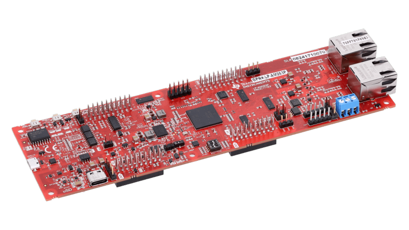

SPRUJ85B – APRIL 2024 – REVISED JANUARY 2026 _Submit Document Feedback_ 

_AM263Px LaunchPad User Guide_ 

1 

Copyright © 2026 Texas Instruments Incorporated 

_LaunchPad Module Overview_ 

www.ti.com 

## **1 LaunchPad Module Overview** 

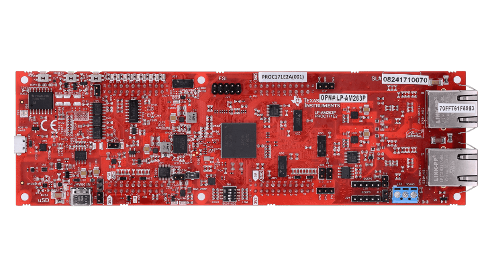

## **Figure 1-1. AM263Px LaunchPad Board** 

## **1.1 Introduction** 

This user's guide details the design of the EVM and how to properly use each interface. The user's guide also details many important aspects of the board including but not limited to power requirements, boot mode selections, and mux/switch signal routing. 

## **1.2 Kit Contents** 

The Sitara AM263Px Series LaunchPad Development Kit contains the following items: 

- AM263Px Sitara Series LaunchPad development board 

- USB micro-B cable 

- Micro SD card 

- CAT5 Ethernet cable 

## **Note** 

The maximum length for any IO cables are required to be less than 3 meters. 

The kit does not include: 

- USB type-C 5V/3A AC/DC supply 

- USB type-C cable 

## **1.3 Device Information** 

## _**1.3.1 System Architecture Overview**_ 

Figure 1-2 shows the overall top level architecture of the AM263Px LaunchPad. 

_AM263Px LaunchPad User Guide_ 

SPRUJ85B – APRIL 2024 – REVISED JANUARY 2026 _Submit Document Feedback_ 

2 

Copyright © 2026 Texas Instruments Incorporated 

_LaunchPad Module Overview_ 

www.ti.com 

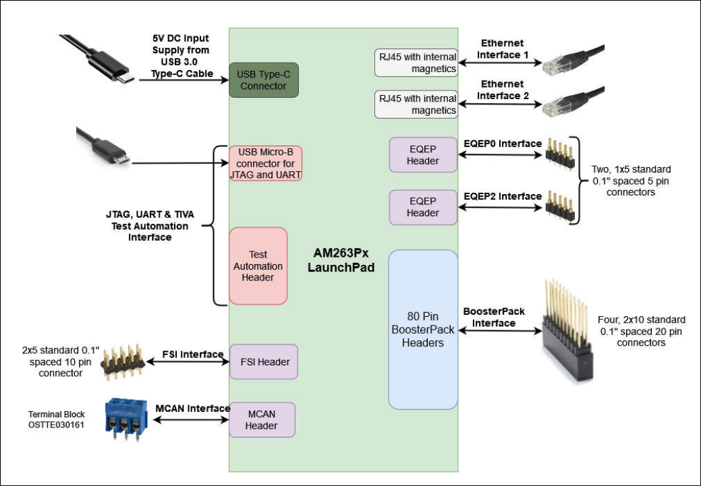

**Figure 1-2. System Architecture** 

## _**1.3.2 Security**_ 

The AM263Px LaunchPad features a High Security, Field Securable (HS-FS) device. An HS-FS device has the ability to use a one time programming to convert the device from HS-FS to High Security, Security Enforced (HS-SE) device. 

The AM263Px device leaves the TI factory in an HS-FS state where customer keys are not programmed and has the following attributes: 

- Does not enforce the secure boot process 

- M4 JTAG port is closed 

- R5 JTAG port is open 

- Security Subsystem firewalls are closed 

- SoC Firewalls are open 

- ROM Boot expects a TI signed binary (encryption is optional) 

- TIFS-MCU binary is signed by the TI private key 

The One Time Programmable (OTP) keywriter converts the secure device from HS-FS to HS-SE. The OTP keywriter programs customer keys into the device efuses to enforce secure boot and establish a root of trust. The secure boot requires an image to be encrypted (optional) and signed using customer keys, which will be verified by the SoC. A secure device in the HS-SE state has the following attributes: 

- M4, R5 JTAG ports are both closed 

- Security Subsystems and SoC Firewalls are both closed 

- TIFS-MCU and SBL need to be signed with active customer key 

SPRUJ85B – APRIL 2024 – REVISED JANUARY 2026 _Submit Document Feedback_ 

_AM263Px LaunchPad User Guide_ 

3 

Copyright © 2026 Texas Instruments Incorporated 

_LaunchPad Module Overview_ 

www.ti.com 

## _**1.3.3 BoosterPacks**_ 

The AM263Px LaunchPad development kit provides an easy and inexpensive way to develop applications with the AM263Px Series microcontroller. BoosterPacks are add-on boards that follow a pin-out standard created by Texas Instruments. The TI and third-party ecosystem of BoosterPacks greatly expands the peripherals and potential applications that you can easily explore with the AM263Px LaunchPad. For a detailed diagram on the pin-out of the AM263Px LaunchPad, refer to BoosterPack Headers. 

You can also build your own BoosterPack by following the design guidelines on TI’s website. Texas Instruments even helps you promote your BoosterPack to other members of the community. TI offers a variety of avenues for you to reach potential customers with your solutions. 

## _**1.3.4 Component Identification**_ 

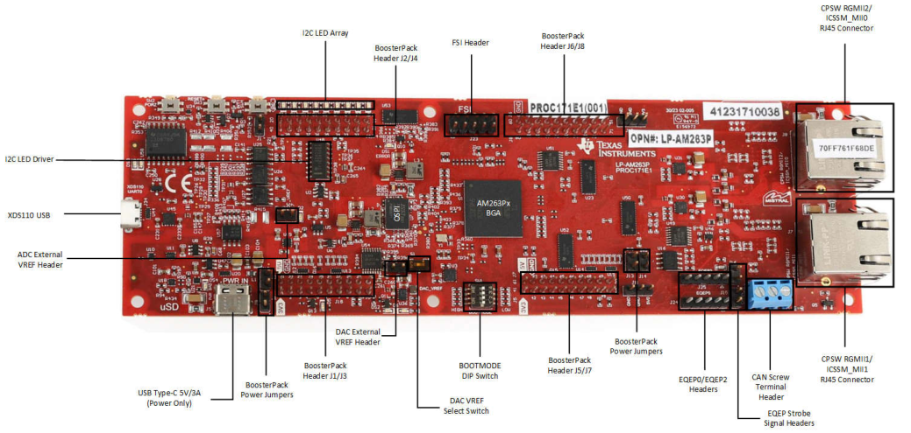

**Figure 1-3. AM263Px LaunchPad Top Components Identification** 

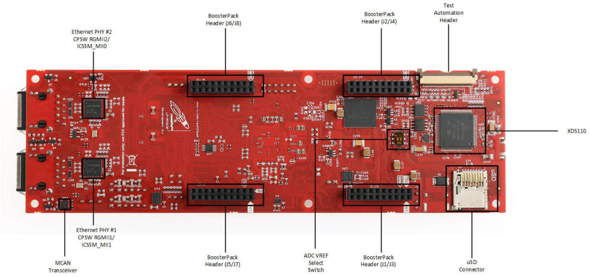

**Figure 1-4. AM263Px LaunchPad Bottom Components Identification** 

_AM263Px LaunchPad User Guide_ 

SPRUJ85B – APRIL 2024 – REVISED JANUARY 2026 _Submit Document Feedback_ 

4 

Copyright © 2026 Texas Instruments Incorporated 

_LaunchPad Module Overview_ 

www.ti.com 

## **1.4 Compliance** 

All components selected meet RoHS and REACH compliance. 

Components installed on the product are sensitve to Electrostatic Discharge (ESD). It is recommended this product be used in an ESD controlled environment. This may include a temperature and/or humidity controlled environment to limit the buildup of ESD. It is also recommended to use ESD protection such as wrist straps and ESD mats when interfacing with the product. 

The product is used in the basic electromagnetic environment as in laboratory conditions, and the applied standard is as per EN IEC 61326-1:2021. 

SPRUJ85B – APRIL 2024 – REVISED JANUARY 2026 _Submit Document Feedback_ 

_AM263Px LaunchPad User Guide_ 

5 

Copyright © 2026 Texas Instruments Incorporated 

_Hardware Description_ 

www.ti.com 

## **2 Hardware Description** 

## **2.1 Board Setup** 

## _**2.1.1 Power Requirements**_ 

The AM263Px LaunchPad is powered from a 5V, 3A USB type-C input. The following sections describe the power distribution network topology that supply the AM263Px LaunchPad, supporting components and the reference voltages. 

Power supply solutions that are compatible with the AM263Px LaunchPad: 

- When using the USB type-C input: 

   - 5V, 3A power adapter with USB-C receptacle 

   - 5V, 3A power adapter with captive USB-C cable 

   - PC USB type-C port that has Power Delivery classification 

      - Thunderbolt 

      - Battery behind USB logo 

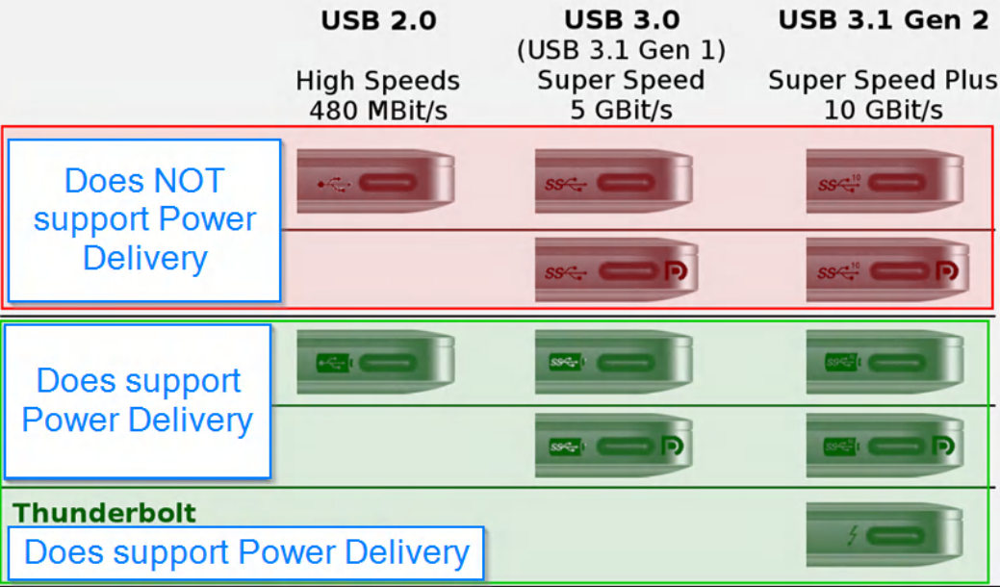

**Figure 2-1. USB Type-C Power Delivery Classification** 

Power supply solutions that are **NOT** compatible with the AM263Px LaunchPad: 

- When using USB type-C input: 

   - Any USB adapter cables such as: 

      - Type-A to type-C 

      - micro-B to type-C 

      - DC barrel jack to type-C 

   - 5V, 1.5A power adapter with USB-C captive cable or receptacle 

   - PC USB type-C port not capable of 3A 

_AM263Px LaunchPad User Guide_ 

SPRUJ85B – APRIL 2024 – REVISED JANUARY 2026 _Submit Document Feedback_ 

6 

Copyright © 2026 Texas Instruments Incorporated 

www.ti.com 

_Hardware Description_ 

## **2.1.1.1 Power Input Using USB Type-C Connector** 

The AM263Px LaunchPad is powered through a USB type-C connection. The USB Type-C source should be capable of providing 3A at 5V and should advertise the current sourcing capability through CC1 and CC2 signals. On AM263Px LaunchPad, the CC1 and CC2 from USB type-C connector are interfaced to the port controller IC (TUSB320). This device uses the CC pins to determine port attach and detach, cable orientation, role detection, and port control for Type-C current mode. The CC logic detects the Type-C current mode as default, medium, or high depending on the role detected. 

The Port pin is pulled down to ground with a resistor to configure it as upward facing port (UFP) mode. VBUS detection is implemented to determine a successful attach in UFP mode. The OUT1 and OUT2 pins are connected to a NOR gate. Active low on both the OUT1 and OUT2 pins advertises high current (3A) in the attached state which enables the VUSB_5V0 power switch to provide the VSYS_5V0 supply which powers other regulators and LDOs. 

In UFP mode, the port controller IC constantly presents pull down resistors on both CC pins. The port controller IC also monitors the CC pins for the voltage level corresponding to the Type-C mode current advertisement by the connected DFP. The port controller IC de-bounces the CC pins and waits for VBUS detection before successfully attaching. As a UFP, the port controller device detects and communicates the advertised current level of the DFP to the system through the OUT1 and OUT2 GPIOs. 

The AM263Px LaunchPad power requirement is 5V at 3A and if the source is not capable of providing the required power, the output at the NOR gate becomes low that disables the VUSB_5V0 power switch. Therefore, if the power requirement is not met, all power supplies except VCC3V3_TA remains in the off state. The board gets powered on completely only when the source can provide 5V at 3A. 

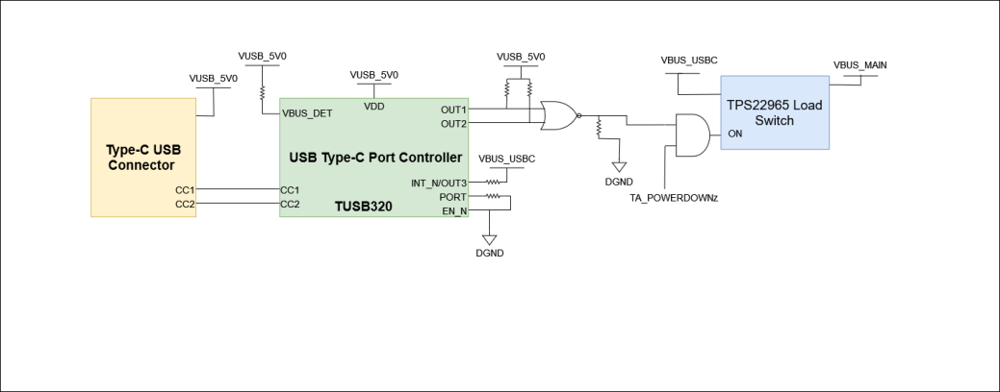

**Figure 2-2. Type-C CC Configuration** 

SPRUJ85B – APRIL 2024 – REVISED JANUARY 2026 _Submit Document Feedback_ 

_AM263Px LaunchPad User Guide_ 

7 

Copyright © 2026 Texas Instruments Incorporated 

_Hardware Description_ 

www.ti.com 

**Table 2-1. Current Sourcing Capability and State of USB Type-C Cable** 

|**OUT1**|**OUT2**|**Advertisement**|
|---|---|---|
|H|H|Default current in unattached state|
|H|L|Default current in attached state|
|L|H|Medium current (1.5A) in attached state|
|L|L|High current (3.0A) in attached state|

The AM263Px LaunchPad includes a power solution based on discrete regulators for each of the power rails. During the initial stage of the power supply, 5V supplied by the type-C USB connector is used to generate all of the necessary voltages required by the LaunchPad. 

Discrete DC-DC buck regulators and LDOs are used to generate the supplies required for the AM263Px system on a chip (SoC) and other peripherals. 

**Table 2-2. Voltage Rail Generation** 

|**Component**|**Reference** **Designator**|**Function**|**Voltage In**|**Voltage Out**|
|---|---|---|---|---|
|TPS62913|U29|AM263Px Core Digital 1.2V|5.0V|1.2V|
|TPS74801|U32|System 3.3V|5.0V|3.3V|
|TSP74801|U30|Ethernet PHY 2.5V|5.0V|2.5V|
|TPS74801|U31|Ethernet PHY 1.1V|5.0V|1.1V|
|TPS62177|U36|Test Automation Header 3.3V|5.0V|3.3V|

8 _AM263Px LaunchPad User Guide_ 

SPRUJ85B – APRIL 2024 – REVISED JANUARY 2026 _Submit Document Feedback_ 

Copyright © 2026 Texas Instruments Incorporated 

www.ti.com 

_Hardware Description_ 

## **2.1.1.2 Power Status LEDs** 

Multiple power-indication LEDs are provided onboard to indicate to users the output status of major supplies. The LEDs indicate power across various domains. 

**Table 2-3. Power Status LEDs** 

|**Name**|**Default Status**|**Operation**|**Function**|
|---|---|---|---|
|D2|ON|VSYS_5V0|Power indicator for generated 5V voltage|
|D4|ON|VSYS_3V3|Power indicator for generated 3.3V voltage|
|D5|ON|PG_VDD_1V2|Power indicator for generated 1.2V power-good voltage|
|D6|ON|VSYS_TA_3V3|Power indicator for voltage going to the Test Automation Header|
|DS1|OFF|SAFETY_ERROR|Power error indication for voltage - VUSB_5V0|
|D3|OFF|XDS_PROGSTAZ1|LED will glow after micro-B connection is made|
|DS3|OFF|XDS_PROGSTAZ2|LED will glow to indicate communication over JTAG|
|DS4|OFF|VUSB_5V0|Power NOT Good (Power Bad)|

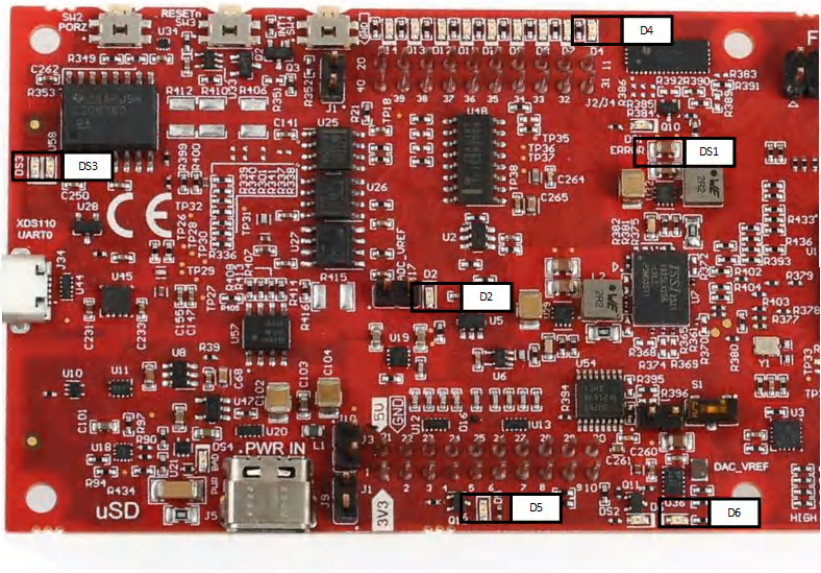

**Figure 2-3. Power Status LEDs** 

SPRUJ85B – APRIL 2024 – REVISED JANUARY 2026 _Submit Document Feedback_ 

_AM263Px LaunchPad User Guide_ 

9 

Copyright © 2026 Texas Instruments Incorporated 

_Hardware Description_ 

www.ti.com 

## **2.1.1.3 Power Tree** 

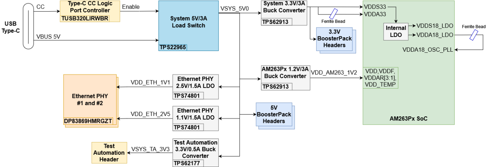

**Figure 2-4. Power Tree Diagram of AM263Px LaunchPad** 

_AM263Px LaunchPad User Guide_ 

SPRUJ85B – APRIL 2024 – REVISED JANUARY 2026 _Submit Document Feedback_ 

10 

Copyright © 2026 Texas Instruments Incorporated 

www.ti.com 

_Hardware Description_ 

## _**2.1.2 Push Buttons**_ 

The LaunchPad supports multiple user push buttons that provide reset inputs and user interrupts to the AM263Px SoC. 

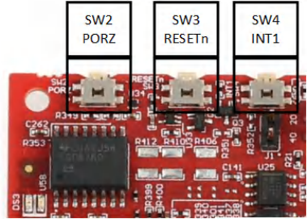

**Figure 2-5. Push Buttons** 

Table 2-4 lists the push buttons that are placed on the top side of the AM263Px LaunchPad. 

**Table 2-4. LaunchPad Push Buttons** 

|**Push Button**|**Signal**|**Function**|
|---|---|---|
|SW2|PORz|SoC PORz reset input|
|SW3|RESETz|SoC warm reset input|
|SW4|INT1|User Interrupt Signal|

SPRUJ85B – APRIL 2024 – REVISED JANUARY 2026 _Submit Document Feedback_ 

_AM263Px LaunchPad User Guide_ 11 

Copyright © 2026 Texas Instruments Incorporated 

_Hardware Description_ 

www.ti.com 

## _**2.1.3 Boot mode Selection**_ 

The boot mode for the AM263Px is selected by a DIP (Dual In-Line Package) switch (SW1) or the test automation header. The test automation header uses an I2C expansion buffer to drive the boot mode when PORz is toggled. The supported boot modes are shown in Table 2-6. The DIP Switch configurations for each boot mode are shown in Table 2-5. 

## **Note** 

As seen in the schematic, enabling(toggling to ON state) a switch pulls the respective SOP pin to GND through a 1kΩ resistor. Thus the Boot mode selection switches' logic table below is logical invert of the corresponding SOP logic levels for a given boot mode, as seen in AM263P Technical Reference Manual. 

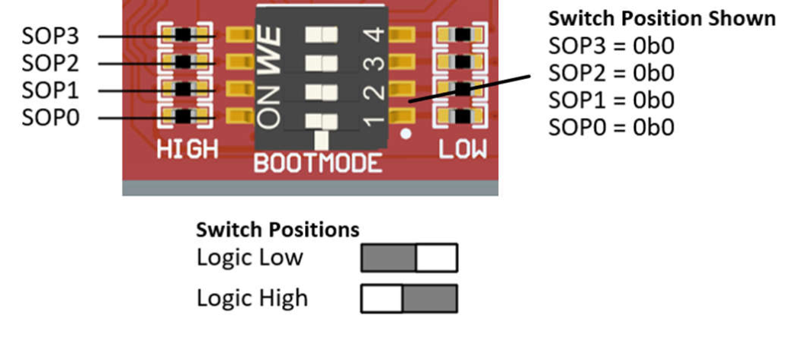

**Figure 2-6. Boot mode DIP Switch Positions - LP AM263P SW1 SOP Switches** 

**Table 2-5. Boot mode Selection** 

|**Boot mode**|**SPI0_D0_pad (SOP3** **- SW1.4)**|**SPI0_CLK_pad** **(SOP2 - SW1.3)**|**QSPI_D1 (SOP1 -** **SW1.2)**|**QSPI_D0 (SOP0 -** **SW1.1)**|
|---|---|---|---|---|
|OSPI (4S) - Quad Read Mode|1|1|1|1|
|UART|1|1|1|0|
|OSPI (1S) - Single Read Mode|1|1|0|1|
|OSPI (8S) - Octal Read Mode|1|1|0|0|
|DevBoot|0|1|0|0|
|xSPI 8D (SFDP)|0|0|1|1|
|Unsupported boot mode|All other combinations not defined above||||

12 _AM263Px LaunchPad User Guide_ 

SPRUJ85B – APRIL 2024 – REVISED JANUARY 2026 _Submit Document Feedback_ 

Copyright © 2026 Texas Instruments Incorporated 

www.ti.com 

_Hardware Description_ 

**Table 2-6. Supported Boot modes** 

|**Boot mode/Peripheral**|**Boot Media/Host**|**Notes**|
|---|---|---|
|OSPI (4S) - Quad Read Mode|OSPI Flash|Download and boot SBL from OSPI flash in quad read mode. Attempt Primary SBL, followed by Secondary SBL if primary loading fails.|
|UART|External Host|Download and boot SBL from UART interface via XMODEM protocol at 115200bps BaudRate.|
|OSPI (1S) - Single Read Mode|OSPI Flash|Download and boot SBL from OSPI flash in single read mode. Attempt Primary SBL, followed by Secondary SBL if primary loading fails.|
|OSPI (8S) - Octal Read Mode|OSPI Flash|Download and boot SBL from OSPI flash in octal read mode. Attempt Primary SBL, followed by Secondary SBL if primary loading fails.|
|xSPI 8D (SFDP)|OSPI Flash|Read SFDP table for read command, download and boot SBL from OSPI flash in 8D mode. Attempt Primary SBL, followed by Secondary SBL if primary loading fails.|
|DevBoot|N/A|No SBL. Used for development purposes only.|

## _**2.1.4 IO Expander**_ 

AM263Px LaunchPad has an TCA6416ARTWR IO Expander, that provides general-purpose remote I/O expansion and bidirectional voltage translation for processors through I2C communication, an interface consisting of serial clock (SCL), and serial data (SDA) signals. 

The TCA6416A's digital core consists of eight 8-bit data registers: two Configuration registers (input or output selection), two Input Port registers, two Output Port registers, and two Polarity Inversion registers. At power on or after a reset, the I/Os are configured as inputs. However, the system controller can configure the I/Os as either inputs or outputs by writing to the Configuration registers. The data for each input or output is kept in the corresponding Input Port or Output Port register. The polarity of the Input Port register can be inverted with the Polarity Inversion register. All registers can be read by the system controller. In AM263P SoC, the communication with IO Expander is done through I2C1 bus. The signals that are coming out of the IO Expander shown in IO Expander. Please refer to TCA6416ARTWR-Datasheet for programming guide of TCA6416ARTWR. 

SPRUJ85B – APRIL 2024 – REVISED JANUARY 2026 _Submit Document Feedback_ 

_AM263Px LaunchPad User Guide_ 

13 

Copyright © 2026 Texas Instruments Incorporated 

_Hardware Description_ 

www.ti.com 

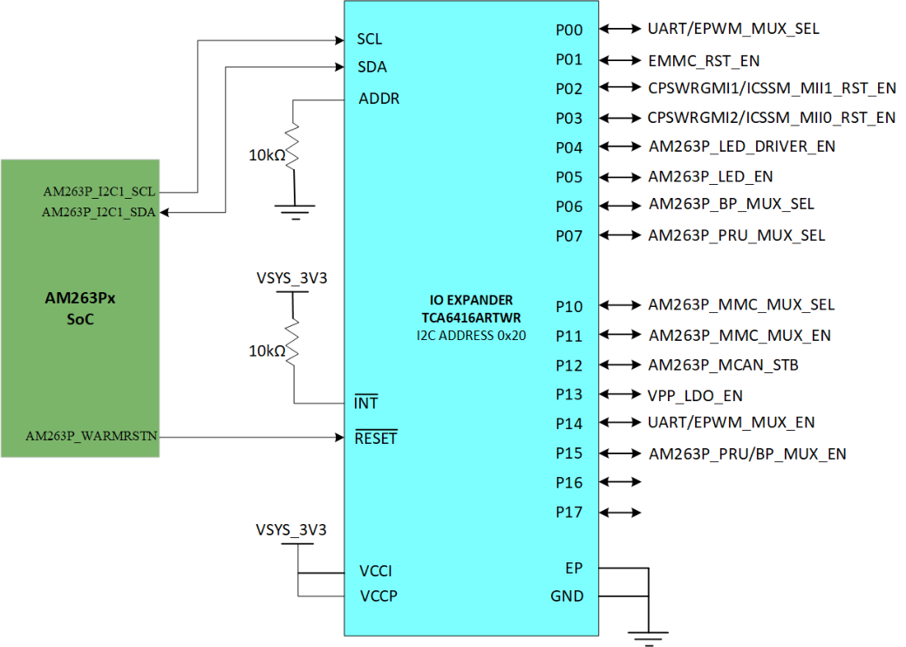

**Figure 2-7. IO Expander** 

14 _AM263Px LaunchPad User Guide_ 

SPRUJ85B – APRIL 2024 – REVISED JANUARY 2026 _Submit Document Feedback_ 

Copyright © 2026 Texas Instruments Incorporated 

www.ti.com 

_Hardware Description_ 

## **2.2 Functional Block Diagram** 

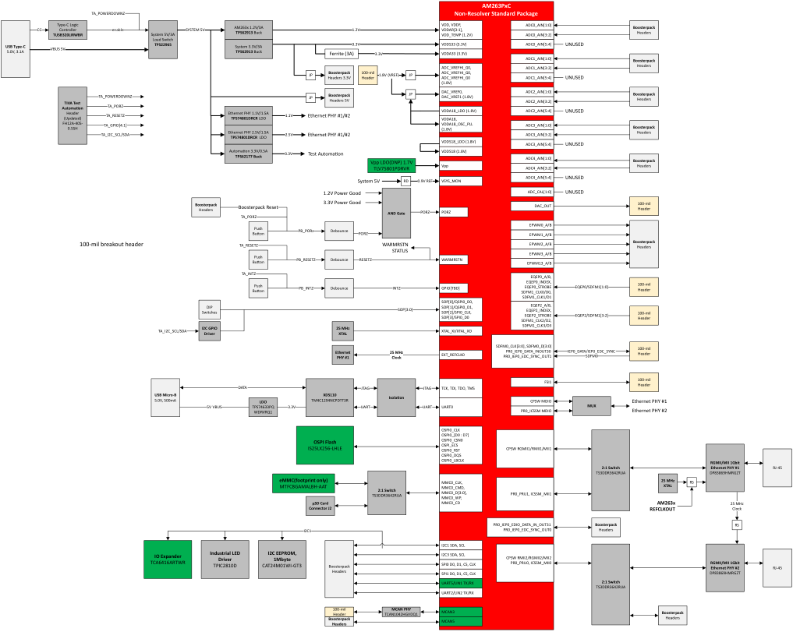

**----- Start of picture text -----** 
AM263PxC TA_POWERDOWNZ Non-Resolver Standard Package USB Type-C  5.0V, 3.1A CC VBUS 5V TUSB320LIRWBR Type-C Logic Controller enable System 5V/3ALoad Switch TPS22965 SYSTEM 5V AM263x 1.2V/3ASystem 3.3V/3A TPS62913 TPS62913  BuckBuck JP Headers 3.3V Boosterpack Ferrite (3A) 1.2V3.3V 100-mil Header 3.3V 1.8V (VREF) JP ADC_VREFHI_G0,ADC_VREFHI_G0,ADC_VREFHI_G0 (1.8V)VDD, VDDF, VDDAR[3:1],VDD_TEMP (1.2V)VDDS33 (3.3V)VDDA33 (3.3V) ADC1_AIN[1:0]ADC1_AIN[3:2]ADC1_AIN[5:4]ADC0_AIN[1:0]ADC0_AIN[3:2]ADC0_AIN[5:4] UNUSEDUNUSED BoosterpackBoosterpack HeadersHeaders Automation FH12A-40S-(Updated) TIVA Test  Header0.5SH TA_POWERDOWNZTA_I2C_SCL/SDATA_GPIO[4:1]TA_RESETZTA_PORZ Ethernet PHY 1.1V/1.5A Ethernet PHY 2.5V/1.5A TPS74801DRCR TPS74801DRCR   LDOLDO 1.1V2.5V Ethernet PHY #1/#2Ethernet PHY #1/#2JP Boosterpack Headers 5V JP DAC_VREF0, DAC_VREF1 (1.8V)VDDA18, VDDA18_OSC_PLL (1.8V)  VDDA18_LDO (1.8V)  VDDS18_LDO (1.8V)   ADC3_AIN[1:0]ADC3_AIN[3:2]ADC3_AIN[5:4]ADC2_AIN[1:0]ADC2_AIN[3:2]ADC2_AIN[5:4] UNUSEDUNUSED BoosterpackBoosterpack HeadersHeaders Automation 3.3V/0.5A TPS62177 Buck 3.3V Test Automation Vpp LDO(DNP) 1.7VTLV75801PDRVR VDDS18 (1.8V)  Vpp ADC4_AIN[1:0]ADC4_AIN[3:2] Boosterpack Headers System 5V RD 0.9V REF VSYS_MON ADC4_AIN[5:4] UNUSED 1.2V Power Good ADC_CAL[1:0] UNUSED Boosterpack Headers Boosterpack ResetTA_PORZ 3.3V Power Good AND Gate PORZ PORZ DAC_OUT 100-mil Header ButtonPush PB_PORz Debounce PORZ EPWM0_A/BEPWM1_A/B 100-mil breakout header TA_RESETZButtonPush PB_RESETZ Debounce RESETZ WARMRSTNSTATUS WARMRSTN EPWM13_A/BEPWM2_A/BEPWM3_A/B Boosterpack Headers TA_INTZ EQEP0_A/B, ButtonPush PB_INTZ Debounce INTZ GPIO[TBD] SDFM1_CLK0/D0, EQEP0_STROBEEQEP0_INDEX,  EQEP0/SDFM1[1:0] 100-mil Header SwitchesDIP  SOP[3:0] SOP[0]/QSPI0_D0,SOP[1]/QSPI0_D1,SOP[2]/SPI0_CLK,SOP[3]/SPI0_D0 SDFM1_CLK2/D2, SDFM1_CLK1/D1EQEP2_STROBEEQEP2_INDEX, EQEP2_A/B, EQEP2/SDFM1[3:2] 100-mil Header TA_I2C_ SCL/SDA I2C GPIO Driver 25 MHzXTAL XTAL_XI/XTAL_XO SDFM1_CLK3/D3 Ethernet PHY #1 25 MHz Clock EXT_REFCLK0 SDFM0_CLK[3:0], SDFM0_D[3:0]PR0_IEP0_EDC_SYNC_OUT1PR0_IEP0_DATA_INOUT30 IEP0_DATA/IEP0_EDC_SYNCSDFM0 100-mil Header DATA JTAG JTAG TCK, TDI, TDO, TMS FSI1 100-mil Header USB Micro-B  5.0V, 500mA 5V VBUS TPS74633PQWDRVRQ1 LDO 3.3V TM4C1294NCPDTT3R XDS110 UART Isolation UART UART0 PR0_ICSSM MDIOCPSW MDIO MUX Ethernet PHY #1Ethernet PHY #2 OSPI0_CLK OSPI0_[D0 : D7] IS25LX256-LHLE OSPI Flash OSPI0_CSN0OSPI_ECSOSPI0_RST CPSW RGMII1/RMII1/MII1 OSPI0_DQS OSPI0_LBCLK 2:1 Switch RGMII/MII 1Gbit Ethernet PHY #1 RJ-45 TS3DDR3642RUA DP83869HMRGZT eMMC(footprint only) MTFC8GAMALBH-AAT Connector J2µSD Card  TS3DDR3642RUA 2:1 Switch MMC0_CLK,MMC0_CMD,MMC0_D[3:0],MMC0_WP,MMC0_CD PR0_PRU1, ICSSM_MII1   REFCLKOUTAM263x 25 MHzXTAL RS 25 MHz Clock I2C1 PR0_IEP0_EDIO_DATA_IN_OUT31PR0_IEP0_EDC_SYNC_OUT0 Boosterpack Headers RS I2C1 SDA, SCL TCA6416ARTWR IO Expander Industrial LED  TPIC2810D Driver CAT24M01WI-GT3 I2C EEPROM, 1Mbyte BoosterpackHeaders I2C3 SDA, SCLSPI0 D0, D1, CS, CLKSPI1 D0, D1, CS, CLK CPSW RMII2/RGMII2/MII2PR0_PRU0, ICSSM_MII0   DP83869HMRGZT RGMII/MII 1Gbit Ethernet PHY #2 RJ-45 UART5/LIN1 TX/RX TS3DDR3642RUA 2:1 Switch UART2/LIN2 TX/RX BoosterpackHeaders 100-mil Header TCAN1042HGVDQ1 MCAN PHY MCAN3MCAN5 Boosterpack Headers **----- End of picture text -----** 

**Figure 2-8. AM263Px LaunchPad Functional Block Diagram** 

SPRUJ85B – APRIL 2024 – REVISED JANUARY 2026 _Submit Document Feedback_ 

_AM263Px LaunchPad User Guide_ 

15 

Copyright © 2026 Texas Instruments Incorporated 

_Hardware Description_ 

www.ti.com 

## **2.3 GPIO Mapping** 

**Table 2-7. GPIO Mapping Table** 

|**GPIO Description**|**GPIO**|**Functionality**|**Net Name**|**Active** **Status**|
|---|---|---|---|---|
|CPSW RGMII1/MII1 MUX select|GPIO105|GPIO|RGMII1_ICSSM_MUX_SEL_GPIO105|LOW|
|SD Card Load Switch Enable|GPIO122|GPIO|AM263P_SD_ENABLE_GPIO122|LOW|
|Interrupt To SoC|GPIO123|Interrupt|AM263P_INT1_PB_GPIO123|LOW|

16 _AM263Px LaunchPad User Guide_ 

SPRUJ85B – APRIL 2024 – REVISED JANUARY 2026 _Submit Document Feedback_ 

Copyright © 2026 Texas Instruments Incorporated 

www.ti.com 

_Hardware Description_ 

## **2.4 Reset** 

Figure 2-9 shows the reset architecture of the AM263Px LaunchPad 

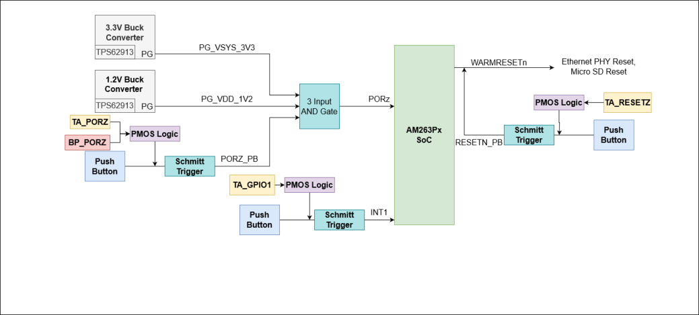

**Figure 2-9. Reset Architecture** 

The AM263Px LaunchPad has the following resets: 

- PORz is the Power On Reset 

- WARMRESETn is the warm reset 

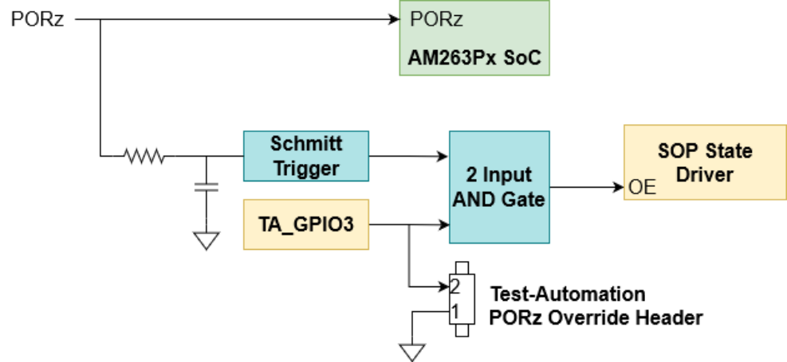

**Figure 2-10. PORZ Reset Signal Tree** 

The PORz signal is driven by a 3-input AND gate that generates a power on reset for the MAIN domain when: 

- The 3.3V buck converter (TPS62913) power good output is driven low by having an output voltage that is below the power-good threshold. 

- The 1.2V buck converter (TPS62913) power good output is driven low by having an output voltage that is below the power-good threshold. 

- The user push button (SW2) is pressed. 

SPRUJ85B – APRIL 2024 – REVISED JANUARY 2026 _Submit Document Feedback_ 

_AM263Px LaunchPad User Guide_ 

17 

Copyright © 2026 Texas Instruments Incorporated 

_Hardware Description_ 

www.ti.com 

- A P-Channel MOSFET gate's signal is logic LOW which causes VGS of the PMOS to be less than zero and so the PORz signal connects to the PMOS drain which is tied directly to ground. The signals that can create the logic LOW input to the PMOS gate are: 

   - TA_PORZ output from the Test Automation header 

   - BP_PORZ output from either of the BoosterPack sites. 

The PORz signal is tied to: 

- AM263Px SoC PORz input 

- Boot mode State Driver(U4)'s output enable input 

   - There is an RC filter to create a 1ms delay from GND to 3.0V such that the SOP State Driver's output enable input is low longer than the required SOP hold time following a PORz de-assertion. 

There is a Test-Automation PORz Override header that enables the ability to hold TA_GPIO3 low when a jumper is installed. This enables the boot mode Control from the Test Automation Header. 

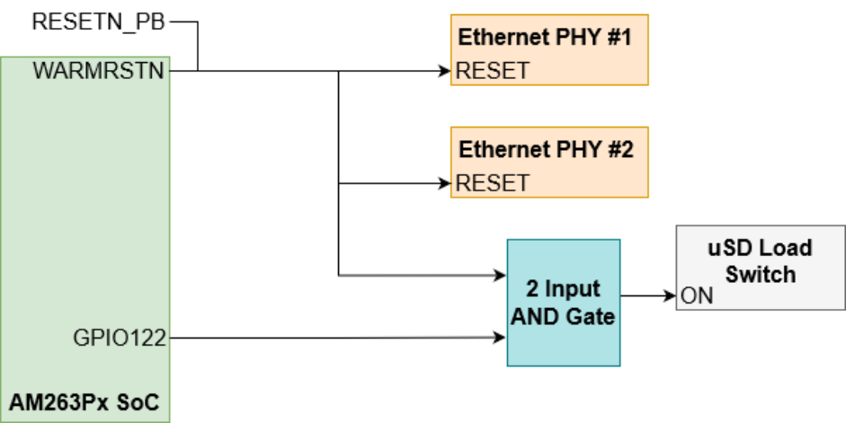

**Figure 2-11. WARMRESETn Reset Signal Tree** 

The WARMRESETn signal creates a warm reset to the MAIN domain when: 

- The user push button (SW3) is pressed. 

- The Test Automation Header outputs a logic LOW signal (TA_RESETz) to a P-Channel MOSFET gate which causes VGS of the PMOS to be less than zero and so the RESETz signal connects to the PMOS drain which is tied directly to ground. 

The WARMRESETn signal is tied to: 

- AM263Px SoC WARMRESETN output 

- RESETN_PB signal that is created from push button + PMOS logic 

- Micro SD Load Switch control input via a 2 input AND Gate with an AM263Px SoC driven GPIO signal (GPIO122) 

- Both Ethernet PHYs reset input 

The AM263Px LaunchPad also has an external interrupt to the SoC , INT1, that occurs when: 

- The user push button (SW4) is pressed. 

- The Test Automation Header outputs a logic LOW signal (TA_GPIO1) to a P-Channel MOSFET gate which causes VGS of the PMOS to be less than zero and so the INTn signal connects to the PMOS drain which is tied directly to ground. 

18 _AM263Px LaunchPad User Guide_ 

SPRUJ85B – APRIL 2024 – REVISED JANUARY 2026 _Submit Document Feedback_ 

Copyright © 2026 Texas Instruments Incorporated 

www.ti.com 

_Hardware Description_ 

## **2.5 Clock** 

The AM263Px SoC requires a 25MHz clock input for XTAL_XI. The AM263Px LaunchPad uses a 25MHz crystal for the SoC clock source. The LaunchPad also has two 25MHz Crystals onboard for the Ethernet PHY clocking. The SoC clock signal output CLKOUT0 can be used as a clock source for Ethernet PHY #1 by removing the resistors mounted for XTAL_XI and XTAL_XO from the 25MHz Ethernet PHY #1 Crystal and mounting the appropriate resistor for the CLKOUT0 signal to be routed to the XI pin of the Ethernet PHY. 

The Ethernet PHY #1 clock signal output ETH1_CLKOUT can be used as a clock source for Ethernet PHY #2 by removing the resistors mounted for XTAL_XI and XTAL_XO from the 25MHz Ethernet PHY #2 Crystal and mounting the appropriate resistor for the ETH1_CLKOUT signal to be routed to the XI pin of Ethernet PHY #2. 

The LaunchPad also requires a 16MHz clock source for the XDS110 for UART-USB JTAG support. 

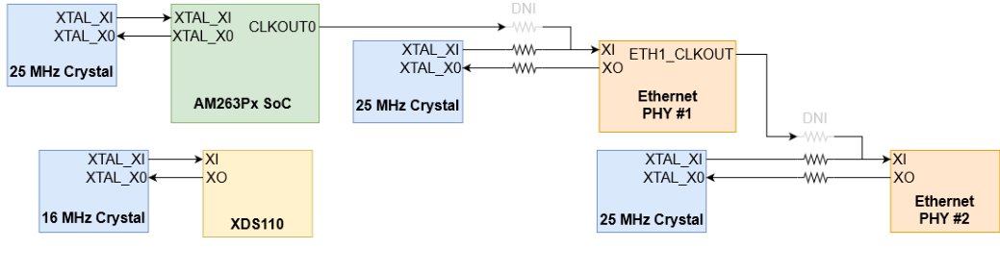

**Figure 2-12. AM263Px LaunchPad Clock Tree** 

SPRUJ85B – APRIL 2024 – REVISED JANUARY 2026 _Submit Document Feedback_ 

_AM263Px LaunchPad User Guide_ 

19 

Copyright © 2026 Texas Instruments Incorporated 

_Hardware Description_ 

www.ti.com 

## **2.6 Memory Interfaces** 

## _**2.6.1 OSPI**_ 

The AM263Px LaunchPad has a 256 Mb OSPI Flash memory device (IS25LX256-LHLE), which is connected to the OSPI0 interface of the AM263Px SoC. The OSPI supports single data rates(SDR) and double data rates(DDR) with memory speeds up to 133MHz. The OSPI flash is powered by the 3.3V system supply. 

The OSPI0_D0/D1 signals are also used for boot mode control logic. There are 10KΩ resistors used to isolate the boot mode control logic after the value is latched. 

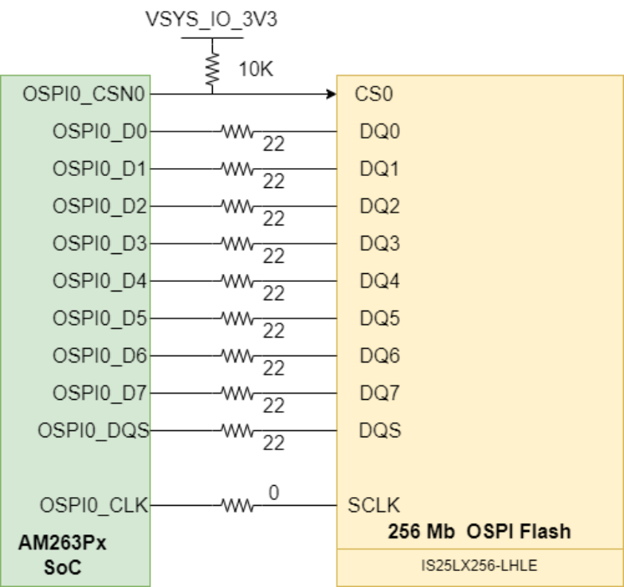

**Figure 2-13. OSPI Flash Interface** 

## **Note** 

AM263P_OSPI0_DQS(UART1_RXD) and AM263P_OSPI0_LBCLK(UART1_TXD) net names are wrongly swapped in the schematics of LP-AM263P Revision E2. As per datasheet OSPI0_DQS must be connected to M3 ball pin and OSPI0_LBCLKO must be connected to L3 Ball pin. This has been corrected in Revision A of LP-AM263P. 

Refer to OSPI DQS and LBCLK nets swap for more details. 

20 _AM263Px LaunchPad User Guide_ 

SPRUJ85B – APRIL 2024 – REVISED JANUARY 2026 _Submit Document Feedback_ 

Copyright © 2026 Texas Instruments Incorporated 

www.ti.com 

_Hardware Description_ 

## _**2.6.2 MMC**_ 

The AM263Px LaunchPad provides a micro SD card interface that is mapped to the MMC0 instance of the AM263Px SoC. 

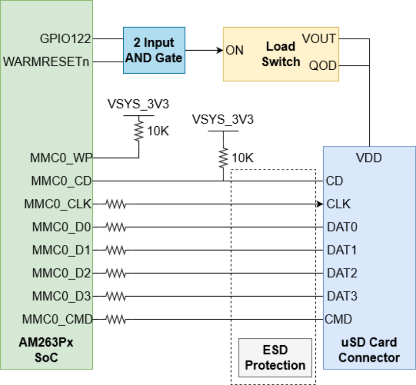

**Figure 2-14. Micro SD Card Connector** 

A load switch (TPS22918TDBVTQ1) is used to power the micro SD card connector. The load switch is driven by the output of a 2-input AND gate between WARMRESETn and the SD Card enable GPIO (GPIO122) to power cycle the card upon reset. The load switch uses quick output discharge (QOD) to make sure that the supply voltage reaches <10% of nominal value during reset. 

Inline ESD protection is provided for the MMC signals in the form of a six channel transient voltage suppressor device (TPD6E001RSER) and two channel transient voltage suppressor device (TPD2E001DRLR). 

The Write Protect (WP) and Card Detect (CD) signals of the SD card connector are pulled up to the 3.3V System voltage supply. 

A series termination resistor is provided for all MMC signals besides CD. 

SPRUJ85B – APRIL 2024 – REVISED JANUARY 2026 _Submit Document Feedback_ 

_AM263Px LaunchPad User Guide_ 21 

Copyright © 2026 Texas Instruments Incorporated 

_Hardware Description_ 

www.ti.com 

## _**2.6.3 eMMC**_ 

The AM263Px LaunchPad has a eMMC footprint that is mapped to the MMC0 instance of the AM263Px SoC, muxed through U53 MUX. The current eMMC footprint is considering the eMMC part MTFC8GAMALBH-AAT. Users can mount the same part, or pin compatible ones for evaluating the eMMC interface. 

## **Note** 

The current eMMC footprint on the LP-AM263P board has a mismatch of the AM263P_EMMC0_CLK_MUX and AM263P_EMMC0_CMD_MUX nets, where in they are swapped with each other wrongly. This needs to be fixed through a hardware modification of the board, before evaluating eMMC. Please refer to eMMC CMD and CLK nets swap for more details. 

22 _AM263Px LaunchPad User Guide_ 

SPRUJ85B – APRIL 2024 – REVISED JANUARY 2026 _Submit Document Feedback_ 

Copyright © 2026 Texas Instruments Incorporated 

www.ti.com 

_Hardware Description_ 

## _**2.6.4 Board ID EEPROM**_ 

The AM263Px LaunchPad has a I2C based 1Mbit EEPROM (CAT24M01WI-GT3) to store board configuration details. The Board ID EEPROM is connected to the I2C1 interface of the AM263Px SoC. The default I2C address of the EEPROM is set to 0x52 by pulling up the address pin A1 and pulling down the address pin A2 to ground. The Write Protect pin for the EEPROM is by default pulled down to ground and therefore Write Protect is disabled. 

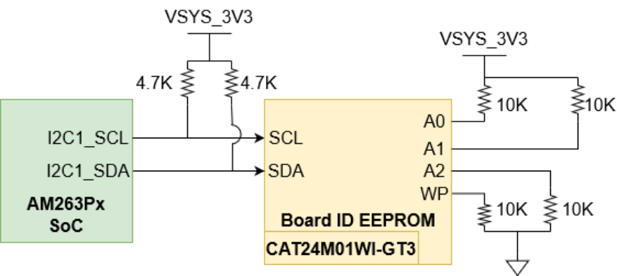

**Figure 2-15. Board ID EEPROM** 

SPRUJ85B – APRIL 2024 – REVISED JANUARY 2026 _Submit Document Feedback_ 

_AM263Px LaunchPad User Guide_ 

23 

Copyright © 2026 Texas Instruments Incorporated 

_Hardware Description_ 

www.ti.com 

## **2.7 Ethernet Interface** 

## _**2.7.1 Ethernet PHY #1 - CPSW RGMII/ICSSM**_ 

## **Note** 

The PRU internal pinmux mapping provided in the TRM is part of the original hardware definition of the PRU. However, due to the flexibility provided by the IP and associated firmware configurations, this is not necessarily a hard requirement. The first PRU implementation for AM65x had the MII TX pins swapped during initial SOC integration and this convention as maintained for subsequent PRU revisions to enable firmware reuse. To make use of the SDK firmware, use the SYSCONFIG generated PRU pin mapping. 

The AM263Px LaunchPad utilizes a 48-pin Ethernet PHY (DP83869HMRGZT) connected to either CPSW RGMII or one on-die Programmable Real-time Unit and Industrial Communication Sub System (PRU-ICSS). There is a 2:1 mux that selects between the RGMII or PRU-ICSS signals. The PHY is configured to advertise 1-Gb operation. The Ethernet data signals of the PHY are terminated to an RJ45 connector. The RJ45 connector is used on the board for Ethernet 10/100/1000Mbps connectivity with integrated magnetics and LEDs for link and activity indication. 

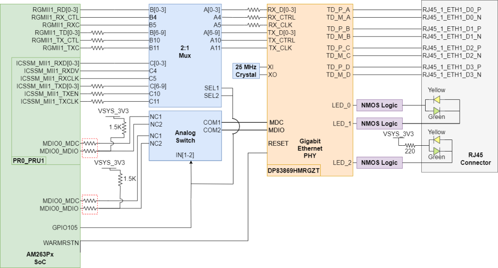

**Figure 2-16. Ethernet PHY #1** 

24 _AM263Px LaunchPad User Guide_ 

SPRUJ85B – APRIL 2024 – REVISED JANUARY 2026 _Submit Document Feedback_ 

Copyright © 2026 Texas Instruments Incorporated 

www.ti.com 

_Hardware Description_ 

The Ethernet PHY requires three separate power sources. VDDIO is the 3.3V, system generated supply. There are dedicated LDO's for the 1.1V and 2.5V supplies for the Ethernet PHY. 

There are series termination resistors on the transmit clock and data signals located near the SoC. There are series termination resistors on the receive clock and data signals near the Ethernet PHY. 

The MDIO signal from the SoC to the PHY require 1.5kΩ pullup resistors to the 3.3V system supply voltage for proper operation. There is an analog switch (TS5A23159DGSR) that selects between the CPSW MDIO/MDC and the ICSSM MDIO/MDC signals to be routed to the Ethernet PHY. 

Both the 2:1 mux and analog switch are controlled by a GPIO signal that selects between CPSW RGMII and ICSSM signals. 

**Table 2-8. Ethernet PHY #1 CPSW/ICSSM Select** 

|**GPIO105**|**Condition**|**Function of Mux**|
|---|---|---|
|LOW|RGMII CPSW Selected|Port A ↔ Port B|
|HIGH|ICSSM Selected|Port A ↔ Port C|

The reset input for the Ethernet PHY is controlled by the WARMRESET AM263Px SoC output signal. 

The Ethernet PHY uses many functional pins as strap option to place the device into specific modes of operation. 

**Table 2-9. Ethernet PHY #1 Strapping Resistors** 

|**Functional Pin**|**Default Mode**|**Mode in** **LaunchPad**|**Function**|
|---|---|---|---|
|RX_D0|0|3|PHY address: 0011|
|RX_D1|0|0||
|JTAG_TDO/GPIO_1|0|0|RGMII to Copper|
|RX_D3|0|0||
|RX_D2|0|0||
|LED_0|0|0|Auto-negotiation, 1000/100/10 advertised, auto MDI-X|
|RX_ER|0|0||
|LED_2|0|0||
|RX_DV|0|0|Port Mirroring Disabled|

## **Note** 

Each strap pin has an internal pull down resistance of 2.49kΩ 

## **Note** 

RX_D0 and RX_D1 are on a 4-level strap resistor mode scheme. All other signals are 2-level strap resistor modes. 

SPRUJ85B – APRIL 2024 – REVISED JANUARY 2026 _Submit Document Feedback_ 

_AM263Px LaunchPad User Guide_ 

25 

Copyright © 2026 Texas Instruments Incorporated 

_Hardware Description_ 

www.ti.com 

## _**2.7.2 Ethernet PHY #2 - CPSW RGMII/ICSSM**_ 

## **Note** 

The PRU internal pinmux mapping provided in the TRM is part of the original hardware definition of the PRU. However, due to the flexibility provided by the IP and associated firmware configurations, this is not necessarily a hard requirement. The first PRU implementation for AM65x had the MII TX pins swapped during initial SOC integration and this convention was maintained for subsequent PRU revisions to enable firmware reuse. To make use of the SDK firmware, use the SYSCONFIG generated PRU pin mapping. 

The AM263Px LaunchPad utilizes a 48-pin Ethernet PHY (DP83869HMRGZT) connected to either CPSW RGMII or one on-die Programmable Real-time Unit and Industrial Communication Sub System (PRU-ICSS). The RGMII CPSW port and ICSSM are internally pinmuxed on the AM263Px SoC. For more information on the internal muxing of signals refer to Pinmux Mapping. The PHY is configured to advertise 1-Gb operation. The Ethernet data signals of the PHY are terminated to an RJ45 connector. The RJ45 connector is used on the board for Ethernet 10/100/1000Mbps connectivity with integrated magnetics and LEDs for link and activity indication. 

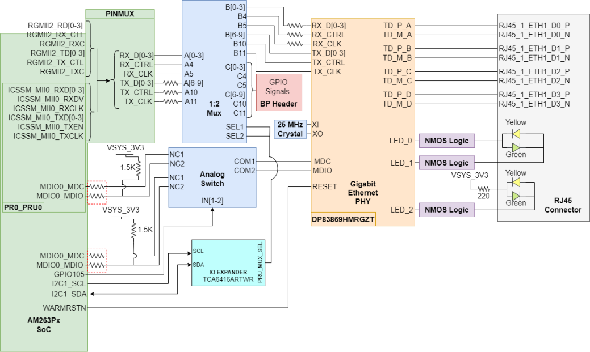

**Figure 2-17. Ethernet PHY #2** 

26 _AM263Px LaunchPad User Guide_ 

SPRUJ85B – APRIL 2024 – REVISED JANUARY 2026 _Submit Document Feedback_ 

Copyright © 2026 Texas Instruments Incorporated 

www.ti.com 

_Hardware Description_ 

The Ethernet PHY requires three separate power sources. VDDIO is the 3.3V, system generated supply. There are dedicated LDOs for the 1.1V and 2.5V supplies for the Ethernet PHY. 

There are series termination resistors on the transmit clock and data signals located near the SoC. There are series termination resistors on the receive clock and data signals near the Ethernet PHY. 

The MDIO signal from the SoC to the PHY require 1.5kΩ pullup resistors to the 3.3V system supply voltage for proper operation. There is an analog switch (TS5A23159DGSR) that selects between the CPSW MDIO/MDC and the ICSSM MDIO/MDC signals to be routed to the Ethernet PHY. 

AM263Px internal Pinmux is used to select between CPSW RGMII and ICSSM signals. The signals are then routed to a 1:2 mux (TS3DDR3812RUAR) that selects between mapping the signals to the Ethernet PHY or the BP headers in the case that the PRU GPIO signals are being used in a BoosterPack application. There is an AM263Px SoC GPIO select signal that drives the 1:2 mux. 

**Table 2-10. Ethernet PHY #2 CPSW/ICSSM Select** 

|**PRU_MUX_SEL**|**Condition**|**Function of Mux**|
|---|---|---|
|LOW|Ethernet PHY Selected|Port A ↔ Port B|
|HIGH|BoosterPack header Selected|Port A ↔ Port C|

The reset input for the Ethernet PHY is controlled by the WARMRESET AM263Px SoC output signal. 

The Ethernet PHY uses many functional pins as strap option to place the device into specific modes of operation. 

**Table 2-11. Ethernet PHY #2 Strapping Resistors** 

|**Functional Pin**|**Default Mode**|**Mode in LP**|**Function**|
|---|---|---|---|
|RX_D0|0|0|PHY address: 1100|
|RX_D1|0|3||
|JTAG_TDO/GPIO_1|0|0|RGMII to Copper|
|RX_D3|0|0||
|RX_D2|0|0||
|LED_0|0|0|Auto-negotiation, 1000/100/10 advertised, auto MDI-X|
|RX_ER|0|0||
|LED_2|0|0||
|RX_DV|0|0|Port Mirroring Disabled|

## **Note** 

Each strap pin has an internal pull down resistance of 2.49kΩ 

## **Note** 

RX_D0 and RX_D1 are on a 4-level strap resistor mode scheme. All other signals are 2-level strap resistor modes. 

SPRUJ85B – APRIL 2024 – REVISED JANUARY 2026 _Submit Document Feedback_ 

_AM263Px LaunchPad User Guide_ 27 

Copyright © 2026 Texas Instruments Incorporated 

_Hardware Description_ 

www.ti.com 

## _**2.7.3 LED Indication in RJ45 Connector**_ 

The AM263Px LaunchPad has two RJ45 network ports for the CPSW RGMII and ICSSM signals of the AM263Px SoC. Each RJ45 connector contains two bi-color LEDs that are used to indicate link and activity. 

RJ45 Connector LED indication for the Ethernet PHY #1: 

**Table 2-12. Ethernet PHY #1 RJ45 Connector LED indication** 

|**LED**|**Color**|**Indication**|
|---|---|---|
|Right LED|Green|Ethernet PHY power established|
||Yellow|Transmit or Receive activity|
|Left LED|Green|Link OK|
||Yellow|1000BT link is up|

RJ45 Connector LED indication for the Ethernet PHY #2: 

**Table 2-13. Ethernet PHY #2 RJ45 Connector LED indication** 

|**LED**|**Color**|**Indication**|
|---|---|---|
|Right LED|Green|Ethernet PHY power established|
||Yellow|Transmit or Receive activity|
|Left LED|Green|Link OK|
||Yellow|1000BT link is up|

_AM263Px LaunchPad User Guide_ 

SPRUJ85B – APRIL 2024 – REVISED JANUARY 2026 _Submit Document Feedback_ 

28 

Copyright © 2026 Texas Instruments Incorporated 

www.ti.com 

_Hardware Description_ 

## **2.8 I2C** 

The AM263Px LaunchPad uses two AM263Px SoC inter-integrated circuit (I2C) ports to operate as a controller for various targets. I2C data and clock lines needs to be pulled up to the 3.3V system voltage supply to enable communication. 

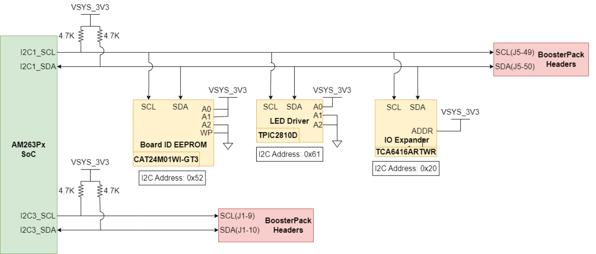

**Figure 2-18. I2C Targets** 

**Table 2-14. I2C Addressing** 

|**Target**|**I2C Instance**|**I2C Address Bit Description**|**Device Addressing**|**LaunchPad Config.**|**I2C Address**|
|---|---|---|---|---|---|
|Board ID EEPROM|I2C1|The first 4 bits of the device address are set to 1010, the next two are set by the A2 and A1 pins, the seventh bit, a16, is the most significant internal address bit|0b10110[A2][A1][a16] A1 is connected to 3.3V supply A2 is connected to ground|0b1010010|0x52|
|LED Driver|I2C1|The first four bits of the target address are 1100, the following three are determined by A2, A1, and A0|0b1100[A2][A1][A0] A2/A1 are connected to ground A0 is connected to 3.3V supply|0b1100001|0x61|
|BoosterPack Headers|I2C1, I2C3|Dependent on target||||

SPRUJ85B – APRIL 2024 – REVISED JANUARY 2026 _Submit Document Feedback_ 

_AM263Px LaunchPad User Guide_ 

29 

Copyright © 2026 Texas Instruments Incorporated 

_Hardware Description_ 

www.ti.com 

## **Table 2-14. I2C Addressing (continued)** 

|**Target**|**I2C Instance**|**I2C Address Bit Description**|**Device Addressing**|**LaunchPad Config.**|**I2C Address**|
|---|---|---|---|---|---|
|Boot mode IO Expander|I2C1|The first 6 bits of the target address are set to 010000, the next bit is determined by the addr pin of the IO expander|IO_ADDR pin connected to 3.3V supply|0b0100001|0x21|
|IO Expander|I2C1|The first 6 bits of the target address are set to 010000, the next bit is determined by the addr pin of the IO expander|IO_ADDR pin connected to 3.3V supply|0b0100001|0x20|

## **Note** 

Underlined address bits are fixed based on the device addressing and cannot be configured. 

_AM263Px LaunchPad User Guide_ 

SPRUJ85B – APRIL 2024 – REVISED JANUARY 2026 _Submit Document Feedback_ 

30 

Copyright © 2026 Texas Instruments Incorporated 

www.ti.com 

_Hardware Description_ 

## **2.9 Industrial Application LEDs** 

The AM263Px LaunchPad has an LED Driver (TPIC2810D) that is used for Industrial Communication LEDs. The driver is connected to eight green LEDs, and the driver has an I2C address of 0x61. 

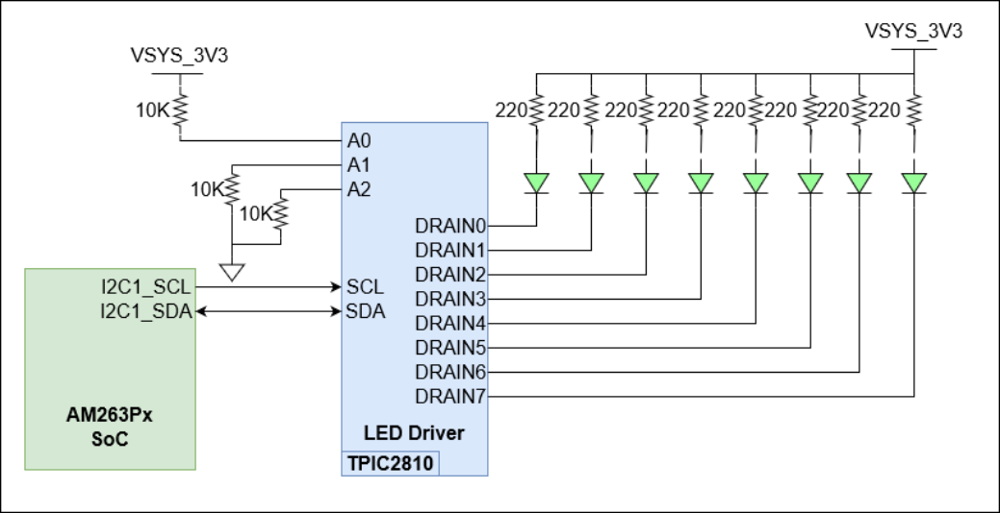

**Figure 2-19. Industrial Application I2C LED Array** 

SPRUJ85B – APRIL 2024 – REVISED JANUARY 2026 _Submit Document Feedback_ 

_AM263Px LaunchPad User Guide_ 

31 

Copyright © 2026 Texas Instruments Incorporated 

_Hardware Description_ 

www.ti.com 

## **2.10 SPI** 

The AM263Px LaunchPad maps two SPI instances (SPI0, SPI1) from the AM263Px SoC to the BoosterPack Headers. Series termination resistors are placed near the SoC for each SPI clock and SPI D0 signal. There is a 2:1 mux (SN74CB3Q3257PWR) that is responsible for selecting SPI signals for proper function. The mux is driven by two GPIO signals that are generated from the AM263Px SoC. 

**Table 2-15. SPI Mux** 

|**Output Enable (OE)**|**Select (S)**|**Input/Output**|**Function**|
|---|---|---|---|
|Low|Low|A ↔ B1|A port = B1 port|
|Low|High|A ↔ B2|A port = B2 port|
|High|X|Hi-Z|Disconnect|

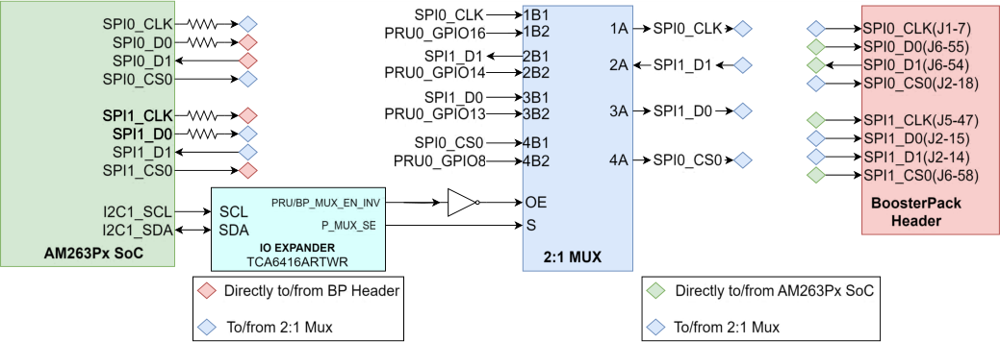

**Figure 2-20. SoC SPI to BoosterPack - LP-AM263P RevE2** 

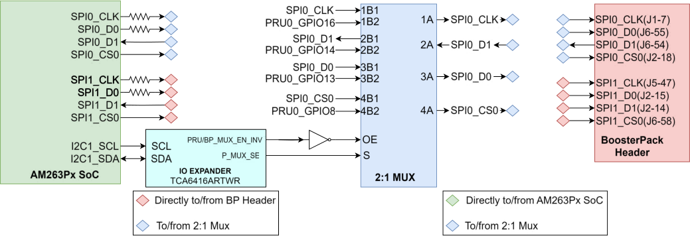

**Figure 2-21. SoC SPI to BoosterPack - LP-AM263P RevA** 

_AM263Px LaunchPad User Guide_ 

SPRUJ85B – APRIL 2024 – REVISED JANUARY 2026 _Submit Document Feedback_ 

32 

Copyright © 2026 Texas Instruments Incorporated 

www.ti.com 

_Hardware Description_ 

## **2.11 UART** 

The AM263Px LaunchPad uses the XDS110 as a USB2.0 to UART bridge for terminal access. UART0 transmit and receive signals of the AM263Px SoC are mapped to the XDS110 with a dual channel isolation buffer (ISO7721DR) for translating from the 3.3V IO voltage supply to the 3.3V XDS supply. The XDS110 is connected to a micro-B USB connector for the USB 2.0 signals. ESD protection is provided to the USB 2.0 signals by a transient voltage suppression device (TPD4E02B04DQAR). The micro-B USB connector's VBUS 5V power is mapped to a low dropout regulator (TPS79601DRBR) to generate the 3.3V XDS110 supply. A separate 3.3V supply for the XDS110 allows for the emulator to maintain a connection when power to the LaunchPad is removed. 

Separate UART instances (UART2 & UART5) are mapped directly to the BoosterPack header. 

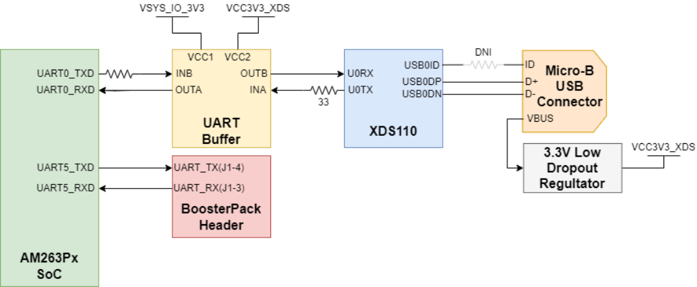

**Figure 2-22. UART** 

SPRUJ85B – APRIL 2024 – REVISED JANUARY 2026 _Submit Document Feedback_ 

_AM263Px LaunchPad User Guide_ 

33 

Copyright © 2026 Texas Instruments Incorporated 

_Hardware Description_ 

www.ti.com 

## **2.12 MCAN** 

The LaunchPad is equipped with a single MCAN Transceiver (TCAN1044VDRBTQ1) that is connected to the MCAN3 interface of the AM263Px SoC. The MCAN Transceiver has two power inputs, VIO is the transceiver 3.3V system level shifting supply voltage and VCC is the transceiver 5V supply voltage. The SoC CAN data transmit data input is mapped to TXD of the transceiver and the CAN receive data output of the transceiver is mapped to the MCAN RX signal of the SoC. 

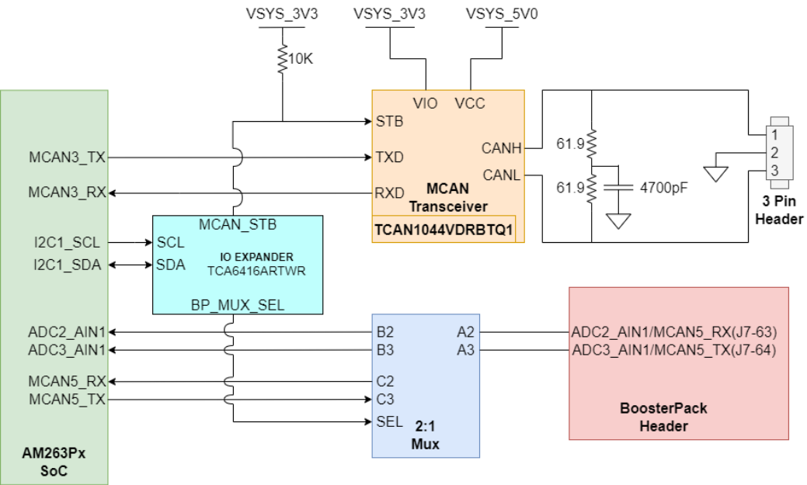

**Figure 2-23. MCAN Transceiver and BoosterPack Header** 

The system has a 120Ω split termination on the CANH and CANL signals to improve EMI performance. Split termination improves the electromagnetic emissions behavior of the network by eliminating fluctuations in the bus common-mode voltages at the start and end of message transmissions. 

The low and high level CAN bus input output lines are terminated to a three pin header. 

34 _AM263Px LaunchPad User Guide_ 

SPRUJ85B – APRIL 2024 – REVISED JANUARY 2026 _Submit Document Feedback_ 

Copyright © 2026 Texas Instruments Incorporated 

www.ti.com 

_Hardware Description_ 

The standby control signal is an AM263Px SoC GPIO signal. The STB control input has a pullup resistor that is used to have the transceiver be in low-power standby mode to prevent excessive system power. Below is a table that shows the operating modes of the MCAN transceiver based on the STB control input logic. 

**Table 2-16. MCAN Transceiver Operating Modes** 

|**STB**|**Device Mode**|**Driver**|**Receiver**|**RXD Pin**|
|---|---|---|---|---|
|High|Low current standby mode with bus wake-up|Disabled|Low-power receiver and bus monitor enable|High (recessive) until valid WUP is received|
|Low|Normal Mode|Enabled|Enabled|Mirrors bus state|

MCAN5 is routed to the BoosterPack Header via a 2:1 mux. The mux selects whether ADC inputs or MCAN signals are mapped to the BoosterPack Header. 

**Table 2-17. MCAN BoosterPack Mux** 

|**BP_MUX_SEL**|**Condition**|**Function of Mux**|
|---|---|---|
|LOW|ADC Inputs Selected|Port A ↔ Port B|
|HIGH|MCAN TX/RX Selected|Port A ↔ Port C|

SPRUJ85B – APRIL 2024 – REVISED JANUARY 2026 _Submit Document Feedback_ 

_AM263Px LaunchPad User Guide_ 

35 

Copyright © 2026 Texas Instruments Incorporated 

_Hardware Description_ 

www.ti.com 

## **2.13 FSI** 

The AM263Px LaunchPad supports a fast serial interface by terminating the SoC signals to a 10-pin header. The interface has two lines of data and a clock line for both the receive and transmit signals. The 10-pin header is connected to the 3.3V System voltage supply. 

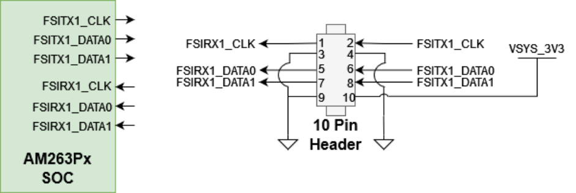

**Figure 2-24. FSI 10-Pin Header** 

## **2.14 JTAG** 

The AM263Px LaunchPad includes an XDS110 class onboard emulator. The LaunchPad includes all circuitry needed for XDS110 emulation. The emulator uses a USB 2.0 micro-b connector to interface the USB 2.0 signals that are created from the UART-USB bridge. The VBUS power from the connector is used to power the emulator circuit so that the connection to the emulator is not lost when power to the LaunchPad is removed. For more information on the XDS110 and the UART-USB bridge refer to UART 

The XDS110 controls two power status LEDs. For more information on the Power Status LEDs refer to Power Status LEDs 

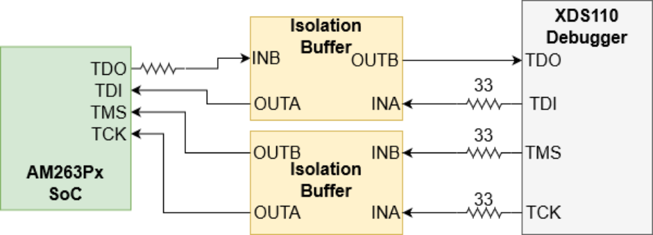

**Figure 2-25. JTAG Interface to XDS110** 

## **2.15 TIVA and Test Automation Header** 

The board supports two test automation features: 

- A USB-based virtual COM port, using the TIVA Test Automation Header. 

   - The header allows an external controller to manipulate basic operations such as power down, PORz, warm reset, and boot mode control. 

   - The AM263Px SOC I2C instance is connected to the TIVA Test Automation Header - FH12A-402-0.55H. 

- A 40 pin test automation header that allows an external controller to manipulate basic operations such as power down, PORz, warm reset, and boot mode control. 

_AM263Px LaunchPad User Guide_ 

SPRUJ85B – APRIL 2024 – REVISED JANUARY 2026 _Submit Document Feedback_ 

36 

Copyright © 2026 Texas Instruments Incorporated 

www.ti.com 

_Hardware Description_ 

- The Test Automation Circuit is powered by a dedicated 3.3V power supply (VSYS_TA_3V3) which is generated by a 5V to 3.3V buck regulator (TPS62177DQCR). 

- The AM263Px SoC I2C3 instance is connected to both the Test Automation Header and the boot mode IO expander (TCA6408ARGTR). 

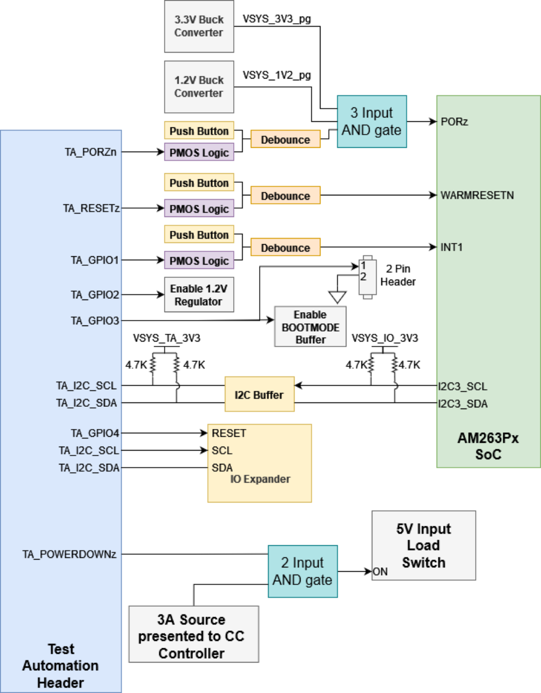

**Figure 2-26. Test Automation Header** 

SPRUJ85B – APRIL 2024 – REVISED JANUARY 2026 _Submit Document Feedback_ 

_AM263Px LaunchPad User Guide_ 

37 

Copyright © 2026 Texas Instruments Incorporated 

_Hardware Description_ 

www.ti.com 

## The following table details the Test Automation mapping. 

**Table 2-18. Test Automation GPIO and I2C Mapping** 

|**Signal Name**|**Description**|**Direction**|
|---|---|---|
|TA_POWERDOWNZ|When logic low, disables the 3.3V buck regulator that is used in the first stage of DC/DC conversion|Output|
|TA_PORZ|When logic low, connects the PORz signal to ground due to PMOS VGSbeing less than zero creating a power on reset to the MAIN domain|Output|
|TA_RESETZ|When logic low, connects the WARM RESETn signal to ground due to PMOS VGSbeing less than zero creating a warm reset to the MAIN domain|Output|
|TA_GPIO1|When logic low, connects the INTn signal to ground due to PMOS VGSbeing less than zero creating an interrupt to SoC|Output|
|TA_GPIO3|When logic low, disables the boot mode buffer output enable|Output|
|TA_GPIO4|Reset signal for boot mode IO Expander|Output|
|TA_I2C_SCL|I2C Clock signal used to communicate with bootmode IO expander to change the boot modes.|Output|
|TA_I2C_SDA|I2C Data signal used to communicate with bootmode IO expander to change the boot modes.|Output|

38 _AM263Px LaunchPad User Guide_ 

SPRUJ85B – APRIL 2024 – REVISED JANUARY 2026 _Submit Document Feedback_ 

Copyright © 2026 Texas Instruments Incorporated 

www.ti.com 

_Hardware Description_ 

## **2.16 LIN** 

The AM263Px LaunchPad supports Local Interconnect Network communication with two LIN instances mapped to the BoosterPack header. 

## **Note** 

The AM263Px does **not** have an onboard LIN Transceiver 

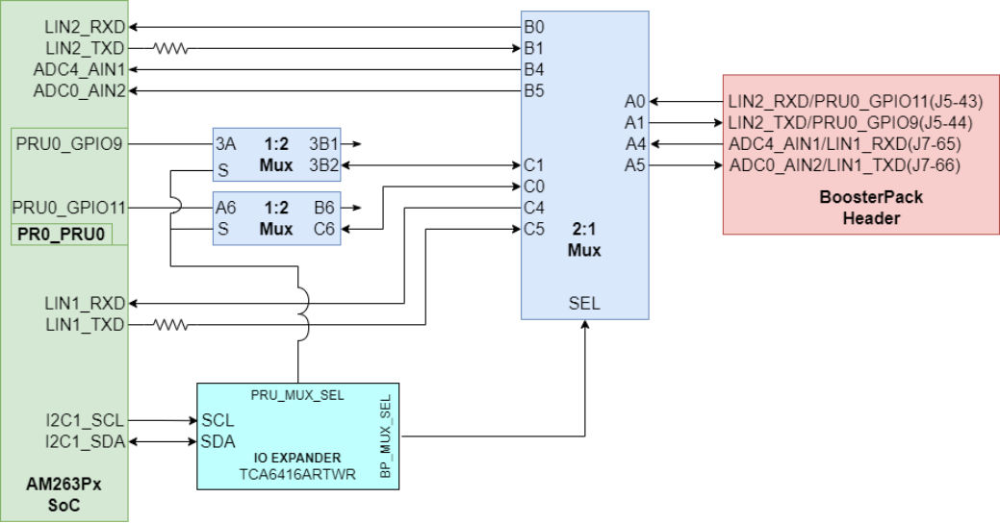

**Figure 2-27. LIN Instances to BoosterPack Header** 

Both LIN instances are mapped to the alternate BoosterPack function 2:1 mux. The alternate BoosterPack function mux also has mappings for ADC inputs and PRU0 GPIO signals. 

**Table 2-19. LIN 2:1 Mux** 

|**PRU_MUX_SEL**|**BP_MUX_SEL**|**Function of 2:1 Mux**|**Signals to BP Header**|
|---|---|---|---|
|HIGH|LOW|Port A ↔ Port B|LIN2TX/RX, ADC4_AIN1, ADC0_AIN2|
|HIGH|HIGH|Port A ↔ Port C|PRU GPIO11/9, LIN1TX/RX|
|LOW|LOW|Port A ↔ Port B|LIN2TX/RX, ADC4_AIN1, ADC0_AIN2|
|LOW|HIGH|Port A ↔ Port C|NC, NC, LIN1 TX/RX|

SPRUJ85B – APRIL 2024 – REVISED JANUARY 2026 _Submit Document Feedback_ 

_AM263Px LaunchPad User Guide_ 

39 

Copyright © 2026 Texas Instruments Incorporated 

_Hardware Description_ 

www.ti.com 

## **2.17 ADC and DAC** 

The AM263Px LaunchPad maps 20 ADC inputs to the BoosterPack header. All of the ADC inputs that are used in the LaunchPad are ESD protected. 

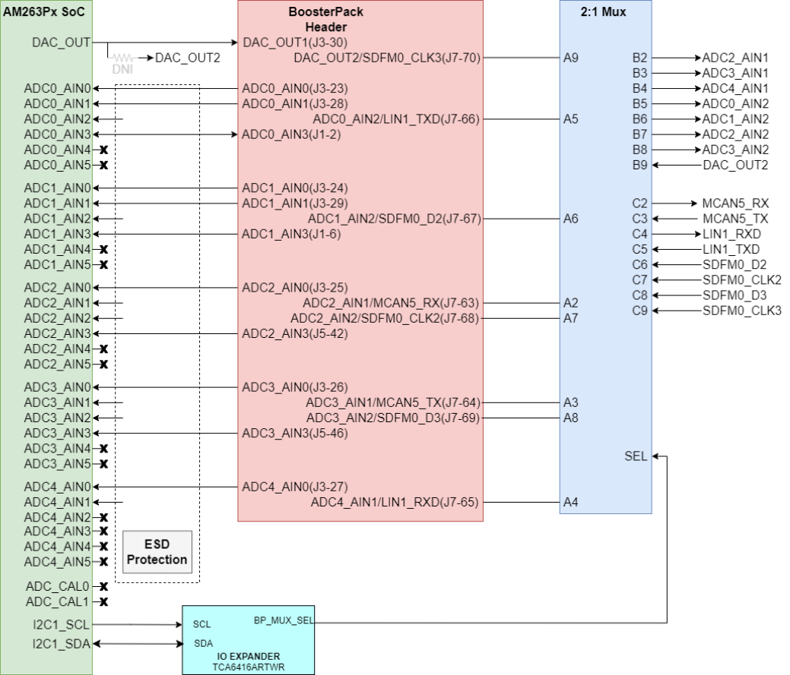

**Figure 2-28. ADC/DAC Signal Pathing** 

Seven of the ADC inputs and one instance of the DAC_OUT signal is routed to a 2:1 mux (TS3DDR3812RUAR) to offer alternate BoosterPack functionality. The select line of the mux is driven by an AM263Px SoC GPIO signal. 

**Table 2-20. ADC BoosterPack Mux** 

|**BP_MUX_SEL**|**Condition**|**Function of Mux**|
|---|---|---|
|LOW|ADC input/DAC_OUT Selected|Port A ↔ Port B|
|HIGH|Alternate BP functionality Selected|Port A ↔ Port C|

_AM263Px LaunchPad User Guide_ 

SPRUJ85B – APRIL 2024 – REVISED JANUARY 2026 _Submit Document Feedback_ 

40 

Copyright © 2026 Texas Instruments Incorporated 

www.ti.com 

_Hardware Description_ 

The ADC and DAC require a voltage reference. The AM263Px LaunchPad has two switches that allow the user to switch between the DAC and ADC VREF source. 

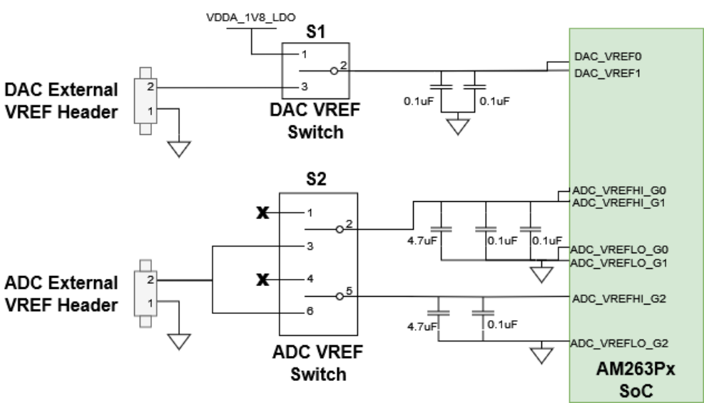

**Figure 2-29. ADC and DAC VREF Switches** 

The DAC VREF Switch (S1) is a single pole double throw switch that controls the input of the ADC VREF inputs of the AM263Px SoC. 

**Table 2-21. DAC VREF Switch** 

|**DAC VREF Switch Position**|**Reference Selection**|
|---|---|
|Pin 1-2|AM263Px on-die LDO|
|Pin 2-3|External DAC VREF Header|

The ADC VREF Switch (S2) contains two single pole double throw switches that controls the input of the ADC VREF inputs of the AM263Px SoC. 

**Table 2-22. ADC VREF Switch** 

|**ADC VREF Switch Position**|**Reference Selection**|
|---|---|
|Pin 1-2|OPEN - Allow for reference to be AM263Px on-die LDO reference|
|Pin 2-3|External ADC VREF Header|
|Pin 4-5|OPEN - Allow for reference to be AM263Px on-die LDO reference|
|Pin 5-6|External ADC VREF Header|

SPRUJ85B – APRIL 2024 – REVISED JANUARY 2026 _Submit Document Feedback_ 

_AM263Px LaunchPad User Guide_ 

41 

Copyright © 2026 Texas Instruments Incorporated 

_Hardware Description_ 

www.ti.com 

## **2.18 EQEP and SDFM** 

The AM263Px LaunchPad internally muxes the eQEP and SDFM signals. The eQEP0 and SDFM1 instances of the AM263Px are terminated to two headers (J24, J15). The eQEP2 and SDFM2 instances of the AM263Px are terminated to two headers (J25, J16). 

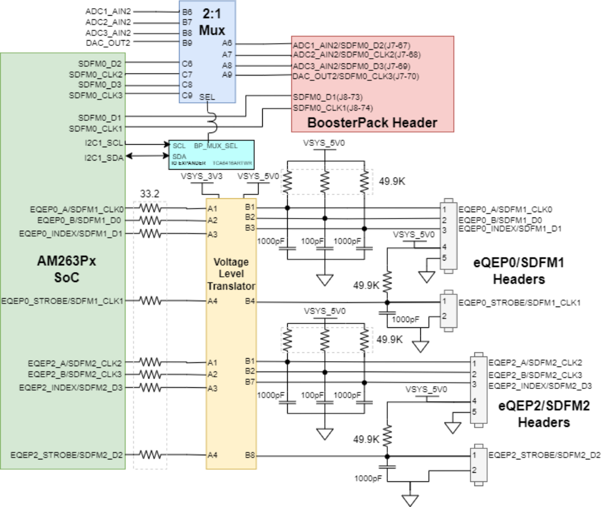

**Figure 2-30. EQEP and SDFM Signal Mapping** 

All eQEP signals have series termination resistors between the AM263Px SoC and the Voltage Level Translator (TXB0108RGYR). The voltage level shifter is responsible for translating the 3.3V to 5V. 

SDFM0 is mapped to the BoosterPack Header rather than an independent header. Four of the SDFM0 signals are routed through a 2:1 mux to offer alternate BoosterPack functionality. The select line of the mux is driven by an AM263Px SoC GPIO signal. 

**Table 2-23. SDFM0 Mux** 

|**BP_MUX_SEL**|**Condition**|**Function of Mux**|
|---|---|---|
|LOW|Alternate BP functionality Selected|Port A ↔ Port B|
|HIGH|SDFM0 Selected|Port A ↔ Port C|

42 _AM263Px LaunchPad User Guide_ 

SPRUJ85B – APRIL 2024 – REVISED JANUARY 2026 _Submit Document Feedback_ 

Copyright © 2026 Texas Instruments Incorporated 

www.ti.com 

_Hardware Description_ 

## **2.19 EPWM** 

The AM263Px LaunchPad maps 20 PWM channels (10 PWM_A/B pairs) to the BoosterPack Header. Each EPWM signal has a series termination resistor. For the mapping of each EPWM signal refer to Pinmux Mapping. 

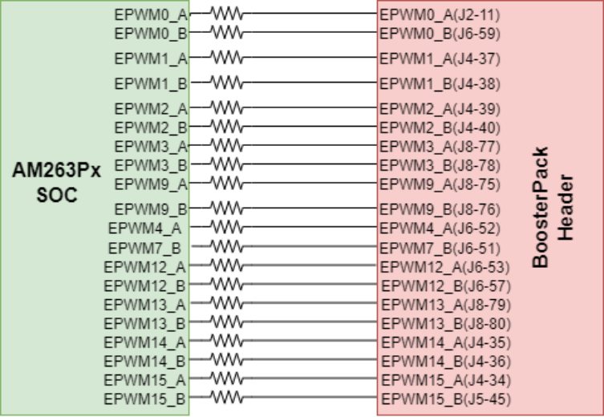

**Figure 2-31. EPWM Signal Mapping to BoosterPack Header** 

SPRUJ85B – APRIL 2024 – REVISED JANUARY 2026 _Submit Document Feedback_ 

_AM263Px LaunchPad User Guide_ 

43 

Copyright © 2026 Texas Instruments Incorporated 

_Hardware Description_ 

www.ti.com 

## **2.20 BoosterPack Headers** 

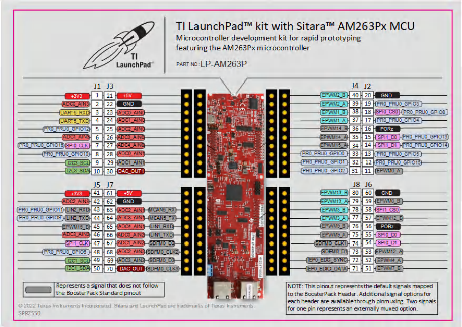

**Figure 2-32. AM263Px LaunchPad BoosterPack Pinout** 

## **Note** 

This pinout represents the default signals mapped to the BoosterPack Header. Additional signal options for each header are available through Pinmux Mapping. Two signals for one pin represents an externally muxed option 

The AM263Px LaunchPad supports two fully independent BoosterPack XL connectors. BoosterPack site #1 (J1/J3, J2/J4) is located in between the SoC and the micro-B USB Connector. BoosterPack site #2 (J5/J7, J6/J8) is located in between the SoC and the RJ45 connectors. Each GPIO has multiple functions available through the GPIO mux. The signals connected from the SoC to the BoosterPack headers include: 

- Various ADC inputs 

- DAC outputs 

- UART5 

- Various GPIO signals 

- SPI0 and SPI1 

- I2C1 and I2C3 

- Various EPWM channels 

- LIN1 and LIN2 

- MCAN1 

- SDFM0 

44 _AM263Px LaunchPad User Guide_ 

SPRUJ85B – APRIL 2024 – REVISED JANUARY 2026 _Submit Document Feedback_ 

Copyright © 2026 Texas Instruments Incorporated 

www.ti.com 

_Hardware Description_ 

## **2.21 Pinmux Mapping** 

The various pinmux options for the BoosterPack connector pins are given below. 

## **Table 2-24. Pinmux Legend** 

Default signal for BP Header Muxed alternative signal External MUX for alternate signal options 

## **Table 2-25. Pinmux Options for J1** 

|**Pin#**|**Mode0**|**Mode1**|**Mode2**|**Mode3**|**Mode4**|**Mode5**|**Mode6**|**Mode7**|**Mode8**|**Mode9**|**Mode 10**|
|---|---|---|---|---|---|---|---|---|---|---|---|
|J1.1|3V3|||||||||||
|J1.2|ADC0_AIN3|||||||||||
|J1.3|EPWM15_B|UART5_RXD|MII1_CRS|MCAN7_TX||||GPIO74|||EPWM15_B|
|J1.4|EPWM15_A|UART5_TXD|MII1_COL|MCAN7_RX||||GPIO73|||EPWM15_A|
|J1.5|PR0_PRU0_GPIO12||RMII2_TXD1|RGMII2_TD1|MII2_TXD1|EPWM28_B||GPIO100|||EPWM28_B|
|J1.6|ADC1_AIN3|||||||||||
|J1.7|SPI0_CLK|UART3_TXD|LIN3_TXD||||FSITX0_CLK|GPIO12||||
||PR0_PRU0_GPIO16|||RGMII2_TXC|MII2_TXCLK|EPWM27_A||GPIO97|||EPWM27_A|
|J1.8|PR0_PRU0_GPIO10||RMII2_CRS_D V|PR0_UART0_RT Sn|MII2_CRS|EPWM23_A||GPIO89|||EPWM22_B|
|J1.9|EPWM8_B|UART4_RXD|I2C3_SCL|SPI6_D1|||FSITX2_D0|GPIO60|||EPWM9_B|
|J1.10|EPWM8_A|UART4_TXD|I2C3_SDA|SPI6_D0|||FSITX2_CLK|GPIO59|||EPWM8_A|

## **Table 2-26. Pinmux Options for J2** 

|**Pin#**|**Mode0**|**Mode1**|**Mode2**|**Mode3**|**Mode4**|**Mode5**|**Mode6**|**Mode7**|**Mode8**|**Mode9**|**Mode10**|
|---|---|---|---|---|---|---|---|---|---|---|---|
|J2.11|EPWM0_A|||||||GPIO43|||EPWM0_A|
|J2.12|PR0_PRU0_GPIO 15||RMII2_TX_EN|RGMII2_TX_C TL|MII2_TX_EN|EPWM27_B||GPIO98||||
|J2.13|PR0_PRU0_GPIO 5||RMII2_RX_ER||MII2_RX_ER|EPWM22_A||GPIO87|||EPWM22_A|
|J2.14|SPI1_D1|UART5_RXD||||XBAROUT4|FSIRX0_D1|GPIO18||||
||PR0_PRU0_GPIO 14A|||RGMII2_TD3A|MII2_TXD3A|EPWM29_BA||GPIO102A|||EPWM27_BA|
|J2.15|SPI1_D0|UART5_TXD||||XBAROUT3|FSIRX0_D0|GPIO17||||
||PR0_PRU0_GPIO 13A|||RGMII2_TD2A|MII2_TXD2A|EPWM29_AA||GPIO101A|||EPWM27_BA|
|J2.16|PORz|||||||||||
|J2.17|PR0_PRU0_GPIO 4|||RGMII2_RX_C TL|MII2_RXDV|EPWM24_B||GPIO92|||EPWM24_B|
|J2.18|SPI0_CS0|UART3_RXD|LIN3_RXD|||||GPIO11||||
||PR0_PRU0_GPIO 8|||||EPWM23_B||GPIO90|||EPWM29_A|
|J2.19|PR0_PRU0_GPIO 3|||RGMII2_RD3|MII2_RXD3|EPWM26_B||GPIO96|||EPWM26_B|
|J2.20|GND|||||||||||

A - Applies to revision A of LP-AM263P board only. 

SPRUJ85B – APRIL 2024 – REVISED JANUARY 2026 _Submit Document Feedback_ 

_AM263Px LaunchPad User Guide_ 

45 

Copyright © 2026 Texas Instruments Incorporated 

_Hardware Description_ 

www.ti.com 

## **Table 2-27. Pinmux Options for J3** 

|**Pin#**|**Mode0**|**Mode1**|**Mode2**|**Mode3**|**Mode4**|**Mode5**|**Mode6**|**Mode7**|**Mode8**|**Mode9**|
|---|---|---|---|---|---|---|---|---|---|---|
|J3.21|5V||||||||||
|J3.22|GND||||||||||
|J3.23|ADC0_AIN0||||||||||
|J3.24|ADC1_AIN0||||||||||
|J3.25|ADC2_AIN0||||||||||
|J3.26|ADC3_AIN0||||||||||
|J3.27|ADC4_AIN0||||||||||
|J3.28|ADC0_AIN1||||||||||
|J3.29|ADC1_AIN1||||||||||
|J3.30|DAC_OUT1||||||||||

## **Table 2-28. Pinmux Options for J4** 

|**Pin#**|**Mode0**|**Mode1**|**Mode2**|**Mode3**|**Mode4**|**Mode5**|**Mode6**|**Mode7**|**Mode8**|**Mode9**|**Mode10**|
|---|---|---|---|---|---|---|---|---|---|---|---|
|J4.31|PR0_PRU0_GPIO2|||RGMII2_RD2|MII2_RXD2|EPWM26_A||GPIO95|||EPWM26_A|
|J4.32|PR0_PRU0_GPIO1||RMII2_RXD1|RGMII2_RD1|MII2_RXD1|EPWM25_B||GPIO94|||EPWM25_B|
|J4.33|PR0_PRU0_GPIO0||RMII2_RXD0|RGMII2_RD0|MII2_RXD0|EPWM25_A||GPIO93|||EPWM25_A|
|J4.34|EPWM15_A|UART5_TXD|MII1_COL|MCAN7_RX||||GPIO73|||EPWM15_A|
|J4.35|EPWM14_A|UART1_DSRn|SPI7_D1|MCAN6_RX||||GPIO71|||EPWM14_A|
|J4.36|EPWM14_B||MII1_RX_ER|||||GPIO72|||EPWM14_B|
|J4.37|EPWM1_A|||||||GPIO45|||EPWM1_A|
|J4.38|EPWM1_B|||||||GPIO46|||EPWM4_B|
|J4.39|EPWM2_A|||||||GPIO47|||EPWM2_A|
|J4.40|EPWM2_B|||||||GPIO48|||EPWM2_B|

## **Table 2-29. Pinmux Options for J5** 

|**Pin#**|**Mode0**|**Mode1**|**Mode2**|**Mode3**|**Mode4**|**Mode5**|**Mode6**|**Mode7**|**Mode8**|**Mode9**|**Mode10**|
|---|---|---|---|---|---|---|---|---|---|---|---|
|J5.41|3V3|||||||||||
|J5.42|ADC2_AIN3|||||||||||
|J5.43|LIN2_RXD|UART2_RX D|SPI2_D0|||||GPIO21||||
||PR0_PRU0_GPIO1 1||RMII2_TXD0|RGMII2_TD0|MII2_TXD0|EPWM28_A||GPIO99|||EPWM28_A|
|J5.44|LIN2_TXD|UART2_TXD|SPI2_D1|||||GPIO22||||
||PR0_PRU0_GPIO9|||PR0_UART0_C TSn|MII2_COL|EPWM22_B||GPIO88||||
|J5.45|EPWM15_B|UART5_RX D|MII1_CRS|MCAN7_TX||||GPIO74|||EPWM15_B|
|J5.46|ADC3_AIN3|||||||||||
|J5.47|SPI1_CLK|UART4_RX D|LIN4_RXD|||XBAROUT2|FSIRX0_CL K|GPIO16||||
|J5.48|PR0_PRU0_GPIO6||RMII2_REF_CLK|RGMII2_RXC|MII2_RXCLK|EPWM24_A||GPIO91|||EPWM24_A|
|J5.49|I2C1_SCL||SPI3_CS0|||XBAROUT7||GPIO23||||

46 _AM263Px LaunchPad User Guide_ 

SPRUJ85B – APRIL 2024 – REVISED JANUARY 2026 _Submit Document Feedback_ 

Copyright © 2026 Texas Instruments Incorporated 

www.ti.com 

_Hardware Description_ 

## **Table 2-29. Pinmux Options for J5 (continued)** 

|**Pin#**|**Mode0**|**Mode0**|**Mode1**|**Mode1**|**Mode2**|**Mode2**|**Mode3**|**Mode3**|**Mode4**|**Mode4**|**Mode5**|**Mode5**|**Mode6**|**Mode7**|**Mode8**|**Mode8**|**Mode8**|**Mode9**|**Mode9**|**Mode10**|
|---|---|---|---|---|---|---|---|---|---|---|---|---|---|---|---|---|---|---|---|---|
|J5.50|I2C1_SDA||||SPI3_CLK||||||XBAROUT8|||GPIO24|||||||
||**Table 2-30. Pinmux Options for J6**||||||||||||||||||||
|**Pin#**|**Mode0**|**Mode1**||**Mode2**||**Mode3**||**Mode4**||**Mode5**||**Mode6**||**Mode7**||**Mode8**|**Mode9**||**Mode10**||
|J6.51|EPWM7_B|||||SPI6_CLK||||||||GPIO58|||||EPWM5_B||
|J6.52|EPWM4_A|||||||||||||GPIO51|||||EPWM4_A||
|J6.53|EPWM12_A|UART3_CTSn||SPI4_CS1||||MCAN7_RX||||OSPI_D5||GPIO67|||||EPWM12_A||
|J6.54|SPI0_D1|||||||||||FSITX0_D1||GPIO14|||||||
||PR0_PRU0_ GPIO14E2A|||||RGMII2_TD3E 2A||MII2_TXD3E2 A||EPWM29_BE2 A||||GPIO102E2A|||||EPWM29_BE2 A||
|J6.55|SPI0_D0|||||||||||FSITX0_D0||GPIO13|||||||
||PR0_PRU0_ GPIO13E2A|||||RGMII2_TD2E 2A||MII2_TXD2E2 A||EPWM29_AE2 A||||GPIO101E2A|||||EPWM27_BE2 A||
|J6.56|PORz||||||||||||||||||||
|J6.57|EPWM12_B|UART1_DCD n||SPI7_CS0||||MCAN7_TX||||OSPI_D7||GPIO68|||||EPWM10_A||
|J6.58|SPI1_CS0|UART4_TXD||LIN4_TXD||||||XBAROUT1||||GPIO15|||||||
|J6.59|EPWM0_B|||||||||||||GPIO44|||||EPWM0_B||
|J6.60|GND||||||||||||||||||||

## E2A - Applies to revision E2A of LP-AM263P board only. 

## **Table 2-31. Pinmux Options for J7** 

|**Pin#**|**Mode0**|**Mode1**|**Mode2**|**Mode3**|**Mode4**|**Mode5**|**Mode6**|**Mode7**|**Mode8**|**Mode9**|
|---|---|---|---|---|---|---|---|---|---|---|
|J7.61|5V||||||||||
|J7.62|GND||||||||||
|J7.63|ADC2_AIN1||||||||||
||PR0_PRU1_G PIO16|MCAN5_RX||FSITX3_CLK|TRC_DATA10|||GPIO113|||
|J7.64|ADC3_AIN1||||||||||
||PR0_PRU1_G PIO15|MCAN5_TX||FSITX3_D0|TRC_DATA11|||GPIO114|||
|J7.65|ADC4_AIN1||||||||||
||LIN1_RXD|UART1_RXD|SPI2_CS0|OSPI_ECC_FAIL||XBAROUT5||GPIO19|OSPI_RESET_ OUT1||
|J7.66|ADC0_AIN2||||||||||
||LIN1_TXD|UART1_TXD|SPI2_CLK|OSPI_RESET_O UT0||XBAROUT6||GPIO20|||
|J7.67|ADC1_AIN2||||||||||
||UART5_RXD|||||||GPIO127|SDFM0_D2|CHANNEL0|
|J7.68|ADC2_AIN2||||||||||
||UART5_TXD|||||I2C3_SCL||GPIO126|SDFM0_CLK2|CHANNEL8|

SPRUJ85B – APRIL 2024 – REVISED JANUARY 2026 _Submit Document Feedback_ 

_AM263Px LaunchPad User Guide_ 47 

Copyright © 2026 Texas Instruments Incorporated 

_Hardware Description_ 

www.ti.com 

## **Table 2-31. Pinmux Options for J7 (continued)** 

|**Pin#**|**Mode0**|**Mode1**|**Mode2**|**Mode3**|**Mode4**|**Mode5**|**Mode6**|**Mode7**|**Mode8**|**Mode9**|
|---|---|---|---|---|---|---|---|---|---|---|
|J7.69|ADC3_AIN2||||||||||
||MCAN3_RX|||||||GPIO129|SDFM0_D3|CHANNEL1|
|J7.70|DAC_OUT||||||||||
||MCAN3_TX|UART5_RXD||||||GPIO128|SDFM0_CLK3|CHANNEL9|

## **Table 2-32. Pinmux Options for J8** 

|**Pin#**|**Mode0**|**Mode1**|**Mode2**|**Mode3**|**Mode4**|**Mode5**|**Mode6**|**Mode7**|**Mode8**|**Mode9**|**Mode10**|
|---|---|---|---|---|---|---|---|---|---|---|---|
|J8.71|PR0_PRU1_GPIO 18||UART3_T XD|PR0_IEP0_EDIO_DAT A_IN_OUT31|TRC_CTL|XBAROUT1 4||GPIO120||EQEP1_B||
|J8.72|PR0_PRU1_GPIO 19||UART3_R XD|PR0_IEP0_EDC_SYN C_OUT0|TRC_CLK|XBAROUT1 3||GPIO119||EQEP1_A||
|J8.73|PR0_PRU1_GPIO 17||UART5_C TSn|PR0_IEP0_EDIO_DAT A_IN_OUT30||||GPIO125|SDFM0_D1|||
|J8.74|PR0_PRU1_GPIO 7|CPTS0_TS_SYN C|UART5_R TSn|PR0_IEP0_EDC_SYN C_OUT1||I2C3_SDA||GPIO124|SDFM0_CLK1|||
|J8.75|EPWM9_A|||SPI7_CS0|MCAN4_R X||FSITX2_DATA 1|GPIO61|||EPWM9_A|
|J8.76|EPWM9_B|UART1_RTSn||SPI7_CLK|MCAN4_T X||FSIRX2_CLK|GPIO62|||EPWM11_B|
|J8.77|EPWM3_A|||||||GPIO49|||EPWM3_A|
|J8.78|EPWM3_B|||||||GPIO50|||EPWM6_A|
|J8.79|EPWM13_A|UART1_RIn|SPI7_CLK||||OSPI_D3|GPIO69|||EPWM13_A|
|J8.80|EPWM13_B|UART1_DTRn|SPI7_D0||||OSPI_ECC_FA IL|GPIO70|||EPWM13_B|

**Table 2-33. Pinmux Legend** 

Default signal for BP Header Muxed alternative signal External MUX for alternate signal options 

_AM263Px LaunchPad User Guide_ 

SPRUJ85B – APRIL 2024 – REVISED JANUARY 2026 _Submit Document Feedback_ 

48 

Copyright © 2026 Texas Instruments Incorporated 

www.ti.com 

_Hardware Design Files_ 

## **3 Hardware Design Files** 

## **3.1 Schematics** 

## **3.2 PCB Layouts** 

## **3.3 Bill of Materials (BOM)** 

SPRUJ85B – APRIL 2024 – REVISED JANUARY 2026 _Submit Document Feedback_ 

_AM263Px LaunchPad User Guide_ 

49 

Copyright © 2026 Texas Instruments Incorporated 

_Compliance Information_ 

www.ti.com 

## **4 Compliance Information** 

## **4.1 Compliance and Certifications** 

All components selected meet RoHS compliance. 

## **5 Additional Information** 

## **Trademarks** 

LaunchPad[™] , Texas Instruments[™] , and Sitara[™] are trademarks of Texas Instruments. All trademarks are the property of their respective owners. 

## **5.1 Sitara MCU+ Academy** 

TI offers the _MCU+ Academy_ as a resource for designing with the MCU+ software and tools on supported devices. The MCU+ Academy features easy-to-use training modules that range from the basics of getting started to advanced development topics. 

## **5.2 Hardware Changes from RevE2 to RevA** 

The below are the changes done from Revision-E2 of LP-AM263P to Revision-A of LP-AM263P 

1. The Boosterpack pins have been updated such that the pins PR0_PRU0_GPIO13 and PR0_PRU0_GPIO14 which were muxed on Boosterpack pins J6.54 and J6.55 are now muxed onto pins J2.14 and J2.15 pins. This is made to match the BOOSTXL-IOLINKM-8 Boosterpack requirements. Please note that here the alternate function can be selected based on different Muxes and their respective individual controls. 

2. The OSPI0 flash footprint has been made compatible with a standard OSPI PSRAM part footprint. Now a PSRAM part can also be mounted onto the U7(OSPI0 flash) footprint for evaluation. The resistor R443 must be mounted and R444 must be made DNI for evaluating an OSPI PSRAM part. Please refer LP-AM263P RevA schematics for more details. 

## **5.3 Known Board Changes/Issues** 

The below sections capture all the known issues/observations on the board and solutions/fixes for the same. Please note that some of these are already fixed on boards ordered from ti.com, as mentioned in respective sections. 

## _**5.3.1 OSPI DQS and LBCLK nets swap**_ 

This change/issue applies to only Revision E2A(PROC171E2) of LP-AM263P board. 

In AM263P the ball pins for OSPI DQS and LBCLK are as per below 

- OSPI0_DQS is from Ball pin M3 

- OSPI0_LBCLKO is from Ball pin L3 

But as seen in the below image from LP-AM263P Schematics, the nets are wrongly swapped. 

50 _AM263Px LaunchPad User Guide_ 

SPRUJ85B – APRIL 2024 – REVISED JANUARY 2026 _Submit Document Feedback_ 

Copyright © 2026 Texas Instruments Incorporated 

_Additional Information_ 

www.ti.com 

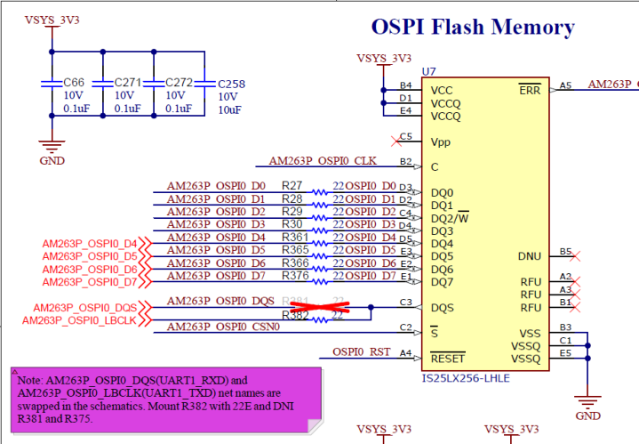

**Figure 5-1. OSPI DQS and LBCLK nets caution note in LP-AM263P Schematic** 

Hence to rectify this, as mentioned in the same schematic the resistor R381 is unmounted and the resistor R382 is mounted with 22Ω resistor. Also the resistor R375 is unmounted. 

All boards ordered from ti.com already have this change made. 

## _**5.3.2 XDS110 Debugger Bricking Issue**_ 

It has been found that few EVMs when connected to the PC and connect through Code Composer Studio(CCS), the user is prompted to update the firmware as per below window. Upon clicking on Update button, the update is unsuccessful and CCS just disconnects from the board and the board is no longer detected by CCS. This has been mostly observed with CCS versions 12.4 and above. 

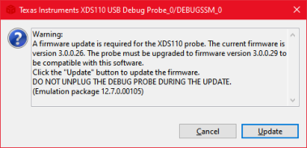

**Figure 5-2. CCS prompt to update firmware** 

The below are the steps of recovering a board when CCS fails to detect the board as mentioned above. 

The failure to detect the board is mostly attributed to the wrong firmware version on the XDS110 debugger on the board. Thus the XDS110 debugger would need to be re-flashed with the latest firmware available with the CCS on the user's PC. Follow the below steps to do the same. 

1. Disconnect all cables connected to LP-AM263P. 

2. Short pins 64 and 97(shown in below image) of the U24 component(TM4C being the XDS110 debugger) and connect back the USB Micro-B debugger cable to LP-AM263P and PC, while pins 64 and 97 are shorted. Now the XDS110 debugger will be in DFU mode. 

SPRUJ85B – APRIL 2024 – REVISED JANUARY 2026 _Submit Document Feedback_ 

_AM263Px LaunchPad User Guide_ 

51 

Copyright © 2026 Texas Instruments Incorporated 

_Additional Information_ 

www.ti.com 

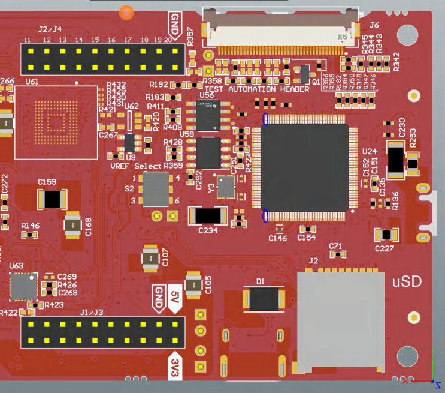

**Figure 5-3. Location of Pins 64 and 97 on U24** 

3. Open Command Prompt on your Windows PC and navigate to 

   - C:\ti\ccs12XX\ccs\ccs_base\common\uscif\xds110, where 12XX corresponds to the CCS version on the PC. 

4. Run command "xdsdfu -e" and the device must be reported with Mode as "DFU". If not, please repeat Steps 1 to 3 ensuring the pin shorting is done properly. 

5. After the debugger is in DFU mode, run command "xdsdfu -f firmware_3.0.0.XX.bin -r" where 3.0.0.XX is the corresponding XDS firmware version found in "C:\ti\ccs12XX\ccs\ccs_base\common\uscif\xds110" path. This starts the firmware upgrade utility and flashes the mentioned firmware to the XDS110 debugger. 

6. Once step 5 is complete, run command "xdsdfu -e" once more to see that the XDS110 debugger is detected by the PC as shown in below image with all the above steps. 

52 _AM263Px LaunchPad User Guide_ 

SPRUJ85B – APRIL 2024 – REVISED JANUARY 2026 _Submit Document Feedback_ 

Copyright © 2026 Texas Instruments Incorporated 

_Additional Information_ 

www.ti.com 

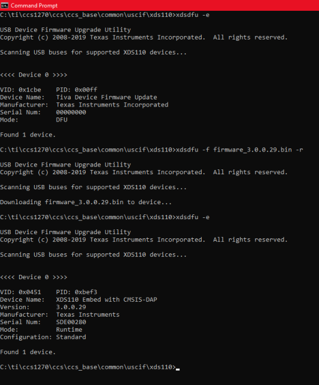

**Figure 5-4. XDS110 Firmware update commands in Command Prompt** 

Post the above steps are complete, CCS should be able to detect and connect to the XDS110 debugger on LP-AM263P. 

More details about XDS110 firmware and updating it can be found in _https://software-dl.ti.com/ccs/esd/ documents/xdsdebugprobes/emu_xds110.html#manual-update_ 

## _**5.3.3 eMMC CMD and CLK nets swap**_ 

This change/issue applies to both Revision E2A(PROC171E2) and Revision A(PROC171A) of the LP-AM263P board. 

The LP-AM263P has an eMMC footprint on board, for the part MTFC8GAMALBH-AAT. But it is seen that the CMD and CLK nets are wrongly swapped. The correct nets should be connected as per below 

- U61 Pin M6 should be connected to AM263P_EMMC0_CLK_MUX net 

- U61 Pin M5 should be connected to AM263P_EMMC0_CMD_MUX net 

Users are suggested to do board re-work before using this eMMC footprint. Please raise an e2e ticket for details on this. 

SPRUJ85B – APRIL 2024 – REVISED JANUARY 2026 _Submit Document Feedback_ 

_AM263Px LaunchPad User Guide_ 53 

Copyright © 2026 Texas Instruments Incorporated 

_Related Documentation_ 

www.ti.com 

## **6 Related Documentation** 

## **6.1 Supplemental Content** 

This LaunchPad uses various other TI components for its functions. A consolidated list of these components with links to their TI data sheets is shown below: 

- _TUSB320USB Type-C Configuration Channel Logic and Port Controller_ 

- _TPD4E02B04 4-Channel ESD Protection Diode for USB Type-C_ 

- _TPS22965x-Q1 5.5-V, 4-A, 16-mΩ On-Resistance Load Switch_ 

- _TPS6291x 3-V to 17-V, 2-A/3-A Low Noise and Low Ripple Buck Converter_ 

- _TPS748 1.5-A Low-Dropout Linear Regulator_ 

- _TCA6408A Low-Voltage 8-Bit I 2C and SMBus I/O Expander_ 

- _SN74AVC4T245 Dual-Bit Bus Transceiver with Configurable Voltage Translation_ 

- _TPS22918-Q1, 5.5-V, 2-A, 52-mΩ On-Resistance Load Switch_ 

- _TPD6E001 Low-Capacitance 6-Channel ESD-Protection for High-Speed Data Interfaces_ 

- _XDS110 JTAG Debug Probe_ 

- _TS5A23159 1-Ω 2-Channel SPDT Analog Switch_ 

- _TCAN1044V-Q1 Automotive Fault-Protected CAN FD Transceiver_ 

- _DP83869HM High Immunity 10/100/1000 Ethernet Physical Layer Transceiver_ 

- _TS3DDR3812 12-Channel, 1:2 MUX/DEMUX Switch for DDR3 Applications_ 

- _TCA9617B Level-Translating I2C Bus Repeater_ 

- _SN74CB3Q3257 4-Bit 1-of-2 FET Multiplexer/Demultiplexer_ 

- _TPIC2810 8-Bit LED Driver with I2C Interface_ 

- _TPS796xx 1-A Low-Dropout Linear Regulators_ 

- _TXB0108 8-Bit Bidirectional Voltage-Level Translator with Auto-Direction Sensing_ 

- TCA6416ARTWR 16-bit translating 1.65- to 5.5-V I2C/SMBus I/O expander 

## **7 References** 

In addition to this document, the following references are available for download at www.ti.com. 

- _AM263P4 Sitara™ Microcontrollers_ 

- _AM263Px Sitara™ Microcontrollers Data Sheet_ 

- _AM263Px Sitara™ Microcontrollers Technical Reference Manual_ 

- _AM263Px Sitara™ Microcontrollers Silicon Errata_ 

- _Texas Instruments Code Composer Studio_ 

- _Updating XDS110 Firmware_ 

   - To find the serial number, only follow steps 1 and 2 of updating XDS110 firmware 

## **8 Revision History** 

NOTE: Page numbers for previous revisions may differ from page numbers in the current version. 

|**Changes from September 30, 2024 to January 31, 2026 (from Revision A (September 2024) to**|
|---|
|**Revision B (January 2026))** **Page**|
|• Updated the SPI diagram for new RevA LP-AM263P board............................................................................32|
|• Updated changes for RevA of LP-AM263P......................................................................................................45|
|• Initial creation to capture details of changes for RevA of LP-AM263P.............................................................50|

54 _AM263Px LaunchPad User Guide_ 

SPRUJ85B – APRIL 2024 – REVISED JANUARY 2026 _Submit Document Feedback_ 

Copyright © 2026 Texas Instruments Incorporated 

## **STANDARD TERMS FOR EVALUATION MODULES** 

1. _Delivery:_ TI delivers TI evaluation boards, kits, or modules, including any accompanying demonstration software, components, and/or documentation which may be provided together or separately (collectively, an “EVM” or “EVMs”) to the User (“User”) in accordance with the terms set forth herein. User's acceptance of the EVM is expressly subject to the following terms. 

   - 1.1 EVMs are intended solely for product or software developers for use in a research and development setting to facilitate feasibility evaluation, experimentation, or scientific analysis of TI semiconductors products. EVMs have no direct function and are not finished products. EVMs shall not be directly or indirectly assembled as a part or subassembly in any finished product. For clarification, any software or software tools provided with the EVM (“Software”) shall not be subject to the terms and conditions set forth herein but rather shall be subject to the applicable terms that accompany such Software 

   - 1.2 EVMs are not intended for consumer or household use. EVMs may not be sold, sublicensed, leased, rented, loaned, assigned, or otherwise distributed for commercial purposes by Users, in whole or in part, or used in any finished product or production system. 

- 2 _Limited Warranty and Related Remedies/Disclaimers_ : 

   - 2.1 These terms do not apply to Software. The warranty, if any, for Software is covered in the applicable Software License Agreement. 

   - 2.2 TI warrants that the TI EVM will conform to TI's published specifications for ninety (90) days after the date TI delivers such EVM to User. Notwithstanding the foregoing, TI shall not be liable for a nonconforming EVM if (a) the nonconformity was caused by neglect, misuse or mistreatment by an entity other than TI, including improper installation or testing, or for any EVMs that have been altered or modified in any way by an entity other than TI, (b) the nonconformity resulted from User's design, specifications or instructions for such EVMs or improper system design, or (c) User has not paid on time. Testing and other quality control techniques are used to the extent TI deems necessary. TI does not test all parameters of each EVM. User's claims against TI under this Section 2 are void if User fails to notify TI of any apparent defects in the EVMs within ten (10) business days after delivery, or of any hidden defects with ten (10) business days after the defect has been detected. 

   - 2.3 TI's sole liability shall be at its option to repair or replace EVMs that fail to conform to the warranty set forth above, or credit User's account for such EVM. TI's liability under this warranty shall be limited to EVMs that are returned during the warranty period to the address designated by TI and that are determined by TI not to conform to such warranty. If TI elects to repair or replace such EVM, TI shall have a reasonable time to repair such EVM or provide replacements. Repaired EVMs shall be warranted for the remainder of the original warranty period. Replaced EVMs shall be warranted for a new full ninety (90) day warranty period. 

## **WARNING** 

**Evaluation Kits are intended solely for use by technically qualified, professional electronics experts who are familiar with the dangers and application risks associated with handling electrical mechanical components, systems, and subsystems. User shall operate the Evaluation Kit within TI’s recommended guidelines and any applicable legal or environmental requirements as well as reasonable and customary safeguards. Failure to set up and/or operate the Evaluation Kit within TI’s recommended guidelines may result in personal injury or death or property damage. Proper set up entails following TI’s instructions for electrical ratings of interface circuits such as input, output and electrical loads.** 

NOTE: 

EXPOSURE TO ELECTROSTATIC DISCHARGE (ESD) MAY CAUSE DEGREDATION OR FAILURE OF THE EVALUATION KIT; TI RECOMMENDS STORAGE OF THE EVALUATION KIT IN A PROTECTIVE ESD BAG. 

www.ti.com 

- 3 _Regulatory Notices:_ 

   - 3.1 _United States_ 

3.1.1 _Notice applicable to EVMs not FCC-Approved:_ 

**FCC NOTICE:** This kit is designed to allow product developers to evaluate electronic components, circuitry, or software associated with the kit to determine whether to incorporate such items in a finished product and software developers to write software applications for use with the end product. This kit is not a finished product and when assembled may not be resold or otherwise marketed unless all required FCC equipment authorizations are first obtained. Operation is subject to the condition that this product not cause harmful interference to licensed radio stations and that this product accept harmful interference. Unless the assembled kit is designed to operate under part 15, part 18 or part 95 of this chapter, the operator of the kit must operate under the authority of an FCC license holder or must secure an experimental authorization under part 5 of this chapter. 

3.1.2 _For EVMs annotated as FCC – FEDERAL COMMUNICATIONS COMMISSION Part 15 Compliant:_ 

## **CAUTION** 

This device complies with part 15 of the FCC Rules. Operation is subject to the following two conditions: (1) This device may not cause harmful interference, and (2) this device must accept any interference received, including interference that may cause undesired operation. 

Changes or modifications not expressly approved by the party responsible for compliance could void the user's authority to operate the equipment. 

## **FCC Interference Statement for Class A EVM devices** 

_NOTE: This equipment has been tested and found to comply with the limits for a Class A digital device, pursuant to part 15 of the FCC Rules. These limits are designed to provide reasonable protection against harmful interference when the equipment is operated in a commercial environment. This equipment generates, uses, and can radiate radio frequency energy and, if not installed and used in accordance with the instruction manual, may cause harmful interference to radio communications. Operation of this equipment in a residential area is likely to cause harmful interference in which case the user will be required to correct the interference at his own expense._ 

## **FCC Interference Statement for Class B EVM devices** 

_NOTE: This equipment has been tested and found to comply with the limits for a Class B digital device, pursuant to part 15 of the FCC Rules. These limits are designed to provide reasonable protection against harmful interference in a residential installation. This equipment generates, uses and can radiate radio frequency energy and, if not installed and used in accordance with the instructions, may cause harmful interference to radio communications. However, there is no guarantee that interference will not occur in a particular installation. If this equipment does cause harmful interference to radio or television reception, which can be determined by turning the equipment off and on, the user is encouraged to try to correct the interference by one or more of the following measures:_ 

      - _Reorient or relocate the receiving antenna._ 

      - _Increase the separation between the equipment and receiver._ 

      - _Connect the equipment into an outlet on a circuit different from that to which the receiver is connected._ 

      - _Consult the dealer or an experienced radio/TV technician for help._ 

- 3.2 _Canada_ 

   - 3.2.1 _For EVMs issued with an Industry Canada Certificate of Conformance to RSS-210 or RSS-247_ 

## **Concerning EVMs Including Radio Transmitters:** 

This device complies with Industry Canada license-exempt RSSs. Operation is subject to the following two conditions: 

(1) this device may not cause interference, and (2) this device must accept any interference, including interference that may cause undesired operation of the device. 

## **Concernant les EVMs avec appareils radio:** 

Le présent appareil est conforme aux CNR d'Industrie Canada applicables aux appareils radio exempts de licence. L'exploitation est autorisée aux deux conditions suivantes: (1) l'appareil ne doit pas produire de brouillage, et (2) l'utilisateur de l'appareil doit accepter tout brouillage radioélectrique subi, même si le brouillage est susceptible d'en compromettre le fonctionnement. 

## **Concerning EVMs Including Detachable Antennas:** 

Under Industry Canada regulations, this radio transmitter may only operate using an antenna of a type and maximum (or lesser) gain approved for the transmitter by Industry Canada. To reduce potential radio interference to other users, the antenna type and its gain should be so chosen that the equivalent isotropically radiated power (e.i.r.p.) is not more than that necessary for successful communication. This radio transmitter has been approved by Industry Canada to operate with the antenna types listed in the user guide with the maximum permissible gain and required antenna impedance for each antenna type indicated. Antenna types not included in this list, having a gain greater than the maximum gain indicated for that type, are strictly prohibited for use with this device. 

2 

www.ti.com 

## **Concernant les EVMs avec antennes détachables** 

Conformément à la réglementation d'Industrie Canada, le présent émetteur radio peut fonctionner avec une antenne d'un type et d'un gain maximal (ou inférieur) approuvé pour l'émetteur par Industrie Canada. Dans le but de réduire les risques de brouillage radioélectrique à l'intention des autres utilisateurs, il faut choisir le type d'antenne et son gain de sorte que la puissance isotrope rayonnée équivalente (p.i.r.e.) ne dépasse pas l'intensité nécessaire à l'établissement d'une communication satisfaisante. Le présent émetteur radio a été approuvé par Industrie Canada pour fonctionner avec les types d'antenne énumérés dans le manuel d’usage et ayant un gain admissible maximal et l'impédance requise pour chaque type d'antenne. Les types d'antenne non inclus dans cette liste, ou dont le gain est supérieur au gain maximal indiqué, sont strictement interdits pour l'exploitation de l'émetteur 

## 3.3 _Japan_ 

- 3.3.1 _Notice for EVMs delivered in Japan:_ Please see http://www.tij.co.jp/lsds/ti_ja/general/eStore/notice_01.page 日本国内に 輸入される評価用キット、ボードについては、次のところをご覧ください。 

https://www.ti.com/ja-jp/legal/notice-for-evaluation-kits-delivered-in-japan.html 

- 3.3.2 _Notice for Users of EVMs Considered “Radio Frequency Products” in Japan:_ EVMs entering Japan may not be certified by TI as conforming to Technical Regulations of Radio Law of Japan. 

If User uses EVMs in Japan, not certified to Technical Regulations of Radio Law of Japan, User is required to follow the instructions set forth by Radio Law of Japan, which includes, but is not limited to, the instructions below with respect to EVMs (which for the avoidance of doubt are stated strictly for convenience and should be verified by User): 

1. Use EVMs in a shielded room or any other test facility as defined in the notification #173 issued by Ministry of Internal Affairs and Communications on March 28, 2006, based on Sub-section 1.1 of Article 6 of the Ministry’s Rule for Enforcement of Radio Law of Japan, 

2. Use EVMs only after User obtains the license of Test Radio Station as provided in Radio Law of Japan with respect to EVMs, or 

3. Use of EVMs only after User obtains the Technical Regulations Conformity Certification as provided in Radio Law of Japan with respect to EVMs. Also, do not transfer EVMs, unless User gives the same notice above to the transferee. Please note that if User does not follow the instructions above, User will be subject to penalties of Radio Law of Japan. 

【無線電波を送信する製品の開発キットをお使いになる際の注意事項】開発キットの中には技術基準適合証明を受けて いないものがあります。技術適合証明を受けていないもののご使用に際しては、電波法遵守のため、以下のいずれかの 措置を取っていただく必要がありますのでご注意ください。 

1. 電波法施行規則第 6 条第 1 項第 1 号に基づく平成 18 年 3 月 28 日総務省告示第 173 号で定められた電波暗室等の試験設備でご使用 いただく。 

2. 実験局の免許を取得後ご使用いただく。 

3. 技術基準適合証明を取得後ご使用いただく。 

なお、本製品は、上記の「ご使用にあたっての注意」を譲渡先、移転先に通知しない限り、譲渡、移転できないものとします。 上記を遵守頂けない場合は、電波法の罰則が適用される可能性があることをご留意ください。日本テキサス・イ ンスツルメンツ株式会社 

東京都新宿区西新宿６丁目２４番１号 

西新宿三井ビル 

- 3.3.3 _Notice for EVMs for Power Line Communication:_ Please see http://www.tij.co.jp/lsds/ti_ja/general/eStore/notice_02.page 電力線搬送波通信についての開発キットをお使いになる際の注意事項については、次のところをご覧くださ い。 https://www.ti.com/ja-jp/legal/notice-for-evaluation-kits-for-power-line-communication.html 

## 3.4 _European Union_ 

- 3.4.1 _For EVMs subject to EU Directive 2014/30/EU (Electromagnetic Compatibility Directive)_ : This is a class A product intended for use in environments other than domestic environments that are connected to a low-voltage power-supply network that supplies buildings used for domestic purposes. In a domestic environment this product may cause radio interference in which case the user may be required to take adequate measures. 

3 

www.ti.com 

- 4 _EVM Use Restrictions and Warnings:_ 

   - 4.1 EVMS ARE NOT FOR USE IN FUNCTIONAL SAFETY AND/OR SAFETY CRITICAL EVALUATIONS, INCLUDING BUT NOT LIMITED TO EVALUATIONS OF LIFE SUPPORT APPLICATIONS. 

   - 4.2 User must read and apply the user guide and other available documentation provided by TI regarding the EVM prior to handling or using the EVM, including without limitation any warning or restriction notices. The notices contain important safety information related to, for example, temperatures and voltages. 

   - 4.3 _Safety-Related Warnings and Restrictions:_ 

      - 4.3.1 User shall operate the EVM within TI’s recommended specifications and environmental considerations stated in the user guide, other available documentation provided by TI, and any other applicable requirements and employ reasonable and customary safeguards. Exceeding the specified performance ratings and specifications (including but not limited to input and output voltage, current, power, and environmental ranges) for the EVM may cause personal injury or death, or property damage. If there are questions concerning performance ratings and specifications, User should contact a TI field representative prior to connecting interface electronics including input power and intended loads. Any loads applied outside of the specified output range may also result in unintended and/or inaccurate operation and/or possible permanent damage to the EVM and/or interface electronics. Please consult the EVM user guide prior to connecting any load to the EVM output. If there is uncertainty as to the load specification, please contact a TI field representative. During normal operation, even with the inputs and outputs kept within the specified allowable ranges, some circuit components may have elevated case temperatures. These components include but are not limited to linear regulators, switching transistors, pass transistors, current sense resistors, and heat sinks, which can be identified using the information in the associated documentation. When working with the EVM, please be aware that the EVM may become very warm. 

      - 4.3.2 EVMs are intended solely for use by technically qualified, professional electronics experts who are familiar with the dangers and application risks associated with handling electrical mechanical components, systems, and subsystems. User assumes all responsibility and liability for proper and safe handling and use of the EVM by User or its employees, affiliates, contractors or designees. User assumes all responsibility and liability to ensure that any interfaces (electronic and/or mechanical) between the EVM and any human body are designed with suitable isolation and means to safely limit accessible leakage currents to minimize the risk of electrical shock hazard. User assumes all responsibility and liability for any improper or unsafe handling or use of the EVM by User or its employees, affiliates, contractors or designees. 

   - 4.4 User assumes all responsibility and liability to determine whether the EVM is subject to any applicable international, federal, state, or local laws and regulations related to User’s handling and use of the EVM and, if applicable, User assumes all responsibility and liability for compliance in all respects with such laws and regulations. User assumes all responsibility and liability for proper disposal and recycling of the EVM consistent with all applicable international, federal, state, and local requirements. 

5. _Accuracy of Information:_ To the extent TI provides information on the availability and function of EVMs, TI attempts to be as accurate as possible. However, TI does not warrant the accuracy of EVM descriptions, EVM availability or other information on its websites as accurate, complete, reliable, current, or error-free. 

6. _Disclaimers:_ 

   - 6.1 EXCEPT AS SET FORTH ABOVE, EVMS AND ANY MATERIALS PROVIDED WITH THE EVM (INCLUDING, BUT NOT LIMITED TO, REFERENCE DESIGNS AND THE DESIGN OF THE EVM ITSELF) ARE PROVIDED "AS IS" AND "WITH ALL FAULTS." TI DISCLAIMS ALL OTHER WARRANTIES, EXPRESS OR IMPLIED, REGARDING SUCH ITEMS, INCLUDING BUT NOT LIMITED TO ANY EPIDEMIC FAILURE WARRANTY OR IMPLIED WARRANTIES OF MERCHANTABILITY OR FITNESS FOR A PARTICULAR PURPOSE OR NON-INFRINGEMENT OF ANY THIRD PARTY PATENTS, COPYRIGHTS, TRADE SECRETS OR OTHER INTELLECTUAL PROPERTY RIGHTS. 

   - 6.2 EXCEPT FOR THE LIMITED RIGHT TO USE THE EVM SET FORTH HEREIN, NOTHING IN THESE TERMS SHALL BE CONSTRUED AS GRANTING OR CONFERRING ANY RIGHTS BY LICENSE, PATENT, OR ANY OTHER INDUSTRIAL OR INTELLECTUAL PROPERTY RIGHT OF TI, ITS SUPPLIERS/LICENSORS OR ANY OTHER THIRD PARTY, TO USE THE EVM IN ANY FINISHED END-USER OR READY-TO-USE FINAL PRODUCT, OR FOR ANY INVENTION, DISCOVERY OR IMPROVEMENT, REGARDLESS OF WHEN MADE, CONCEIVED OR ACQUIRED. 

7. _USER'S INDEMNITY OBLIGATIONS AND REPRESENTATIONS._ USER WILL DEFEND, INDEMNIFY AND HOLD TI, ITS LICENSORS AND THEIR REPRESENTATIVES HARMLESS FROM AND AGAINST ANY AND ALL CLAIMS, DAMAGES, LOSSES, EXPENSES, COSTS AND LIABILITIES (COLLECTIVELY, "CLAIMS") ARISING OUT OF OR IN CONNECTION WITH ANY HANDLING OR USE OF THE EVM THAT IS NOT IN ACCORDANCE WITH THESE TERMS. THIS OBLIGATION SHALL APPLY WHETHER CLAIMS ARISE UNDER STATUTE, REGULATION, OR THE LAW OF TORT, CONTRACT OR ANY OTHER LEGAL THEORY, AND EVEN IF THE EVM FAILS TO PERFORM AS DESCRIBED OR EXPECTED. 

4 

www.ti.com 

8. _Limitations on Damages and Liability:_ 

   - 8.1 _General Limitations_ . IN NO EVENT SHALL TI BE LIABLE FOR ANY SPECIAL, COLLATERAL, INDIRECT, PUNITIVE, INCIDENTAL, CONSEQUENTIAL, OR EXEMPLARY DAMAGES IN CONNECTION WITH OR ARISING OUT OF THESE TERMS OR THE USE OF THE EVMS , REGARDLESS OF WHETHER TI HAS BEEN ADVISED OF THE POSSIBILITY OF SUCH DAMAGES. EXCLUDED DAMAGES INCLUDE, BUT ARE NOT LIMITED TO, COST OF REMOVAL OR REINSTALLATION, ANCILLARY COSTS TO THE PROCUREMENT OF SUBSTITUTE GOODS OR SERVICES, RETESTING, OUTSIDE COMPUTER TIME, LABOR COSTS, LOSS OF GOODWILL, LOSS OF PROFITS, LOSS OF SAVINGS, LOSS OF USE, LOSS OF DATA, OR BUSINESS INTERRUPTION. NO CLAIM, SUIT OR ACTION SHALL BE BROUGHT AGAINST TI MORE THAN TWELVE (12) MONTHS AFTER THE EVENT THAT GAVE RISE TO THE CAUSE OF ACTION HAS OCCURRED. 

   - 8.2 _Specific Limitations._ IN NO EVENT SHALL TI'S AGGREGATE LIABILITY FROM ANY USE OF AN EVM PROVIDED HEREUNDER, INCLUDING FROM ANY WARRANTY, INDEMITY OR OTHER OBLIGATION ARISING OUT OF OR IN CONNECTION WITH THESE TERMS, , EXCEED THE TOTAL AMOUNT PAID TO TI BY USER FOR THE PARTICULAR EVM(S) AT ISSUE DURING THE PRIOR TWELVE (12) MONTHS WITH RESPECT TO WHICH LOSSES OR DAMAGES ARE CLAIMED. THE EXISTENCE OF MORE THAN ONE CLAIM SHALL NOT ENLARGE OR EXTEND THIS LIMIT. 

9. _Return Policy._ Except as otherwise provided, TI does not offer any refunds, returns, or exchanges. Furthermore, no return of EVM(s) will be accepted if the package has been opened and no return of the EVM(s) will be accepted if they are damaged or otherwise not in a resalable condition. If User feels it has been incorrectly charged for the EVM(s) it ordered or that delivery violates the applicable order, User should contact TI. All refunds will be made in full within thirty (30) working days from the return of the components(s), excluding any postage or packaging costs. 

10. _Governing Law:_ These terms and conditions shall be governed by and interpreted in accordance with the laws of the State of Texas, without reference to conflict-of-laws principles. User agrees that non-exclusive jurisdiction for any dispute arising out of or relating to these terms and conditions lies within courts located in the State of Texas and consents to venue in Dallas County, Texas. Notwithstanding the foregoing, any judgment may be enforced in any United States or foreign court, and TI may seek injunctive relief in any United States or foreign court. 

Mailing Address: Texas Instruments, Post Office Box 655303, Dallas, Texas 75265 Copyright © 2023, Texas Instruments Incorporated 

5 

## **IMPORTANT NOTICE AND DISCLAIMER** 

TI PROVIDES TECHNICAL AND RELIABILITY DATA (INCLUDING DATASHEETS), DESIGN RESOURCES (INCLUDING REFERENCE DESIGNS), APPLICATION OR OTHER DESIGN ADVICE, WEB TOOLS, SAFETY INFORMATION, AND OTHER RESOURCES “AS IS” AND WITH ALL FAULTS, AND DISCLAIMS ALL WARRANTIES, EXPRESS AND IMPLIED, INCLUDING WITHOUT LIMITATION ANY IMPLIED WARRANTIES OF MERCHANTABILITY, FITNESS FOR A PARTICULAR PURPOSE OR NON-INFRINGEMENT OF THIRD PARTY INTELLECTUAL PROPERTY RIGHTS. 

These resources are intended for skilled developers designing with TI products. You are solely responsible for (1) selecting the appropriate TI products for your application, (2) designing, validating and testing your application, and (3) ensuring your application meets applicable standards, and any other safety, security, regulatory or other requirements. 

These resources are subject to change without notice. TI grants you permission to use these resources only for development of an application that uses the TI products described in the resource. Other reproduction and display of these resources is prohibited. No license is granted to any other TI intellectual property right or to any third party intellectual property right. TI disclaims responsibility for, and you fully indemnify TI and its representatives against any claims, damages, costs, losses, and liabilities arising out of your use of these resources. 

TI’s products are provided subject to TI’s Terms of Sale, TI’s General Quality Guidelines, or other applicable terms available either on ti.com or provided in conjunction with such TI products. TI’s provision of these resources does not expand or otherwise alter TI’s applicable warranties or warranty disclaimers for TI products. Unless TI explicitly designates a product as custom or customer-specified, TI products are standard, catalog, general purpose devices. 

TI objects to and rejects any additional or different terms you may propose. 

Copyright © 2026, Texas Instruments Incorporated 

Last updated 10/2025 

